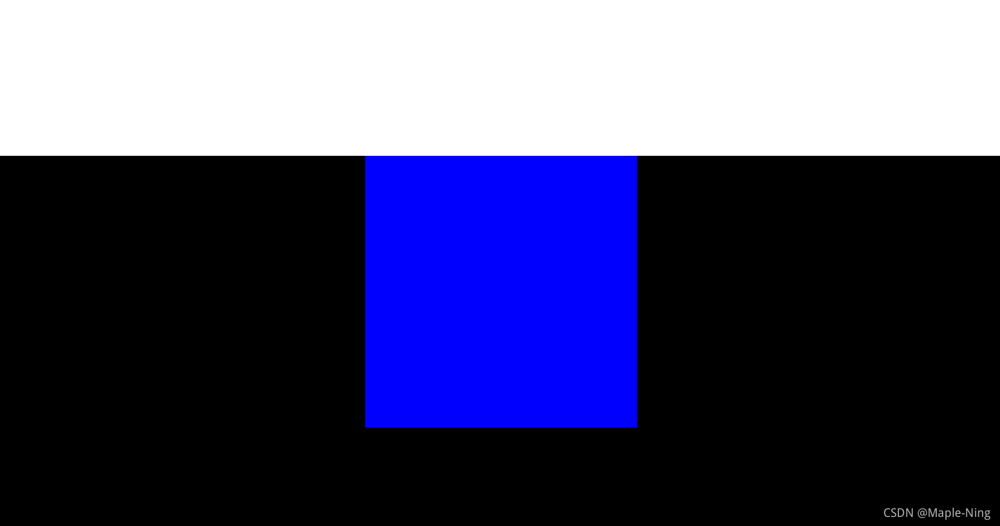
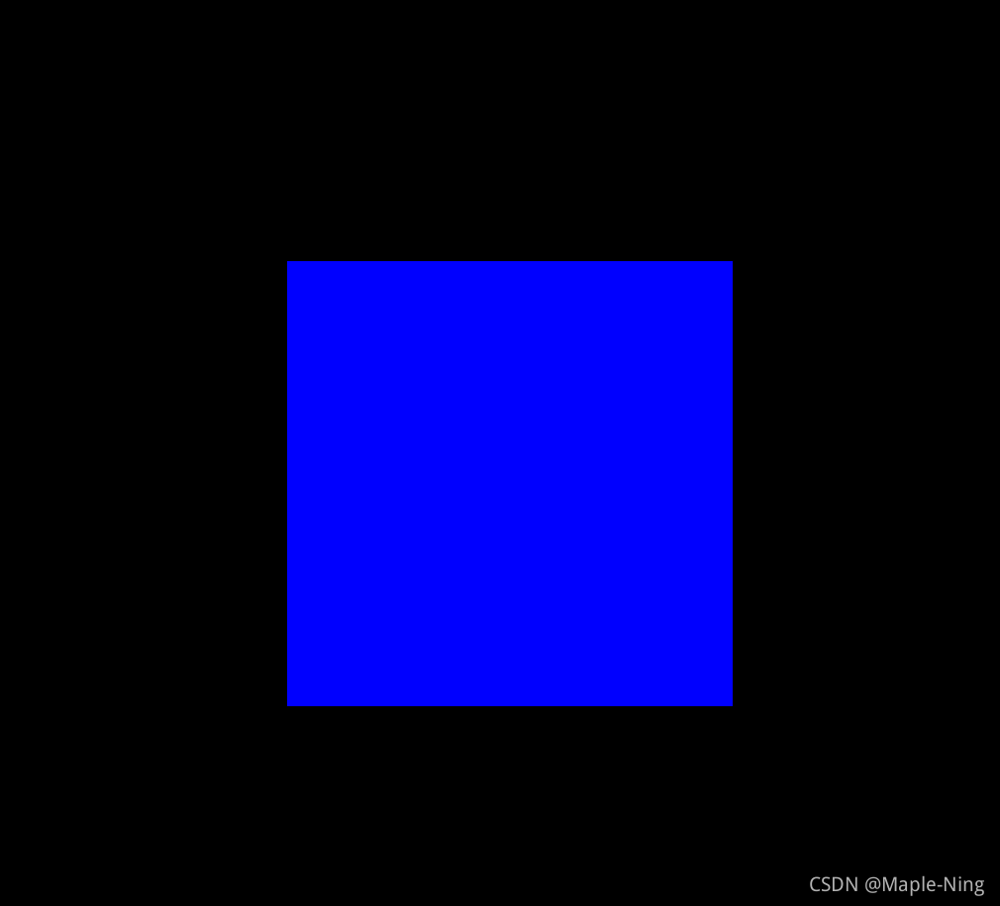

# div水平垂直居中的四种方式

让div水平居中的方式，我所知道的就是以下这四种。

[toc]

### 一、margin

第一种方式我们可以利用外边距属性来使div水平垂直居中

<span style="color:red;">先来看一段有问题的代码</span>

```html
<!DOCTYPE html>
<html lang="en">
<head>
  <meta charset="UTF-8">
  <meta name="viewport" content="width=device-width, initial-scale=1.0">
  <title>margin</title>
  <style>
    *{
      margin: 0;
      padding: 0; 
    }
    /* 父容器样式 */
    .container{
      height: 800px;
      background-color: black;
    }
    /* 子容器样式 */
    .son{
      width: 300px;
      height: 300px;
      background-color: white;
      /* 水平垂直居中 */
      margin: 250px auto;
    }
  </style>
</head>
<body>
    <!-- 父容器 -->
    <div class="container">
      <!-- 子容器 -->
      <div class="son"></div>
    </div>
</body>
</html>
```

<span style="color:red;">错误效果</span>



可以看到，给子容器设置顶部外边距，连带父容器也被往下挤了，这是因为margin属性只有遇到边界才会"停下来"。边界就是border属性或者padding属性，因为父容器没有边界，所以子容器的外边距是相对父容器的父容器的，也就是body。所以我们想要让子容器相对父元素垂直居中，就要给父元素设置一个padding或者border。

**正确的代码**

```html
<!DOCTYPE html>
<html lang="en">
<head>
  <meta charset="UTF-8">
  <meta name="viewport" content="width=device-width, initial-scale=1.0">
  <title>margin</title>
  <style>
    *{
      margin: 0;
      padding: 0; 
    }
    /* 父容器样式 */
    .container{
      height: 800px;
      background-color: black;
      border: 1px solid;
      /* padding: 1px; */
    }
    /* 子容器样式 */
    .son{
      width: 300px;
      height: 300px;
      background-color: blue;
      /* 水平垂直居中 */
      margin: 250px auto;
    }
  </style>
</head>
<body>
    <!-- 父容器 -->
    <div class="container">
      <!-- 子容器 -->
      <div class="son"></div>
    </div>
</body>
</html>
```

**效果**



**margin:上下边距 左右边距;**
要让div水平居中，就要设置左右边距为auto,自适应。
要让div垂直居中，就要==计算==上下边距了，垂直居中的上下边距为父容器高度的一半减去子容器高度的一半。

### 二、绝对定位

**正确代码**

```html
<!DOCTYPE html>
<html lang="en">
<head>
  <meta charset="UTF-8">
  <meta name="viewport" content="width=device-width, initial-scale=1.0">
  <title>绝对定位</title>
  <style>
    *{
      margin: 0;
      padding: 0;
    }
    /* 父容器 */
    .container{
      height: 700px;
      position: relative;
      background-color: black;
    }
    /* 子容器 */
    .son{
      width: 300px;
      height: 300px;
      background-color: white;
      position:absolute;
      /* 水平垂直居中 */
      left: 0;
      right: 0;
      top: 0;
      bottom: 0;
      margin: auto;
    }
  </style>
</head>
<body>
  <div class="container">
    <div class="son"></div>
  </div>
</body>
</html>
```

只要让子容器开启绝对定位，并且left、right、top、bottom全为0，margin:auto就能实现div水平垂直居中了。

### 三、子元素绝对定位父元素相对定位

```html
<!DOCTYPE html>
<html lang="en">
<head>
  <meta charset="UTF-8">
  <meta name="viewport" content="width=device-width, initial-scale=1.0">
  <title>子绝父相</title>
  <style>
    *{
      margin: 0;
      padding: 0;
    }
    /* 父容器 */
    .container{
      height: 700px;
      background-color: black;
       /* 父容器开启相对定位*/
      position: relative;
    }
    /* 子容器 */
    .son{
      width: 300px;
      height: 300px;
      background-color: white;
      /* 子容器开启绝对定位*/
      position:absolute;
      /* 水平垂直居中 */
      top: 50%;
      margin-top: -150px;
      left: 50%;
      margin-left: -150px;
    }
  </style>
</head>
<body>
  <div class="container">
    <div class="son"></div>
  </div>
</body>
</html>
```

给父容器开启相对定位，子元素开启绝对定位。
水平居中 left: 50%;margin-left: -150px;
垂直居中 top: 50%;margin-top: -150px;
margin的值是子容器宽度或高度一半的负值
水平方向我们一般使用left,垂直方向一般使用top,以免出现问题。

### 四、flex布局

**正确代码**

```html
<!DOCTYPE html>
<html lang="en">
<head>
  <meta charset="UTF-8">
  <meta name="viewport" content="width=device-width, initial-scale=1.0">
  <title>flex布局</title>
  <style>
    *{
      margin: 0;
      padding: 0;
    }
    /* 父容器 */
    .container{
      height: 700px;
      background-color: black;
      /* 父容器开启flex布局 */
      display: flex;
      /* 水平垂直居中 */
      justify-content: center;
      align-items: center;
    }
    /* 子容器 */
    .son{
      width: 300px;
      height: 300px;
      background-color: white;
    }
  </style>
</head>
<body>
  <div class="container">
    <div class="son"></div>
  </div>
</body>
</html>
```

给父容器开启flex布局，父容器就变成flex容器了，子容器就变成flex项目了。
利用flex布局控制项目水平方向和垂直方向排列的属性使div垂直水平居中。
**justify-content: center;水平居中**
**align-items: center;垂直居中**

### 总结

可能讲述得不清楚，能看懂就好了。

### 版权特别声明

版权声明：本文为博主原创文章，遵循 CC 4.0 BY-SA 版权协议，转载请附上原文出处链接和本声明。
本文链接：https://blog.csdn.net/qq_57443373/article/details/120179047

### 相关参考

1. 本文摘自：[div水平垂直居中的四种方式](https://blog.csdn.net/qq_57443373/article/details/120179047)
2. [弹性布局（display:flex;）属性详解](https://www.cnblogs.com/hellocd/p/10443237.html)
3. [关于对CC系列知识共享许可证“CC BY-SA 4.0”的理解](https://www.cnblogs.com/funkboy/p/16760511.html)
4. [CSS Flexbox](https://www.w3school.com.cn/css/css3_flexbox.asp)
5. [CSS 外边距](https://www.w3school.com.cn/css/css_margin.asp)
6. [CSS 布局 - position 属性](https://www.w3school.com.cn/css/css_positioning.asp)
7. [CSS 布局 - display 属性](https://www.w3school.com.cn/css/css_display_visibility.asp)
8. [W3School](https://www.w3school.com.cn/index.html)