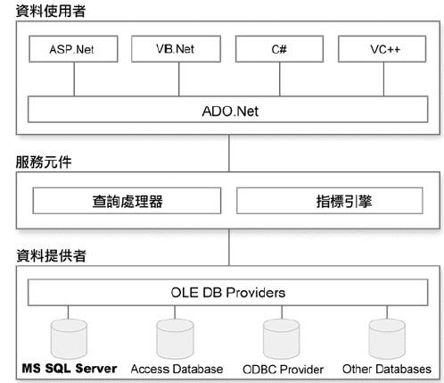
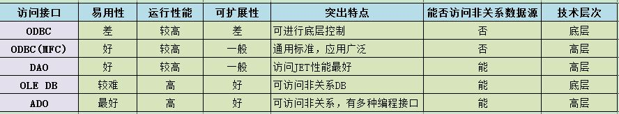

# 一文详解ODBC、OLEDB、ADO、ADO.NET之间的关系

[TOC]

---

相信看到这篇文章的人，心中肯定有这样的想法：ODBC、OLEDB、ADO、ADO.NET貌似都是访问数据库的东东，那么他们之间有什么区别，又有什么联系呢？不要着急，待我慢慢道来。

## 一、ODBC

**ODBC**（Open Database Connectivity，开放数据库互连）。

ODBC，官方的定义是这样的，开放数据库互连（ODBC）是MICROSOFT提出的数据库访问接口标准。ODBC（Open DatabaseConnectivity，开放数据库互连）提供了一种标准的API（应用程序编程接口）方法来访问数据库管理系统（DBMS）。这些API利用SQL来完成其大部分任务。ODBC本身也提供了对SQL语言的支持，用户可以直接将SQL语句送给ODBC。ODBC的设计者们努力使它具有最大的独立性和开放性：与具体的编程语言无关，与具体的数据库系统无关，与具体的操作系统无关。

简单说一下我的理解，从本质上说，ODBC是一种标准，而这些所有的标准其实是一系列的接口。那么这一标准要完成什么工作呢？打个比方，我们把sql Server、Sybase、Oracle等数据库比作是一个个的大水箱，每个水箱都有一个出水口，但不同水箱出水口的形状不一样，sql Server 的可能是三角形的，Sybase的可能是正方形的，而程序员如果需要使用水箱中的水（需要从数据库中取数据），就必须使用与之想对应的水管，比如使用sql Server水箱中的水，就必须用三角口的水管，而用Sybase水箱的时候就得用正方形的水管，这无疑给编程人员带来了麻烦。于是，微软制定了ODBC这么一个标准，要求不管是什么水箱，最后的出水口必须是圆形的，程序员只要有一根圆形的水管，就可以取到任意水箱中的水。至于不同水箱如何把出水口转变成圆形的，这不是我们编程人员的事，是你水箱的事。于是乎，各个水箱都开发了这么一根水管，一头形状是自己水箱口的形状，另一头是标准的圆形。比如sql Server，它就需要有一根一头是三角形，一头是圆形的水管。而这根特殊的水管映射到程序界就是所谓的ODBC驱动。有了ODBC这一标准，各个水箱中的水还可以被使用，与此同时，使用者也方便了许多，皆大欢喜。

## 二、OLEDB

**OLE DB**（Object Linking and Embedding, Database，对象连接嵌入数据库）

再说OLEDB，OLEDB(ObjectLinking and Embedding,Database,又称为OLE DB或OLE-DB），一个基于COM的数据存储对象，能提供对所有类型的数据的操作，甚至能在离线的情况下存取数据(比方说，你使用的是你的便携机，你可以毫不费力地看到最后一次数据同步时的数据映像）.

好吧，说实话，关于OLEDB我也木有真正体会到它的魅力之所在，不过可以肯定的是，它比ODBC功能更强大，使用更方便。它依赖于ODBC，是在ODBC之上的一次封装。暂时就这么理解吧。

## 三、ADO

**ADO**（ActiveX Data Object，活动数据对象）

至于ADO，ADO （ActiveXDataObjects）是一个用于访问数据源的COM组件。它提供了编程语言和统一数据访问方式OLE DB的一个中间层。允许开发人员编写访问数据的代码而不用关心数据库是如何实现的，而只用关心到数据库的连接。访问数据库的时候，关于SQL的知识不是必要的，但是特定数据库支持的SQL命令仍可以通过ADO中的命令对象来执行。

说道ADO，可谓是后起之秀啊，其实，在它之前，出现过DAO和RDO，

DAO（Data Access Object，数据访问对象）
RDO（Remote Data Objects，远程数据对象）

但随着ADO的推出，它成为在Windows NT 4.0和Windows 2000操作系统上开发数据库应用程序的首选。它将对象模型统一化，改由数据库厂商发展数据提供者（data provider，这个模式在此时奠基），从这点来说，貌似它跟ODBC功能类似，但是，它是建立在ODBC和OLEDB之上的又一次封装。而且ADO本身则是与数据源无关 (data source independent) 的开发方法，这让它迅速的获得了使用ASP与Visual Basic开发人员的青睐，顺利取代DAO与RDO等模型。

纯语言的描述可能不太直观，让大家看一张图片。

简单给大家解释一下，最上面的是我们编写的程序，最下面的是数据库，而中间的就是今天的主要内容——一些数据库访问技术。从第二部分我们可以看出，ODBC位于数据访问的最底层，OLEDB次之，ADO位于最上层。我们的应用程序可以通过三种方式访问数据库，分别是

（1）应用程序——ODBC——数据库，

（2）应用程序——OLEDB——ODBC——数据库，

（3）应用程序——ADO——OLEDB——ODBC——数据库。

到此为止，ODBC、OLEDB、ADO三者的关系应该清楚了。

## 四、ADO.NET

最后所ADO.NET，ADO虽然是比较成功的产品，但ADO本身的架构仍然有缺陷，尤其是在开发网络应用程序时，Recordset无法脱机，严重影响了网络应用的开发。于是在1998年时，微软提出了一个下一代的应用程序开发框架 (Application Framework) 的计划。很荣幸，ADO.NET被包含在此计划之内，它引入了脱机型数据模型的概念，成功解决了ADO所不能及的问题。许多人将ADO.NET视为ADO的下一个版本，但其实它是一个全新的架构、产品概念。具体的ADO.NET介绍，参见详解ADO.NET相关的文档

## 五、总结

ODBC 、DAO 、ADO 、OLEDB 数据库连接方式区别及联系

ODBC 是一种底层的访问技术，因此，ODBC API 可以是客户应用程序能从底层设置和控制数据库，完成一些高级数据库技术无法完成的功能；但不足之处由于ODBC只能用于关系型数据库，使得利用ODBC很难访问对象数据库及其他非关系数据库。

DAO 提供了一种通过程序代码创建和操纵数据库的机制。最大特点是对MICROSOFT JET数据库的操作很方便，而且是操作JET数据库时性能最好的技术接口之一。并且它并不只能用于访问这种数据库，事实上，通过DAO技术可以访问从文本文件到大型后台数据库等多种数据格式。

ADO 是基于OLE DB的访问接口，它是面向对象的OLE DB技术，继承了OLE DB的优点。属于数据库访问的高层接口。

## 名词解释

ODBC（Open DataBase Connectivity）开放数据库互联。是由微软主导的数据库链接标准。

MFC（Microsoft Foundation Class）微软基础类。MFC ODBC是对ODBC的封装。

DAO（Data Access Object）数据访问对象。不提供远程访问功能。

RDO（Remote Data Object）远程数据对象。速度快，支持SQL Server存储过程，同DAO一样是发展很多年了的技术。

OLE-DB（Object Linking and Embedding DataBase）对象链接和嵌入数据库。它依赖于COM和提供OLE DB提供者的厂商而非ODBC使用的SQL。

ADO（ActiveX Data Object）ActiveX数据对象。基于OLE-DB建立连接的局部和远程数据库访问技术。同OLE-DB一样要“年轻”些。

使用中，我们一般用OLE-DB和ADO替代DAO和RDO。
————————————————

## 版权声明

本文为CSDN博主「LoveMIss-Y」的原创文章，遵循CC 4.0 BY-SA版权协议，转载请附上原文出处链接及本声明。
原文链接：https://blog.csdn.net/qq_27825451/article/details/86515141

## 推荐阅读

1. [ODBC, OLEDB, ADO, ADO.NET](https://www.cnblogs.com/Niko12230/p/5886080.html)