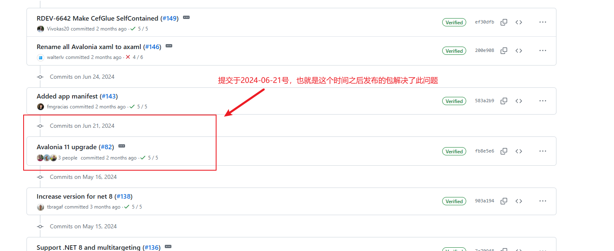
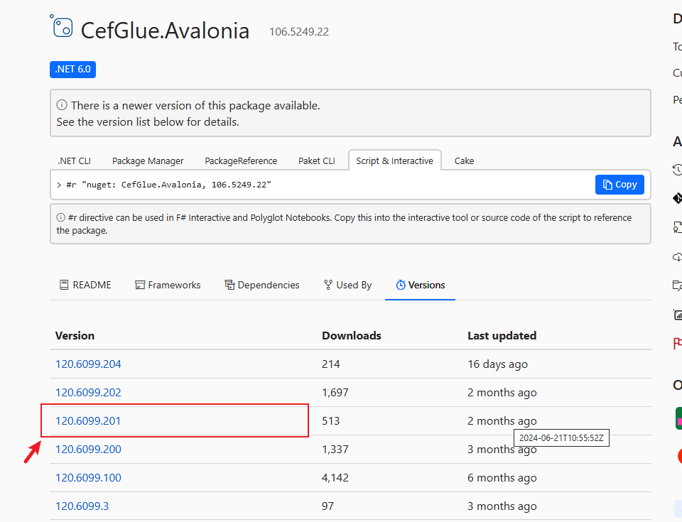

# Avalonia 相关

[TOC]

---

## [Avalonia](https://github.com/AvaloniaUI/Avalonia)

 

## Avalonia UI

[App Showcase](https://avaloniaui.net/showcase)

- [Avalonia UI Doc 官网](https://docs.avaloniaui.net/zh-Hans/docs/welcome)
  - [如何使用实时预览](https://docs.avaloniaui.net/zh-Hans/docs/guides/implementation-guides/ide-support)

- [Git Hub：Avalonia UI](https://github.com/AvaloniaUI)
  - **[AvaloniaUI/Avalonia](https://github.com/AvaloniaUI/Avalonia)**
  - **[AvaloniaUI/Avalonia.Samples](https://github.com/AvaloniaUI/Avalonia.Samples)**

## CefGlue

Avalonia 中集成CEF项目。

- **[OutSystems/CefGlue](https://github.com/OutSystems/CefGlue)**

其他可参考的项目

- **[davidhuangxc](https://gitee.com/davidhuangxc)/[CefGlue.AvaloniaBrowser](https://gitee.com/davidhuangxc/CefGlue.AvaloniaBrowser)**

## Avalonia UI 框架

| 项目名称                                                     | 协议                                                         | 功能说明/介绍                                                |
| ------------------------------------------------------------ | ------------------------------------------------------------ | ------------------------------------------------------------ |
| **Git:[SukiUI](https://github.com/kikipoulet/SukiUI)**       | [MIT license](https://github.com/kikipoulet/SukiUI#MIT-1-ov-file) | SukiUI 包含 AvaloniaUI 基本控件的主题，支持浅色/深色主题。 提供了在不同颜色主题之间选择和切换以及创建自定义主题的能力。 并且SukiUI还包含额外的控件，以提供制作丰富多样的用户界面的可能性。 [详细介绍](https://mp.weixin.qq.com/s?__biz=MzIxMTUzNzM5Ng==&mid=2247496544&idx=1&sn=5f41676dfb7cde40863aa2cc93b4638d&scene=21#wechat_redirect) |
| **Git:[Material.Avalonia](https://github.com/AvaloniaCommunity/Material.Avalonia)** | [MIT license](https://github.com/AvaloniaCommunity/Material.Avalonia#MIT-1-ov-file) | 一款基于Material Design风格开源、免费（MIT License）的Avalonia UI控件库。 [详细介绍](https://mp.weixin.qq.com/s?__biz=MzIxMTUzNzM5Ng==&mid=2247504425&idx=2&sn=f168ef8e769266317c627e9fcf01aa6c&scene=21#wechat_redirect) |
| **Git:[Citrus.Avalonia](https://github.com/AvaloniaUI/Citrus.Avalonia)** | [MIT license](https://github.com/AvaloniaUI/Citrus.Avalonia#MIT-1-ov-file) | 一款开源（MIT License）、免费的现代化风格的Avalonia控件库。 [详细介绍](https://mp.weixin.qq.com/s?__biz=MzIxMTUzNzM5Ng==&mid=2247502097&idx=2&sn=da816ddd0476256b0a254249e04e75e1&scene=21#wechat_redirect) |

### 相关参考

[分享3款开源、免费的Avalonia UI控件库 (qq.com)](https://mp.weixin.qq.com/s?__biz=MzIxMTUzNzM5Ng==&mid=2247505324&idx=1&sn=2c4027e460057acfb1b39ed747ef73c3&chksm=968ed68cc9e3bb5c18561016d47efe87ac519f467f5b67e936377241861e5a22dbc475833d0a&scene=126&sessionid=1726621538#rd)

## Q&A

1、Could not load file or assembly 'Avalonia.Visuals, Version=0.10.17.0, Culture=neutral, PublicKeyToken=c8d484a7012f9a8b.报错如何处理？

> 问题提出：[Avalonia v11 Error · Issue #99 · OutSystems/CefGlue · GitHub](https://github.com/OutSystems/CefGlue/issues/99)
>
> 问题解决：[Avalonia 11 upgrade by joaompneves · Pull Request #82 · OutSystems/CefGlue · GitHub](https://github.com/OutSystems/CefGlue/pull/82)
>
> 
>
> NuGet包地址：[NuGet Gallery | CefGlue.Avalonia 106.5249.22](https://www.nuget.org/packages/CefGlue.Avalonia/106.5249.22#versions-body-tab)
>
> 
>
> 此包中问题得到修正。

