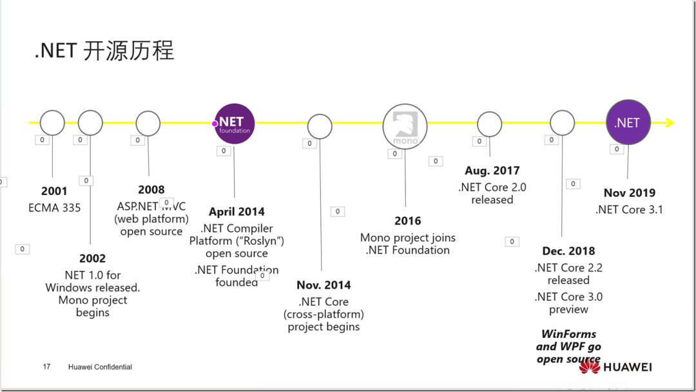

# .NET版本，C#版本，MSBuild版本，Visual Studio版本

[TOC]

---

## 一、相关参考

**1、 [C#版本与.NET版本对应关系](https://www.cnblogs.com/webapi/p/15204940.html)** 

**2、[.NET 版本](https://docs.microsoft.com/zh-cn/dotnet/csharp/whats-new/csharp-version-history)**

**3、[.NET 文档](https://docs.microsoft.com/zh-cn/dotnet/fundamentals/)**

**4、[.NET 6 中的新增功能](https://docs.microsoft.com/zh-cn/dotnet/core/whats-new/dotnet-6)**

**5、[.NET Framework 文档](https://docs.microsoft.com/zh-cn/dotnet/framework/)**

**6、[.NET Blog](https://devblogs.microsoft.com/dotnet/category/csharp/)**

**7、[.NET、MSBuild 和 Visual Studio 版本控制概述](https://docs.microsoft.com/zh-cn/dotnet/core/porting/versioning-sdk-msbuild-vs)**

**8、[C# 11 Preview Updates](https://devblogs.microsoft.com/dotnet/csharp-11-preview-updates/)**

## **二、相关下载**

**1、[.NET下载](https://dotnet.microsoft.com/zh-cn/download)**

**2、[Visual Studio 2022 预览版](https://visualstudio.microsoft.com/zh-hans/vs/preview/)**

**3、[.NET 7.0](https://dotnet.microsoft.com/zh-cn/download/dotnet/7.0)** 

## **三、介绍.NET版本，C#版本之间的关系**

| C#版本/LangVersion | .NET版本             | Visual Studio版本           | MSBuild版本  | 发布日期   | 特性                                                         |
| ------------------ | -------------------- | --------------------------- | ------------ | ---------- | ------------------------------------------------------------ |
| C# 1.0             | .NET Framework 1.0   |                             |              | 2002-02-13 | 委托、事件                                                   |
| C# 1.1             | .NET Framework 1.1   |                             |              | 2003-04-24 | APM（异步编程模型）                                          |
| C# 2.0             | .NET Framework 2.0   | Visual Studio 2005          | MSBuild 2.0  | 2005-11-07 | 泛型、匿名方法、迭代器、可空类型                             |
| C# 3.0             | .NET Framework 3.0   |                             |              | 2007-11-06 | 隐式类型                                                     |
|                    | .NET Framework 3.5   | Visual Studio 2008          |              | 2007-11-19 | 对象集合初始化、自动实现属性、匿名类型、 扩展方法、查询表达式、Lambda表达式、 表达式树、分部类和方法、Linq |
| C# 4.0             | .NET Framework 4.0   | Visual Studio 2010          |              | 2010-04-12 | 动态绑定、命名和可选参数、泛型的协变和逆变、 互操作性,最高支持MVC4.0+EF5，vs2010 |
| C# 5.0             | .NET Framework 4.5   | Visual Studio 2013          |              | 2012-08-15 | 异步和等待(async和await)、调用方信息(Caller Information)， 最高支持mvc5.0+EF6，vs2013 |
| C# 6.0             | .NET Framework 4.6   | Visual Studio 2015          |              | 2015-07-20 | 静态导入、[C# 6 中的新增功能](https://docs.microsoft.com/zh-cn/dotnet/csharp/whats-new/csharp-version-history#c-version-60) vs2015 |
|                    | .NET Core 1.0        |                             |              | 2016-06-27 | asp.net mvc core1                                            |
| C# 7.0             | .NET Framework 4.6.2 | Visual Studio 2017          | MSBuild 16.x | 2016-08-02 | 元组、[C# 7.0 中的新增功能](https://docs.microsoft.com/zh-cn/dotnet/csharp/whats-new/csharp-version-history#c-version-70) 最低系统要求 Windows Server 2008 SP2，vs2017 |
| C# 7.1             | .NET Framework 4.7   | Visual Studio 2017          | MSBuild 16.x | 2017-04-05 | vs2017 version15.3+                                          |
|                    | .NET Core 2.0        | Visual Studio 2017          | MSBuild 16.x | 2016-08-14 | [.NET Core 2.0 的新增功能](https://docs.microsoft.com/zh-cn/dotnet/core/whats-new/dotnet-core-2-0) |
| C# 7.2             | .NET Framework 4.7.1 | Visual Studio 2017          | MSBuild 16.x | 2017-10-17 | vs2017 version15.5+                                          |
| C# 7.3             | .NET Framework 4.7.2 | Visual Studio 2017          | MSBuild 16.x | 2018-04-30 | vs2017 version15.7+                                          |
|                    | .NET Core 2.1        |                             |              | 2018-05-30 | [.NET Core 2.1 的新增功能](https://docs.microsoft.com/zh-cn/dotnet/core/whats-new/dotnet-core-2-1) |
|                    | .NET Core 2.2        |                             |              | 2018-12-04 | [.NET Core 2.2 的新增功能](https://docs.microsoft.com/zh-cn/dotnet/core/whats-new/dotnet-core-2-2) |
| C# 8.0             | .NET Framework 4.8   |                             | MSBuild 16.x | 2019-04-18 | [C# 8.0 中的新增功能](https://docs.microsoft.com/zh-cn/dotnet/csharp/whats-new/csharp-8) |
|                    | .NET Core 3.0        |                             | MSBuild 16.x | 2019-09-23 | [.NET Core 3.0 的新增功能](https://docs.microsoft.com/zh-cn/dotnet/core/whats-new/dotnet-core-3-0) |
|                    | .NET Core 3.1        |                             | MSBuild 16.x | 2019-12-03 | [.NET Core 3.1 的新增功能](https://docs.microsoft.com/zh-cn/dotnet/core/whats-new/dotnet-core-3-1) |
| C# 9.0             | .NET 5               | Visual Studio 2019          | MSBuild 16.x | 2020-09-04 | [C# 9.0 中的新增功能](https://docs.microsoft.com/zh-cn/dotnet/csharp/whats-new/csharp-9)  不再支持asp.net webform、 wcf，必须使用vs预览版 Visual Studio 2019 (v16.6) |
|                    | .NET 5               | Visual Studio 2019          |              | 2020-10-13 | [What's new in .NET 5](https://docs.microsoft.com/zh-cn/dotnet/core/dotnet-five) |
| C# 10              | .NET 6               | Visual Studio 2022          | MSBuild 17.0 | 2021/11/8  | [C# 10 中的新增功能](https://docs.microsoft.com/zh-cn/dotnet/csharp/whats-new/csharp-10) |
| C# 11              | .NET 7 预览版        | Visual Studio 2022（V17.2） |              | 2022/4/13  | [C# 11 中的新增功能](https://docs.microsoft.com/zh-cn/dotnet/csharp/whats-new/csharp-11) |
| C# 12              | .NET 8               | Visual Studio 2022（V17.8） |              | 2023年11月 | [C# 12 中的新增功能](https://learn.microsoft.com/zh-cn/dotnet/csharp/whats-new/csharp-12) |
| C# 13              | .NET 9               |                             |              |            | [C# 13 中的新增功能](https://learn.microsoft.com/zh-cn/dotnet/csharp/whats-new/csharp-13) |

## .NET 的开源历程

## 四、文章推荐

- **[.NET科普：.NET简史、.NET Standard以及C#和.NET Framework之间的关系](https://www.cnblogs.com/daxnet/p/18299758)**
- **[C#.NET体系图文概述—2024最全总结](https://www.cnblogs.com/anding/p/18031760)**
- [**C# 发展历史**](https://learn.microsoft.com/zh-cn/dotnet/csharp/whats-new/csharp-version-history#c-version-80)
- [**C#版本与.NET版本对应关系以及各版本的特性**](https://www.cnblogs.com/mq0036/p/15983912.html)
- [**C# 11 的新特性和改进前瞻**](https://www.cnblogs.com/hez2010/p/whats-new-in-csharp-11.html)
- [**呼吁改正《上海市卫生健康信息技术应用创新白皮书》**](https://www.sohu.com/a/788218506_121124363)
- [**下载 .NET**](https://dotnet.microsoft.com/zh-cn/download/dotnet)
- **[.NET Standard(.net standard 与Framework和.net core之间的关系)](https://dotnet.microsoft.com/en-us/platform/dotnet-standard)**
- **[C# language versioning](https://learn.microsoft.com/en-us/dotnet/csharp/language-reference/language-versioning#defaults)**
- **[Time.Graphics Embed Timeline](https://time.graphics/embed?v=1&id=593132)**
- [[转] C# 语言版本控制-请使用 9.0 或更高的语言版本。 - z5337 - 博客园](https://www.cnblogs.com/z5337/p/18053370)
- [配置语言版本 - C# reference | Microsoft Learn](https://learn.microsoft.com/zh-cn/dotnet/csharp/language-reference/configure-language-version)