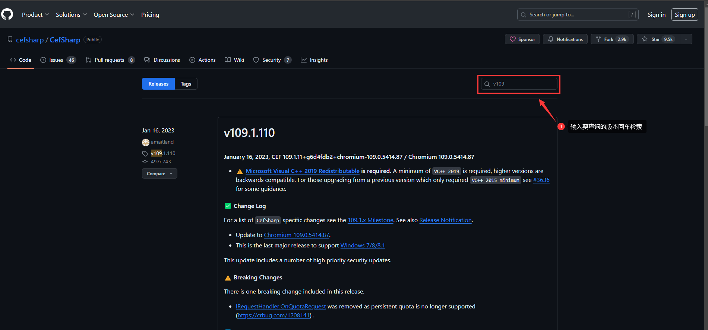

# CefSharp 使用

[TOC]

---

## CEF Bitbucket

### 1、CEF Src Master

 https://bitbucket.org/chromiumembedded/cef/src/master/

### 2、CEF Wiki Home

 https://bitbucket.org/chromiumembedded/cef/wiki/Home

### 3、BranchesAndBuilding

CEF 分支（发布的版本）及Windows构建环境要求

 https://bitbucket.org/chromiumembedded/cef/wiki/BranchesAndBuilding.md

## CEF GitHub

### 1、CefSharp Code

 https://github.com/cefsharp/CefSharp

### 2、CefSharp Release

CefSharp发布的版本

 https://github.com/cefsharp/CefSharp/releases

### 3、Cef版本和VC++版本

[Release Branches](https://github.com/cefsharp/CefSharp?tab=readme-ov-file#release-branches)

### 4、CefSharp中文帮助文档

 [CefSharp中文帮助文档 · cefsharp/CefSharp Wiki · GitHub](https://github.com/cefsharp/CefSharp/wiki/CefSharp中文帮助文档)

 [CSDN：CefSharp中文帮助文档](https://blog.csdn.net/fuhanghang/article/details/110468063)

### 5、Output files description table (Redistribution)

 https://github.com/cefsharp/CefSharp/wiki/Output-files-description-table-(Redistribution)

## CefSharp几个重要的版本

| CefSharp版本                                                 | CEF Version | VC++ Version | .Net Version | 备注                                                         |
| ------------------------------------------------------------ | ----------- | ------------ | ------------ | ------------------------------------------------------------ |
| [cefsharp/115](https://github.com/cefsharp/CefSharp/tree/cefsharp/115) | 5790        | 2019*        | 4.6.2**      | Framework要求4.6.2                                           |
| [cefsharp/109](https://github.com/cefsharp/CefSharp/tree/cefsharp/109) | 5414        | 2019*        | 4.5.2**      | ==最后支持Windows 7/8/8.1的版本==                            |
| [cefsharp/93](https://github.com/cefsharp/CefSharp/tree/cefsharp/93) | 4577        | 2019*        | 4.5.2**      | VC++使用2019                                                 |
| [cefsharp/92](https://github.com/cefsharp/CefSharp/tree/cefsharp/92) | 4515        | 2015*        | 4.5.2**      | 最后支持VC++2015的版本                                       |
| [cefsharp/v87.1.132](https://github.com/cefsharp/CefSharp/releases/tag/v87.1.132) | 4280        | 2015*        | 4.5.2**      | ==[支持AnyCpu配置](https://github.com/cefsharp/CefSharp/issues/1714)== |
| [cefsharp/49](cefsharp/49)                                   | 2623        | 2013         | 4.0          | ==最后支持Xp的版本==                                         |

## Q&A

<span style="color:blue;font-weight:bold;">为什么cefsharp/49是最后支持Xp的版本？</span>

> 在Windows Xp系统上能安装的最高Framework版本为Framework4.0（Windows XP的支持已经于2014年4月8日终止）。而高于cefsharp/49版本的Framework版本要求为Framework4.5.2，受限于此因此cefsharp/49是最后支持Xp的版本。

<span style="color:blue;font-weight:bold;">如何查阅cefsharp发布版本的详细信息？</span>

> 1. 打开cefsharp releases https://github.com/cefsharp/CefSharp/releases
>
> 2. 然后在右侧的搜索栏中检索相应的发布版本信息，如下图所示
>
>    

<span style="color:blue;font-weight:bold;">CefSharp.Common is unable to proceeed as your current Platform is 'AnyCPU'. To target AnyCPU please read https://github.com/cefsharp/CefSharp/issues/1714. Alternatively change your Platform to x86 or x64 and the relevant files will be copied automatically. For details on changing your projects Platform see https://docs.microsoft.com/en-gb/visualstudio/ide/how-to-configure-projects-to-target-platforms?view=vs-2017 编译报错如何处理？</span>

> 此报错问题的原因是当前安装的CEF版本中的CefSharp.Common程序集不支持AnyCpu的配置，必须更改配置为x64或x86。

<span style="color:blue;font-weight:bold;">cefsharp支持AnyCpu配置的最低版本？</span>

> [v87.1.132](https://github.com/cefsharp/CefSharp/releases/tag/v87.1.132) 版本中的 [#3319](https://github.com/cefsharp/CefSharp/issues/3319)重构了Nuge包以支持AnyCpu.
>
> **UPDATE**: Starting with release [v87.1.132](https://github.com/cefsharp/CefSharp/releases/tag/v87.1.132) the `Nuget` packages have been restructured to greatly simplify using `AnyCPU`. Issue [#3319](https://github.com/cefsharp/CefSharp/issues/3319) has some specific information.

<span style="color:blue;font-weight:bold;">cefsharp支持AnyCpu的配置方式有几种？</span>

>  https://github.com/cefsharp/CefSharp/issues/1714
>
> 通常采用第四种，在配置文件app.config中增加如下配置
>
> ```xml
> <?xml version="1.0"?>
> <configuration>
> <startup><supportedRuntime version="v4.0" sku=".NETFramework,Version=v4.5.2"/></startup>
>   <!--<runtime>
>     <assemblyBinding xmlns="urn:schemas-microsoft-com:asm.v1">
>       <probing privatePath="MyCefSharpTargetDir"/>
>     </assemblyBinding>
>   </runtime>-->
>   <runtime>
>     <assemblyBinding xmlns="urn:schemas-microsoft-com:asm.v1">
>       <dependentAssembly>
>         <assemblyIdentity name="CefSharp.Core.Runtime" processorArchitecture="x86" publicKeyToken="40c4b6fc221f4138" culture="neutral"/>
>         <codeBase version="89.0.170.0" href="x86/CefSharp.Core.Runtime.dll"/>
>       </dependentAssembly>
>       <dependentAssembly>
>         <assemblyIdentity name="CefSharp.Core.Runtime" processorArchitecture="amd64" publicKeyToken="40c4b6fc221f4138" culture="neutral"/>
>         <codeBase version="89.0.170.0" href="x64/CefSharp.Core.Runtime.dll"/>
>       </dependentAssembly>
>     </assemblyBinding>
>   </runtime>
> 
> </configuration>
> ```


## 推荐阅读

1. [CefSharp 知道这些就完事了](https://blog.csdn.net/hcmdghv587/article/details/106279735)
2. [关于CefSharp的坎坷之路](https://www.cnblogs.com/M-Silencer/p/5846494.html)
2. [Chrome发布109正式版：Win7/8.1平台最后一次更新](https://baijiahao.baidu.com/s?id=1754687761569778706)
