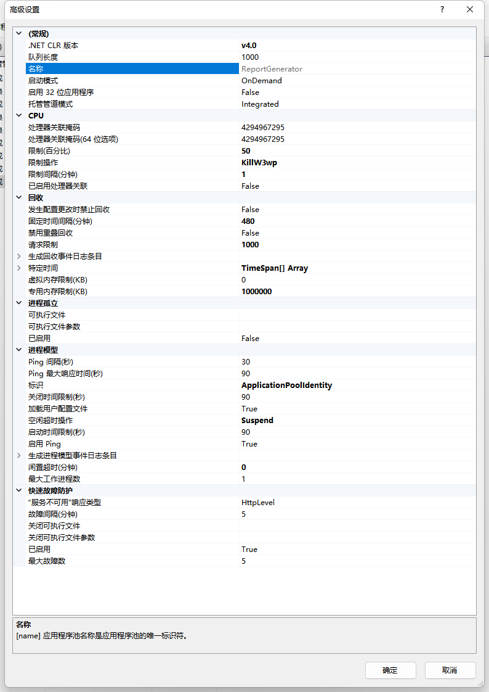

# IIS之应用程序池

[TOC]

## 名词说明

### 回收

先停止，然后自动启动。释放应用程序池使用的资源。

## 应用程序池高级设置

应用程序池配置说明：[system.applicationhost/applicationpools/](https://learn.microsoft.com/zh-cn/iis/configuration/system.applicationhost/applicationpools/)

### 常规

参考文章：[applicationpools/add/](https://learn.microsoft.com/zh-cn/iis/configuration/system.applicationhost/applicationpools/add/)

#### .NET CLR版本 [managedRuntimeVersion]

.NET 应用程序池所使用的运行时版本

#### 队列长度 [queueLength]

HTTP.sys 将针对应用程序池排队的最大请求数。如果队列已满，新请求将收到 503“服务不可用”的响应。默认队列长度设置是**1000**，范围在10-65535 之间。　

#### 名称 [name]

应用程序池名称是应用程序池的唯一标识符。

#### 启动模式 [startMode]

指定应用程序池的启动类型，默认值为 `OnDemand`（按需运行模式）。

##### 始终运行模式 [AlwaysRunning]

指定 Windows 进程激活服务 (WAS) 将始终启动应用程序池。 此行为允许应用程序在为任何 HTTP 请求提供服务之前加载操作环境，从而减少应用程序初始 HTTP 请求的启动处理。

##### 按需运行模式 [OnDemand]

指定当为应用程序池中托管的应用程序发出 HTTP 请求时，Windows 进程激活服务 (WAS) 将启动应用程序池。 此行为类似于早期版本的 IIS 中的 WAS 行为。

#### enable32BitAppOnWin64 [启用 32 位应用程序]

如果 **为 true**，则允许 32 位应用程序在运行 64 位版本的 Windows 的计算机上运行。

#### 托管管道模式 [managedPipelineMode]

##### 经典模式 [Integrated]

指的是与IIS6或者之前版本保持兼容的一种模式。在IIS6.0中的经典模式中，ASP.NET是一个添加到IIS中的ISAPI。IIS7.0之所以支持这种模式，是为了做到向后兼容。但是，经典模式缺少许多集成模式才能提供的特性。在经典模式中，IIS拥有自身的管道，这些管道可以通过创建一个ISAPI扩展进行扩充，而ISAPI扩展是以难以开发而著称的。ASP.NET作为一个ISAPI扩展运行，只是IIS管道中的一项组成部分。

==注意：==在这种情况下，ASP.NET仅当IIS处理ISAPI扩展时才能够发挥作用。

##### 集成模式 [Classic]

这种全新的模式，允许将ASP.NET更好地与IIS集成，甚至允许在ASP.NET中编写一些功能（例如Module）来改变IIS的行为（扩展）。集成的好处是，不再通过ISAPI的方式，提高了速度和稳定性。至于扩展，则可以使得对于IIS以及其他类型的请求有更多的控制。

利用集成模式，可以将ASP.NET作为IIS的有机组成部分。现在，IIS服务器的功能被划分为40多个模块，因此也就将IIS和ASP.NET的功能划分为不同的组成部分。诸如StaticFileModule、BasicAuthenticationModule、FormsAuthentication、Session、Profile，以及RoleManager等模块都是IIS管道的组成部分。

==注意：==FormsAuthentication、Session、Profile，以及RoleManager原本就是ASP.NET的组成部分，与IIS并无关系。

参考：[IIS 经典模式和集成模式的区别分析](https://blog.csdn.net/songjuntao8/article/details/119064971)

### CPU

参考文章：[applicationpools/add/cpu](https://learn.microsoft.com/zh-cn/iis/configuration/system.applicationhost/applicationpools/add/cpu)

#### 处理器关联掩码 [smpProcessorAffinityMask]

强制此应用程序池的工作进程在特定 CPU 上运行的十六进制掩码。如果启用了处理器关联，则值 0 将导致错误。　

默认值为 `4294967295`。　

#### 处理器关联掩码（64 位选项） [smpProcessorAffinityMask2]

为64位计算机制定强制此应用程序池的工作进程在特定 CPU 上运行的高顺序 DWORD 十六进制掩码。在 64 位计算机上，smpProcessorAffinityMask 特性包含处理器掩码的低顺序 DWORD ，而 smpProcessorAffinityMask2 特性包含处理器掩码的高顺序 DWORD。

默认值为 `4294967295`。

#### 限制（百分比） [limit]

配置允许应用程序池中的工作进程在" CPU 限制间隔 "属性指示的时间段内使用的 CPU 时间的最大百分比。如果超过“ CPU 限制 ”属性设置的限制，系统将向事件日志写入一个事件，并且可能触发一组可选事件（由“CPU 限制操作”属性决定）。如果将此属性的值设为 0 ，将禁止将工作进程限制为 CPU 时间的百分比。

#### 限制操作 [action]

操作属性可以是下列可能值之一。 默认值为 `NoAction`。

| 值                  | 说明                                                         |
| :------------------ | :----------------------------------------------------------- |
| `NoAction`          | 超出 CPU 限制时不执行任何操作。 警告将写入事件日志。数值为 `0`. |
| `KillW3wp`          | 超出 CPU 限制的应用程序池辅助进程将被迫关闭。数值为 `1`.     |
| `Throttle`          | CPU 消耗限制为“限制”中设置的值。 不使用“限制”间隔，并生成事件日志条目。数值为 `2`. |
| `ThrottleUnderLoad` | 仅当 CPU 上存在争用时，CPU 消耗才受到限制。 不使用“限制”间隔，并生成事件日志条目。数值为 `3`. |

#### 限制间隔（分钟） [resetInterval]

指定用于应用程序池的 CPU 监视和限制的重设期限（以分钟为单位）。如果自上次进程计帐重设以来所经过的分钟数等于此属性指定的分钟数，IIS 将重设日志和限制间隔的 CPU 计时器。将此属性的值设为 0 将禁用 CPU 监视。　

默认值为 `00:05:00` 5分钟。

#### 已启用处理器关联 [smpAffinitized]

如果设为 True ，“处理器关联掩码”属性会强制为此应用程序池提供服务的工作进程在特定的 CPU 上运行。这样便可以在多处理服务器中有效使用 CPU 缓存。

此属性与 **smpProcessorAffinityMask** 和 **smpProcessorAffinityMask2** 属性一起使用。

默认值为 `false`。

### 回收

参考文章：[applicationpools/add/recycling/](https://learn.microsoft.com/zh-cn/iis/configuration/system.applicationhost/applicationpools/add/recycling/)

#### 发生配置更改时禁止回收 [disallowRotationOnConfigChange]

如果为 True，应用程序池在发生配置更改时将不会回收。

默认为false。

#### 固定时间间隔（分钟） [time]

一个时间段（以分钟为单位），超过该时间后，应用程序池将回收。值为 0 意味着应用程序池不会按固定间隔回收。

默认为

默认为1740分钟，29小时。

#### 禁用重叠回收 [disallowOverlappingRotation]

如果为 True ,将发生应用程序池回收，以便在创建另一个工作进程之前退出现有工作进程。如果工作进程加载不支持多个实例的应用程序，请将该属性设为True。

默认为false。

#### 请求限制 [requests]

指定在处理特定数量的请求后应回收工作进程。

默认值为 `0`

#### 生成回收事件日志条目 [logEventOnRecycle]

每发生一次指定的回收事件时便生成一个事件日志条目。

| Value            | Description                                                  |
| :--------------- | :----------------------------------------------------------- |
| `ConfigChange`   | Log an event when an application pool recycles because of a configuration change.  The numeric value is `64`. |
| `IsapiUnhealthy` | Log an event when an application pool recycles after an ISAPI extension reports to the worker process that it is in an unhealthy state. The numeric value is `16`. |
| `Memory`         | Log an event when an application pool recycles after it uses a specified amount of virtual memory.  The numeric value is `8`. |
| `OnDemand`       | Log an event when an application pool is recycled immediately to correct a problem.  The numeric value is `32`. |
| `PrivateMemory`  | Log an event when an application pool recycles after it uses a specified amount of virtual memory.  The numeric value is `128`. |
| `Requests`       | Log an event when an application pool recycles after it reaches a configured number of requests.  The numeric value is `2`. |
| `Schedule`       | Log an event when an application pool recycles after it reaches a configured time of day.  The numeric value is `4`. |
| `Time`           | Log an event when an application pool recycles after a configured time.  The numeric value is `1`. |

#### 特定时间 [schedule]

应用程序池进行回收的一组特定的本地时间（24小时制）。　

#### 虚拟内存限制（KB） [memory]

指定工作进程在回收工作进程之前可以使用的虚拟内存量 (以 KB 为单位) 。

默认值为 `0`禁用属性。

#### 专用内存限制（KB）[privateMemory]

指定工作进程回收前可以使用的以 KB 为单位的专用内存量 。

默认值为 `0`禁用属性。

### 进程孤立

参考文章：[applicationpools/add/failure](https://learn.microsoft.com/zh-cn/iis/configuration/system.applicationhost/applicationpools/add/failure)

#### 可执行文件 [orphanActionExe]

当工作进程被废弃（孤立）时运行的可执行文件。例如，“C:\dbgtools\ntsd.exe”将调用 NTSD 来调试工作进程故障。

#### 可执行文件参数 [orphanActionParams]

当工作进程被废弃（孤立）时所运行的可执行文件的参数。例如，如果 NTSD 是为调试工作进程故障而调用的可执行文件，则“-g -p %1%”适用。

#### 已启用 [orphanWorkerProcess]

如果设为True ，则无响应的工作进程将被废弃（孤立），而不是终止。可以使用此功能来调试工作进程故障。

默认为false。

### 进程模型

参考文章：[applicationpools/add/processmodel](https://learn.microsoft.com/zh-cn/iis/configuration/system.applicationhost/applicationpools/add/processmodel)

#### Ping 间隔（秒）[pingInterval]

向工作进程发送健康状况监视 ping 所间隔的时间段（以秒为单位）。

默认值 `00:00:30` (30 秒) 。

#### Ping 最大响应时间（秒）[pingResponseTime]

工作进程响应健康状况监视 ping 的最长时间（以秒为单位）。如果工作进程不响应，将被终止。

默认值 `00:01:30` (1 分 30 秒) 。

#### 标识 [identityType]

指定运行应用程序池的帐户标识。

#### 关闭时间限制（秒）[shutdownTimeLimit]

指定 W3SVC 服务启动回收后等待的时间。 如果工作进程未在 **shutdownTimeLimit** 中关闭，则 W3SVC 服务将终止该进程。

默认值 `00:01:30` (1 分 30 秒) 。

#### 加载用户配置文件 [loadUserProfile]

指定 IIS 是否加载应用程序池标识的用户配置文件。 将此值设置为 **false** 会导致 IIS 还原为 IIS 6.0 行为。 IIS 6.0 不会加载应用程序池标识的用户配置文件。

默认值为 `false`。

#### 空闲超时操作 [idleTimeoutAction]

| 值          | 说明                                                         |
| :---------- | :----------------------------------------------------------- |
| `Terminate` | 终止空闲工作进程。 这需要更长的启动期，即用户随后访问站点并启动辅助进程。  数值为 `0`. |
| `Suspend`   | 挂起空闲的工作进程。 这会使工作进程保持活动状态，但已从内存移动到磁盘，从而减少系统资源消耗。 当请求随后出现时，内存管理器会加载请求从磁盘到内存所需的页面文件，这有可能使工作进程比以前终止的更快。  数值为 `1`. |

#### 启动时间限制（秒）[startupTimeLimit]

指定 IIS 等待应用程序池启动的时间。 如果应用程序池未在 **startupTimeLimit** 中启动，则终止工作进程并递增快速失败保护计数。

默认值 `00:01:30` (1 分 30 秒) 。

#### 启用 Ping [pingingEnabled]

指定是否为工作进程启用 ping。

默认值为 `true`。

#### 生成进程模型事件日志条目 [logEventOnProcessModel]

指定将进程中执行的操作记录到事件查看器。 在 IIS 8.0 中，应用的唯一操作是空闲超时操作，在该操作中，进程因空闲时间处于空闲状态而终止。

标志名称等于 `IdleTimeout`。 值为 `1`。

默认值为 `IdleTimeout`。

#### 闲置超时（分钟）[idleTimeout]

指定当未收到新请求且工作进程未处理请求时，工作进程在 **idleTimeout** 分配的时间过后，工作进程应请求由 WWW 服务关闭。

默认值为 `00:20:00`。

若要禁用空闲超时功能，请将此值设置为 `00:00:00`。

#### 最大工作进程数 [maxProcesses]

指示将用于应用程序池的最大工作进程数。

- 值为“1”表示应用程序池的最大单个工作进程。 这将是没有 NUMA 节点的服务器上的设置。
- 值“2”或更多表示使用多个辅助进程的应用程序池 (的 Web 花园（如有必要) ）。
- 值“0”指定 IIS 运行与 NUMA () 节点的非统一内存访问数相同的工作进程数。 IIS 标识硬件上可用的 NUMA 节点数，并启动相同数量的辅助进程。 例如，如果有四个 NUMA 节点，它将为该应用程序池使用最多四个工作进程。 在此示例中，将 maxProcesses 设置为值“0”或“4”将具有相同的结果。

默认值为 `1`。

### 快速故障防护

参考文章：[applicationpools/add/failure](https://learn.microsoft.com/zh-cn/iis/configuration/system.applicationhost/applicationpools/add/failure)

#### “服务不可用”响应类型 [loadBalancerCapabilities]

如果设为 HttpLevel,那么当应用程序池停止时， HTTP.sys 将返回 HTTP 503 错误。如果设为 TcpLevel，HTTP.sys 将重置连接。如果负载平衡器识别其中一种响应类型，并随后重定向该类型，则此设置非常有用。

#### 故障间隔（分钟）[rapidFailProtectionInterval]

应用程序池发生指定数量的工作进程崩溃（最大故障数）的最短时间间隔（以分钟为单位）。如果低于此间隔，应用程序池将被快速故障防护功能关闭。

#### 关闭可执行文件[autoShutdownExe]

当应用程序池被快速故障防护功能关闭时所运行的可执行文件。可以使用它来配置负载平衡器，将此应用程序池的通信重定向至其他服务器。

#### 关闭可执行文件参数 [autoShutdownParams]

当应用程序池被快速故障防护功能关闭时运行的可执行文件的参数。

#### 已启用 [rapidFailProtection]

如果设为 True，则当在指定的时间段（故障间隔）内出现指定数量的工作进程崩溃（最大故障数）的情况时，应用程序池将被关闭。默认情况下，如果在5分钟的间隔内发生5次崩溃，应用程序池将被关闭。

#### 最大故障数 [rapidFailProtectionMaxCrashes]

应用程序池被快速故障防护功能关闭之前允许的最大工作进程崩溃数。

## 相关疑问

1. CPU设置中，当limit=50%，action=`KillW3wp`，resetInterval=1时。
   当CPU使用率超过50%时，线程池是否会被关闭，关闭后1分钟（resetInterval指定的时间后）线程池是否会自动重启？
2. CPU设置中，当limit=50%，action=`Throttle`，resetInterval=1时。
   当CPU使用率飙升要超过50%时，会发生什么？

欢迎大家参与讨论，并能解决我上面的疑惑，不胜感激！

## 相关参考

1. [IIS应用程序池高级设置各参数详解](https://blog.csdn.net/zeromess/article/details/125521073)
1. [IIS基本设置、回收机制、性能、并发、安全性](https://blog.csdn.net/meanshe/article/details/118387326)
