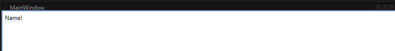

# WPF学习笔记

[TOC]

---

## .NET、.NET Core 和 .NET Framework 桌面指南

欢迎使用桌面指南。 桌面指南是一组适用于基于 .NET 的 Windows UI 技术（包括 Windows Presentation Foundation (WPF) 和 Windows 窗体 (WinForms)）的文档。 桌面指南涵盖 .NET 5（和 .NET Core 3.1）及更高版本，以及 .NET Framework。

[**DotNet Desktop**](https://learn.microsoft.com/zh-cn/dotnet/desktop/)


## Windows Presentation Foundation 文档

了解如何在 .NET 8 上使用 Windows Presentation Foundation (WPF)，这是一种适用于 Windows 的开放源代码图形用户界面。

[**WPF Docs**](https://learn.microsoft.com/zh-cn/dotnet/desktop/wpf/?view=netdesktop-6.0)


## Windows Presentation Foundation

了解如何在 .NET Framework 4.x 上使用 Windows Presentation Foundation (WPF)，Windows Presentation Foundation (WPF) 向开发人员提供了一个统一的编程模型，可用于在 Windows 上生成业务线桌面应用程序。

[**WPF Docs**](https://learn.microsoft.com/zh-cn/dotnet/desktop/wpf/?view=netframeworkdesktop-4.8&preserve-view=true)


## WPF 布局


### 相关参考

1. [WPF中的常用布局](https://www.cnblogs.com/laizhenghong2012/p/8832562.html)


## WPF 数据绑定

### 设计时的数据绑定

> 有些布局没有数据很难进行可视化。 在本文档中，我们将审查从事桌面项目的开发人员可在 XAML 设计器中模拟数据的一种方法。 此方法是使用现有可忽略的“d:”命名空间来实现的。 利用这种方法，可快速将设计时数据添加到页面或控件中，而无需创建完整的模拟视图模型，或者只需测试属性更改会如何影响应用程序，而无需担心这些更改会影响你的发布版本。 所有 d: 数据仅由 XAML 设计器使用，无可忽略的命名空间值编译到应用程序中。

#### 设计时数据基本信息

设计时数据是你设置的模拟数据，使控件更易于在 XAML 设计器中进行可视化。 首先，将以下代码行添加到 XAML 文档的标头（如果这些代码行尚不存在）：

```xaml
xmlns:d="http://schemas.microsoft.com/expression/blend/2008"
xmlns:mc="http://schemas.openxmlformats.org/markup-compatibility/2006"
mc:Ignorable="d"
```

添加命名空间后，可将 `d:` 置于任何特性或控件之前，使其仅在 XAML 设计器中显示，而不在运行时显示。

例如，可将文本添加到通常绑定了数据的 TextBlock。

```xaml
<TextBlock Text="{Binding Name}" d:Text="Name!" />
```



#### 推荐阅读

1. **[在 Visual Studio 中通过 XAML 设计器使用设计时数据](https://learn.microsoft.com/zh-cn/visualstudio/xaml-tools/xaml-designtime-data?view=vs-2022)**
2. **[将设计时示例数据与 Visual Studio 中的 XAML 设计器结合使用](https://learn.microsoft.com/zh-cn/visualstudio/xaml-tools/xaml-designtime-data?view=vs-2022)**
3. **[设计时特性](https://learn.microsoft.com/zh-cn/previous-versions/visualstudio/visual-studio-2010/ee839627(v=vs.100))**


## FAQ

<h3 style="border-left:6px solid #2196F3;background:#ddffff;padding:14px;font-size:16px;letter-spacing:1px;">1. 什么是WPF？</h3>

WPF（Windows Presentation Foundation）是微软公司开发的一种用于创建Windows应用程序的用户界面框架。它是.NET Framework的一部分，提供了一种基于XAML（可扩展应用程序标记语言）的方式来构建富客户端应用程序。

WPF具有以下特点：

矢量图形：WPF支持矢量图形，可以实现高质量的图形渲染，使应用程序具有更好的外观和用户体验。
数据绑定：WPF提供了强大的数据绑定机制，可以将数据与用户界面元素进行关联，实现数据的自动更新和同步。
样式和模板：WPF允许开发人员使用样式和模板来定义应用程序的外观和布局，使界面设计更加灵活和可定制。
动画和转换：WPF支持丰富的动画和转换效果，可以为应用程序添加生动和吸引人的交互效果。
响应式布局：WPF使用基于容器的布局模型，可以自动调整和适应不同大小和分辨率的屏幕，提供更好的跨平台和响应式设计。
总之，WPF是一种强大的用户界面框架，可以帮助开发人员构建现代化、可定制和具有良好用户体验的Windows应用程序。

[什么是 WPF？](https://learn.microsoft.com/zh-cn/visualstudio/get-started/visual-basic/tutorial-wpf?view=vs-2022#what-is-wpf)

<h3 style="border-left:6px solid #2196F3;background:#ddffff;padding:14px;font-size:16px;letter-spacing:1px;">2. 说说WPF中的XAML是什么？为什么需要它？它只存在于WPF吗？</h3>

XAML（可扩展应用程序标记语言）是一种基于XML的标记语言，用于定义WPF应用程序的用户界面和对象的结构。它是WPF中的一部分，但也被用于其他.NET技术，如Silverlight和UWP（Universal Windows Platform）应用程序。

XAML的存在有以下几个原因：

**1、分离界面和逻辑：**XAML允许开发人员将界面设计与应用程序逻辑分离，使得界面设计师和开发人员可以并行工作，提高开发效率。

**2、可读性和可维护性：**XAML使用类似于HTML的标记语法，易于阅读和理解。它提供了一种声明性的方式来描述界面元素和其属性，使得界面的修改和维护更加方便。

**3、数据绑定和样式：**XAML提供了强大的数据绑定机制和样式定义，可以将界面元素与数据源关联，并通过样式和模板来定义元素的外观和行为。

**4、可扩展性：**XAML是可扩展的，可以通过自定义标记和扩展来满足特定的需求，使开发人员能够更好地适应不同的应用场景。

尽管XAML最初是为WPF设计的，但它也被广泛应用于其他.NET技术中。例如，Silverlight和UWP应用程序也使用XAML来定义界面和对象结构。因此，XAML不仅存在于WPF，还存在于其他.NET平台和技术中。

<h3 style="border-left:6px solid #2196F3;background:#ddffff;padding:14px;font-size:16px;letter-spacing:1px;">3. 简单描述下WPF的样式？</h3>

WPF的样式是一种用于定义界面元素外观和行为的机制。它允许开发人员通过集中定义和应用样式，来实现界面的一致性和可定制性。

WPF样式具有以下特点：

**1、外观定义：**样式可以定义界面元素的外观，包括背景、前景、边框、字体等。通过样式，可以统一应用程序中的元素外观，使其具有一致的风格。

**2、行为定义：**样式还可以定义界面元素的行为，例如鼠标悬停效果、点击效果等。通过样式，可以为元素添加交互效果，提升用户体验。

**3、层级结构：**WPF样式支持层级结构，可以定义基本样式，并在其基础上进行扩展和修改。这样可以实现样式的继承和重用，提高开发效率。

**4、动态样式：**WPF样式支持动态更新，可以根据应用程序的状态或用户的操作来改变样式。这样可以实现动态的界面效果，增强应用程序的交互性。

样式可以在XAML中定义，并通过键值对的方式应用到界面元素上。开发人员可以通过在应用程序的资源字典中定义样式，或者直接在元素的属性中指定样式来应用样式。

总之，WPF的样式是一种强大的机制，可以帮助开发人员定义和应用界面元素的外观和行为，实现界面的一致性和可定制性。

<h3 style="border-left:6px solid #2196F3;background:#ddffff;padding:14px;font-size:16px;letter-spacing:1px;">4. WPF 中的资源是什么？</h3>

在WPF中，资源是一种用于定义和管理可重用对象的机制。资源可以是各种类型的对象，如样式、模板、数据、图像等，它们可以在应用程序中被多个元素共享和重用。

WPF中的资源具有以下特点：

**1、全局性：**资源可以在整个应用程序范围内访问和使用，不受特定元素的限制。这意味着资源可以在不同的窗口、页面或用户控件中共享和重用。

**2、层级结构：**WPF资源支持层级结构，可以在应用程序级别、窗口级别、页面级别或元素级别定义和使用。这样可以实现资源的继承和覆盖，提供更灵活的资源管理。

**3、静态和动态：**资源可以是静态的，即在XAML中直接定义；也可以是动态的，即在代码中动态创建和添加。这样可以根据应用程序的需求来选择合适的资源定义方式。

**4、资源字典：**WPF中的资源通常被组织在资源字典中，资源字典是一种集合，可以包含多个资源定义。资源字典可以在XAML中直接定义，也可以通过外部文件导入。

通过使用资源，开发人员可以实现以下目标：

**1、提高开发效率：**资源可以被多个元素共享和重用，避免了重复定义和修改的工作，提高了开发效率。

**2、统一外观和行为：**通过定义样式、模板等资源，可以实现界面元素的一致性，使应用程序具有统一的外观和行为。

**3、管理和修改方便：**通过集中管理资源，可以方便地修改和更新资源，而不需要逐个修改每个元素的属性。

总之，WPF中的资源是一种用于定义和管理可重用对象的机制，可以提高开发效率、统一界面风格，并方便地管理和修改资源。

<h3 style="border-left:6px solid #2196F3;background:#ddffff;padding:14px;font-size:16px;letter-spacing:1px;">5. WPF中的Visibility.Collapsed和Visibility.Hidden有什么区别？</h3>

在WPF中，Visibility.Collapsed和Visibility.Hidden是用于控制界面元素可见性的枚举值。

Visibility.Collapsed：当一个元素的可见性设置为Collapsed时，该元素将不会占用任何空间，并且不会显示在界面上。与之相对的是Visibility.Visible，表示元素可见并占用空间。

Visibility.Hidden：当一个元素的可见性设置为Hidden时，该元素将不会显示在界面上，但仍然会占用相应的空间。与之相对的是Visibility.Visible，表示元素可见并占用空间。

因此，Visibility.Collapsed和Visibility.Hidden的区别在于是否占用空间。Collapsed会使元素不占用空间，而Hidden仅隐藏元素但仍占用空间。

使用Collapsed可以在需要时动态地隐藏元素，并且不会影响布局。而使用Hidden可以在需要时隐藏元素，但仍然保留其占用的空间，可能会影响布局。

根据具体的需求，开发人员可以选择使用Collapsed或Hidden来控制元素的可见性。

<h3 style="border-left:6px solid #2196F3;background:#ddffff;padding:14px;font-size:16px;letter-spacing:1px;">6. 什么是静态资源和动态资源？</h3>

在WPF中，静态资源和动态资源是用于定义和管理可重用对象的两种不同方式。

**1、静态资源：**静态资源是在XAML中直接定义的资源，其值在编译时确定并保持不变。静态资源可以通过资源字典或资源文件定义，并通过键值对的方式在XAML中引用和应用。一旦静态资源被定义，它可以在整个应用程序中被多个元素共享和重用。静态资源的值在应用程序运行期间保持不变，除非手动修改或重新加载资源。
**2、动态资源：**动态资源是在代码中动态创建和添加的资源，其值可以在运行时根据应用程序的状态或用户的操作进行修改。动态资源通常通过代码来创建和管理，可以在需要时动态地添加、修改或移除。与静态资源不同，动态资源的值可以在应用程序运行期间发生变化，以适应不同的场景和需求。
使用静态资源可以在应用程序中实现资源的统一管理和重用，提高开发效率和维护性。而使用动态资源可以根据应用程序的需求来动态地修改和更新资源，实现更灵活的界面效果和交互。开发人员可以根据具体的场景和需求选择使用静态资源或动态资源来管理和应用可重用对象。

<h3 style="border-left:6px solid #2196F3;background:#ddffff;padding:14px;font-size:16px;letter-spacing:1px;">7. WPF中控件的分类？</h3>

在WPF中，控件可以按照其功能和用途进行分类。以下是常见的WPF控件分类：

**1、基本控件（Basic Controls）：**这些是WPF中最基本的控件，用于构建用户界面的基本元素，如Button（按钮）、TextBox（文本框）、Label（标签）、CheckBox（复选框）、RadioButton（单选按钮）等。

**2、布局控件（Layout Controls）：**这些控件用于在界面中组织和布局其他控件，以实现界面的结构和排列。常见的布局控件包括Grid（网格）、StackPanel（堆栈面板）、WrapPanel（自动换行面板）、DockPanel（停靠面板）等。

**3、容器控件（Container Controls）：**这些控件用于容纳其他控件，并提供额外的功能和样式。常见的容器控件包括GroupBox（分组框）、TabControl（选项卡控件）、Expander（可展开控件）、ScrollViewer（滚动视图控件）等。

**4、数据控件（Data Controls）：**这些控件用于显示和操作数据，通常与数据绑定一起使用。常见的数据控件包括ListBox（列表框）、ListView（列表视图控件）、DataGrid（数据表格控件）、ComboBox（下拉框）等。

**5、图形控件（Graphics Controls）：**这些控件用于绘制和显示图形、图像和形状。常见的图形控件包括Image（图像控件）、Canvas（画布控件）、Rectangle（矩形控件）、Ellipse（椭圆控件）等。

**6、导航控件（Navigation Controls）：**这些控件用于实现应用程序的导航和页面切换。常见的导航控件包括Frame（框架控件）、Page（页面控件）、NavigationWindow（导航窗口控件）等。

**7、模板控件（Template Controls）：**这些控件用于自定义和重写控件的外观和行为。常见的模板控件包括ControlTemplate（控件模板）、DataTemplate（数据模板）、Style（样式）等。

这些是WPF中常见的控件分类，每个分类中都有更多的具体控件可供使用。开发人员可以根据应用程序的需求选择合适的控件来构建用户界面。

<h3 style="border-left:6px solid #2196F3;background:#ddffff;padding:14px;font-size:16px;letter-spacing:1px;">8. WPF中的命令设计模式是什么？</h3>

WPF中的命令设计模式是一种用于处理用户界面操作的模式。它将用户界面操作（如按钮点击、菜单选择等）与执行操作的逻辑代码分离，使得代码更加可维护和可重用。

在WPF中，命令设计模式由以下几个关键组件组成：

**1、命令（Command）：**命令是一个抽象类，定义了执行操作的方法（Execute）和判断是否可以执行操作的方法（CanExecute）。

**2、命令目标（Command Target）：**命令目标是指接收命令的对象，通常是用户界面元素（如按钮、菜单项等）。

**3、命令绑定（Command Binding）：**命令绑定是将命令与命令目标关联起来的机制。通过命令绑定，可以将命令与用户界面元素的事件（如按钮的点击事件）关联起来。

**4、命令参数（Command Parameter）：**命令参数是传递给命令的额外信息，可以用于在执行命令时进行一些特定的操作。

使用命令设计模式，可以将用户界面操作的逻辑代码从界面代码中分离出来，使得代码更加清晰和可维护。此外，命令还可以通过CanExecute方法来控制命令是否可用，从而实现界面元素的禁用和启用。

<h3 style="border-left:6px solid #2196F3;background:#ddffff;padding:14px;font-size:16px;letter-spacing:1px;">9. XML和XAML有什么区别？</h3>

XML（可扩展标记语言）和XAML（可扩展应用程序标记语言）都是基于标记的语言，用于描述和表示数据和结构。它们在某些方面有相似之处，但也有一些区别。

1、用途：XML主要用于存储和传输数据，它是一种通用的标记语言，可以用于描述各种类型的数据。而XAML主要用于描述用户界面和应用程序的结构，它是一种特定领域的标记语言，用于构建WPF、Silverlight和UWP等应用程序的用户界面。

2、语法：XML的语法相对简单，它使用标签和属性来描述数据结构。而XAML的语法更加复杂，它使用标签、属性和属性值来描述用户界面元素和应用程序的结构。

3、可读性：XML的语法相对直观和易读，可以被人类读取和理解。而XAML的语法相对复杂，需要一定的学习和理解才能读取和理解。

4、功能：XML主要用于描述数据和结构，它没有直接的编程功能。而XAML不仅可以描述用户界面和应用程序的结构，还可以包含一些编程逻辑，如事件处理和数据绑定等。

总的来说，XML和XAML都是标记语言，用于描述和表示数据和结构，但XML更加通用，而XAML更加专注于描述用户界面和应用程序的结构。

<h3 style="border-left:6px solid #2196F3;background:#ddffff;padding:14px;font-size:16px;letter-spacing:1px;">10. WPF中的xmlns 和xmlns:x有什么区别？</h3>

在WPF中，xmlns和xmlns:x都是用于定义命名空间的属性，用于引入和使用特定的命名空间。

**1、xmlns：**xmlns是XML命名空间的属性，用于引入和使用WPF的命名空间。它通常用于定义WPF的核心命名空间，如"xmlns=“http://schemas.microsoft.com/winfx/2006/xaml/presentation”"，这样就可以在XAML中使用WPF的核心元素和特性。

**2、xmlns:x：**xmlns:x是XAML命名空间的属性，用于引入和使用XAML的命名空间。它通常用于定义XAML的扩展命名空间，如"xmlns:x=“http://schemas.microsoft.com/winfx/2006/xaml”"，这样就可以在XAML中使用XAML的扩展功能，如x:Key、x:Name等。
总的来说，xmlns用于引入和使用WPF的命名空间，而xmlns:x用于引入和使用XAML的命名空间。它们的区别在于所引入的命名空间的不同，以及所支持的元素和特性的不同。

<h3 style="border-left:6px solid #2196F3;background:#ddffff;padding:14px;font-size:16px;letter-spacing:1px;">11. 相对于Winform，WPF有什么优势？</h3>

相对于WinForms，WPF（Windows Presentation Foundation）具有以下优势：

**1、强大的可视化能力：**WPF提供了丰富的可视化能力，支持更灵活、更富有创意的用户界面设计。它使用XAML语言来描述界面，可以轻松实现复杂的布局、动画、效果和样式等。

**2、数据绑定：**WPF内置了强大的数据绑定机制，可以将数据与界面元素进行绑定，实现数据的自动更新和双向绑定。这使得开发人员可以更轻松地处理数据和界面之间的交互。

**3、MVVM模式支持：**WPF天生支持MVVM（Model-View-ViewModel）模式，这是一种用于分离界面逻辑和业务逻辑的设计模式。MVVM模式使得代码更加清晰、可维护和可测试。

**4、可重用性：**WPF提供了一系列可重用的控件和组件，可以通过样式和模板进行自定义和扩展。这使得开发人员可以更快速地构建和定制用户界面，提高开发效率。

**5、矢量图形支持：**WPF内置了矢量图形引擎，可以实现高质量的图形渲染和动画效果。这使得开发人员可以创建更具吸引力和交互性的用户界面。

**6、平台限制：**WPF本身只能在Windows操作系统上运行。如果想要在其他平台上运行WPF应用程序，可以使用一些第三方框架如MAUI（.NET Multi-platform App UI）、Avalonia UI或Uno等来实现跨平台(支持Windows、Linux、macOS等)支持。

总的来说，相对于WinForms，WPF具有更强大的可视化能力、数据绑定、MVVM模式支持、可重用性和矢量图形支持等优势，使得开发人员可以更轻松地构建现代化、灵活和可扩展的应用程序。然而，需要注意的是WPF本身只能在Windows操作系统上运行，如果需要跨平台支持，可以考虑使用相关的第三方框架。

<h3 style="border-left:6px solid #2196F3;background:#ddffff;padding:14px;font-size:16px;letter-spacing:1px;">12. 什么是WPF的值转换器？</h3>

在WPF（Windows Presentation Foundation）中，值转换器（Value Converter）是一种实现IValueConverter接口的类，用于在绑定过程中将一个值转换为另一个值。它可以在数据绑定时对数据进行转换、格式化或者适配，以满足特定的需求。

值转换器通常用于以下情况：

**1、数据类型转换：**当绑定的源数据类型与目标属性的类型不匹配时，值转换器可以将源数据转换为目标类型，以便正确地显示或使用。

**2、数据格式化：**值转换器可以将数据格式化为特定的格式，例如将日期时间格式化为特定的字符串格式，或者将数字格式化为货币格式。

**3、数据适配：**当绑定的源数据与目标属性的数据结构不匹配时，值转换器可以将源数据适配为目标属性所需的数据结构，以便正确地显示或使用。

值转换器通过实现IValueConverter接口中的两个方法来完成转换：

**1、Convert：**该方法用于将源数据转换为目标数据。在该方法中，开发人员可以根据需要进行数据转换、格式化或适配，并返回转换后的值。

**2、ConvertBack：**该方法用于将目标数据转换回源数据。在双向绑定时，当目标属性的值发生变化时，该方法会被调用，开发人员可以根据需要将目标数据转换回源数据，并返回转换后的值。
值转换器可以通过在XAML中的绑定表达式中使用Converter属性来指定。例如：

<TextBlock Text="{BindingMyProperty,Converter={StaticResourceMyConverter}}"/>

在上述示例中，MyConverter是一个值转换器的实例，它将被应用于绑定表达式中的MyProperty属性。

通过使用值转换器，开发人员可以更灵活地处理数据绑定过程中的数据转换、格式化和适配，以满足特定的需求。

<h3 style="border-left:6px solid #2196F3;background:#ddffff;padding:14px;font-size:16px;letter-spacing:1px;">13. XAML 文件中的 xmlns 是什么？</h3>

xmlns 是 XML 命名空间的缩写，用于定义 XML 文件中使用的命名空间。在 XAML 文件中，xmlns 用于引用和定义 XAML 文件中使用的命名空间。通过使用 xmlns，可以引用其他命名空间中定义的类型和成员，并在 XAML 文件中使用它们。

<h3 style="border-left:6px solid #2196F3;background:#ddffff;padding:14px;font-size:16px;letter-spacing:1px;">14. 我们什么时候应该使用“x:Name”和“Name”？</h3>

在 XAML 中，我们可以使用 “x:Name” 和 “Name” 来为元素指定一个名称。但是它们有一些不同的用途和适用场景。

**1、x:Name：**这是 XAML 特有的属性，用于在 XAML 中为元素指定一个名称。它主要用于在 XAML 中引用元素，例如在代码中访问元素或在触发器中使用元素。x:Name 属性的值在 XAML 文件中必须是唯一的。
**2、Name：**这是一个通用的属性，可以在 XAML 和代码中使用。它用于为元素指定一个名称，以便在代码中访问元素。与 x:Name 不同，Name 属性的值可以在 XAML 文件中重复使用。
因此，当你需要在 XAML 中引用元素时，应该使用 “x:Name” 属性。而当你只需要在代码中访问元素时，可以使用 x:Name 或 “Name” 属性。


## 相关参考

1. [**WPF面试题入门篇**](https://wiggins.blog.csdn.net/article/details/134558031?spm=1001.2014.3001.5502)


