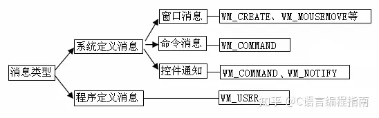
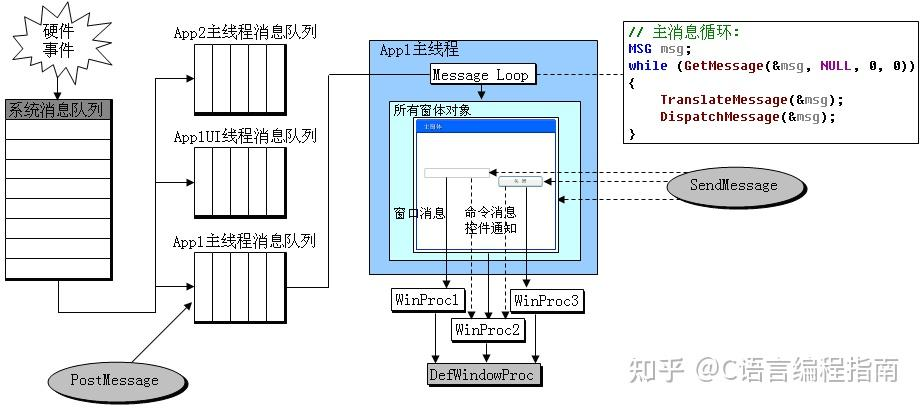
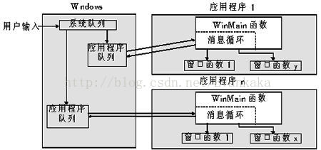
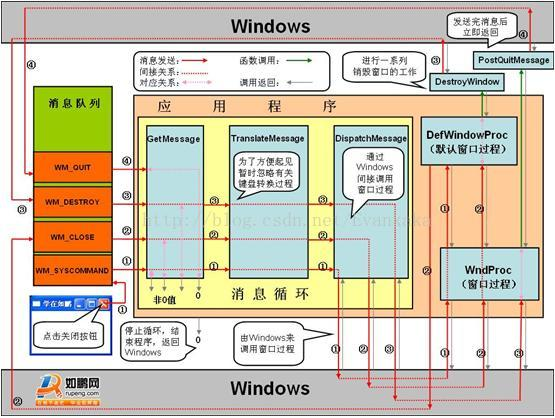
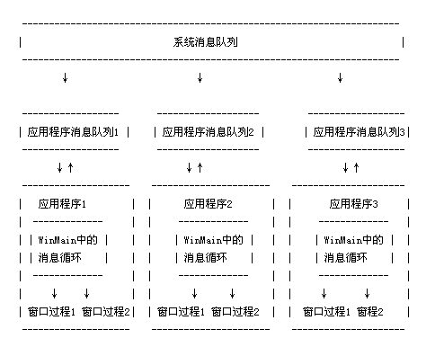
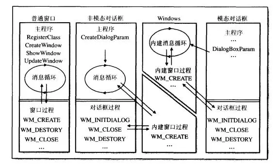
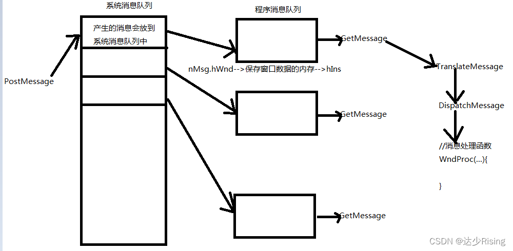

# Windows 消息

[TOC]

---

## Windows 和消息

### 消息和消息队列

| 名称                                                         | 说明                                                         |
| :----------------------------------------------------------- | :----------------------------------------------------------- |
| [消息和消息队列](https://learn.microsoft.com/zh-cn/windows/win32/winmsg/messages-and-message-queues) | 本部分介绍消息和消息队列，以及如何在应用程序中使用它们。     |
| [关于消息和消息队列](https://learn.microsoft.com/zh-cn/windows/win32/winmsg/about-messages-and-message-queues) | 本部分讨论 Windows 消息和消息队列。                          |
| [使用消息和消息队列](https://learn.microsoft.com/zh-cn/windows/win32/winmsg/using-messages-and-message-queues) | 以下代码示例演示如何执行与 Windows 消息和消息队列关联的以下任务。 |
| [消息引用](https://learn.microsoft.com/zh-cn/windows/win32/winmsg/message-and-message-queue-reference) | 包含 API 引用。                                              |

#### Windows消息类型

根据消息的来源进行分类，可以分为：

- [系统定义的消息](https://learn.microsoft.com/zh-cn/windows/win32/winmsg/about-messages-and-message-queues#system-defined-messages)
- [应用程序定义的消息](https://learn.microsoft.com/zh-cn/windows/win32/winmsg/about-messages-and-message-queues#application-defined-messages)
  

根据消息的路由方式分类，可以分为：

- [队列消息](https://learn.microsoft.com/zh-cn/windows/win32/winmsg/about-messages-and-message-queues#queued-messages)
- [非队列消息](https://learn.microsoft.com/zh-cn/windows/win32/winmsg/about-messages-and-message-queues#nonqueued-messages)

#### Windows系统的整个消息系统分为3个层级

1. Windows内核的**系统消息队列**

   > Windows内核维护着一个全局的系统消息队列；按照线程的不同，系统消息队列中的消息会分发到应用程序的UI线程的消息队列中；

2. 应用程序**UI线程消息队列**

   > 应用程序的每一个UI线程都有自己的消息循环，会不停地从自己的消息队列取出消息，并发送给Windows窗体对象(WinForm控件)；

3. 每个控件自己的**消息处理函数**

   > WinForm 中的 `void WndProc(ref Message m)` 消息处理函数













### Q&A

1. <span style="color:blue;font-weight:bold;">进程消息队列(应用程序消息队列)和主线程的消息队列是一回事吗？</span>

> 在 WinForm 程序中，进程消息队列指的是主线程的消息队列。WinForm 应用程序是单线程的，所有的 UI 操作都必须在主线程中执行。当用户与应用程序的界面交互时，操作系统会将相关的消息发送到应用程序的消息队列中，然后主线程从消息队列中逐个获取并处理这些消息，以更新界面状态和响应用户操作。因此，==进程消息队列实际上就是主线程的消息队列==。

2. <span style="color:blue;font-weight:bold;">线程中消息队列消息的结构是怎样的?</span>

```c++
typedef struct tagMSG {
  // 接收消息的窗口的句柄。 当消息是线程消息时，此成员为 NULL 。
  HWND   hwnd;
  // 消息的标识符。 应用程序只能使用低字;高字由系统保留。
  UINT   message;
  // 消息的附加信息。 确切含义取决于 消息 成员的值。
  WPARAM wParam;
  // 消息的附加信息。 确切含义取决于 消息 成员的值。
  LPARAM lParam;
  // 消息的发布时间。
  DWORD  time;
  // 发布消息时的光标位置（以屏幕坐标表示）。
  POINT  pt;
  // 
  DWORD  lPrivate;
} MSG, *PMSG, *NPMSG, *LPMSG;
```

[msg 结构 (winuser.h)](https://learn.microsoft.com/zh-cn/windows/win32/api/winuser/ns-winuser-msg?redirectedfrom=MSDN)

3. <span style="color:blue;font-weight:bold;">在WinForm程序中线程Id和托管线程Id是一回事吗？</span>


> 线程Id和托管线程Id是==不一样的！==

可以通过以下方法获取线程的Id

```c#
        /// <summary>
        /// 获取操作系统线程ID，Windows 10下的偏移量为0x022C(x64-bit-Application)和0x0160(x32-bit-Application)：
        /// https://www.ibckf.com/questions/1679243
        /// </summary>
        /// <param name="thread"></param>
        /// <returns></returns>
        public static int GetNativeThreadId(Thread thread)
        {
            var f = typeof(Thread).GetField("DONT_USE_InternalThread",
                BindingFlags.GetField | BindingFlags.NonPublic | BindingFlags.Instance);

            var pInternalThread = (IntPtr)f.GetValue(thread);
            var nativeId = Marshal.ReadInt32(pInternalThread, (IntPtr.Size == 8) ? 0x022C : 0x0160); // found by analyzing the memory
            return nativeId;
        }
```

获取当前线程的托管线程Id

```c#
        public static string CurrentThreadId
        {
            get
            {
                var thread = Thread.CurrentThread;
                var threadId = GetNativeThreadId(thread);
                return $"{thread.ManagedThreadId} - ({threadId}, 0x{threadId.ToString("x2")})";
            }
        }
```

4. <span style="color:blue;font-weight:bold;">知道控件的句柄如何获取该控件所在的进程和线程信息？</span>

```C#
    public static class Extensions
    {
        // 导入 Windows API 函数

        /// <summary>
        /// 检索创建指定窗口的线程的标识符，以及创建该窗口的进程（可选）的标识符。
        /// GetWindowThreadProcessId 函数 : https://learn.microsoft.com/zh-cn/windows/win32/api/winuser/nf-winuser-getwindowthreadprocessid
        /// </summary>
        /// <param name="hWnd">控件句柄</param>
        /// <param name="processId">控件所属进程Id</param>
        /// <returns>控件所属线程Id</returns>
        [DllImport("user32.dll")]
        private static extern int GetWindowThreadProcessId(IntPtr hWnd, out int processId);

        public static void ConsoleHandleInfo(this Control ctrl, string name)
        {
            var handle = ctrl.Handle;
            var threadId = GetWindowThreadProcessId(handle, out int processId);
            Console.WriteLine($"{ThreadInfo.CurrentThreadId} -> 创建 {name} 的进程Id = {processId}，线程Id = {threadId}");
        }
    }
```


## WinForm程序中消息处理的相关方法

==按调用顺序依次介绍，可以对消息进行拦截与处理==

1. <span style="color:blue;font-weight:bold;">IMessageFilter的消息处理</span>

   > [IMessageFilter 接口](https://learn.microsoft.com/zh-cn/dotnet/api/system.windows.forms.imessagefilter?view=windowsdesktop-7.0)
   >
   > 一般处理逻辑，在构造函数中调用Application.AddMessageFilter(this);添加消息筛选器，在析构函数中调用Application.RemoveMessageFilter(this);移除消息筛选器，然后重写PreProcessMessage消息处理函数。
   >
   > **返回值：**如果消息已处理，则为 `true`；否则为 `false`。
   >
   > **影响级别：**应用程序级
   
2. <span style="color:blue;font-weight:bold;">Control.PreProcessMessage</span>

   > 在调度键盘或输入消息之前，在消息循环内对它们进行预处理（**键盘消息预处理函数**）。
   >
   > **返回值：**如果消息已由控件处理，则为 `true`；否则为 `false`。
   >
   > **影响级别：**应用程序级
   >
   > 重写 [PreProcessMessage](https://learn.microsoft.com/zh-cn/dotnet/api/system.windows.forms.control.preprocessmessage?view=windowsdesktop-7.0)时，控件返回 `true` 以指示它已处理消息。 对于控件未处理的消息，应返回 `base.PreProcessMessage` 的结果 。 控件通常会替代更专用的方法之一，例如 [IsInputChar](https://learn.microsoft.com/zh-cn/dotnet/api/system.windows.forms.control.isinputchar?view=windowsdesktop-7.0)、 [IsInputKey](https://learn.microsoft.com/zh-cn/dotnet/api/system.windows.forms.control.isinputkey?view=windowsdesktop-7.0)、 [ProcessCmdKey](https://learn.microsoft.com/zh-cn/dotnet/api/system.windows.forms.control.processcmdkey?view=windowsdesktop-7.0)、 [ProcessDialogChar](https://learn.microsoft.com/zh-cn/dotnet/api/system.windows.forms.control.processdialogchar?view=windowsdesktop-7.0)或 [ProcessDialogKey](https://learn.microsoft.com/zh-cn/dotnet/api/system.windows.forms.control.processdialogkey?view=windowsdesktop-7.0) ，而不是重写 [PreProcessMessage](https://learn.microsoft.com/zh-cn/dotnet/api/system.windows.forms.control.preprocessmessage?view=windowsdesktop-7.0)。
   >
   > [Control.PreProcessMessage(Message) 方法](https://learn.microsoft.com/zh-cn/dotnet/api/system.windows.forms.control.preprocessmessage?view=windowsdesktop-7.0)

3. <span style="color:blue;font-weight:bold;">键盘消息的其他处理函数，如 protected override bool IsInputKey(Keys keyData)</span>

4. <span style="color:blue;font-weight:bold;">控件的消息处理函数</span>

   [NativeWindow.WndProc(Message) 方法](https://learn.microsoft.com/zh-cn/dotnet/api/system.windows.forms.nativewindow.wndproc?view=windowsdesktop-7.0)
   
   > WndProc是开发者自己定义的窗口过程函数，在窗口创建时会将其指定为窗口过程函数。WndProc函数用于接收和处理窗口消息，开发者可以在其中编写消息处理的逻辑。
   
    ```C#
            protected override void WndProc(ref Message m)
            {
                // 控件内消息处理函数
                //Console.WriteLine($"WndProc-> {m}");
                base.WndProc(ref m);
            }
    ```
   
5. <span style="color:blue;font-weight:bold;">DefWndPro函数</span>

   [NativeWindow.DefWndProc(Message) 方法](https://learn.microsoft.com/zh-cn/dotnet/api/system.windows.forms.nativewindow.defwndproc?view=windowsdesktop-7.0&viewFallbackFrom=xamarinios-10.8)
   
   > DefWndProc是系统提供的默认窗口过程函数，用于处理那些没有在自定义的WndProc函数中处理的窗口消息。当某个窗口消息在自定义的WndProc函数中没有进行处理时，可以调用DefWndProc函数来执行默认的处理逻辑。

   ```C#
       protected override void DefWndProc(ref Message m)
       {
           Console.WriteLine($"DefWndProc-> {m}");
           base.DefWndProc(ref m);
       }
   ```
   
   WndPro与DefWndPro的联系
   
   > 1. WndProc函数和DefWndProc函数在窗口过程中会被调用，用于处理窗口消息。
   > 2. 在自定义的WndProc函数中，可以选择调用DefWndProc函数来执行默认的处理逻辑，即在自定义逻辑之前或之后执行。
   
   > 总的来说，WndProc函数是开发者自定义的窗口过程函数，用于处理窗口消息，而DefWndProc函数是系统提供的默认的窗口过程函数，用于处理那些在自定义窗口过程中没有处理的窗口消息。开发者可以根据具体需求，在WndProc函数中编写个性化的消息处理逻辑，并根据需要选择是否调用DefWndProc函数。

### 其他代码片段

<span style="color:blue;">[bool PreProcessMessage(ref Message msg)实现](https://source.dot.net/#System.Windows.Forms/System/Windows/Forms/Control.cs,9075)</span>

```c#
    /// <summary>
    ///  This method is called by the application's message loop to pre-process input messages before they
    ///  are dispatched. If this method processes the message it must return true, in which case the message
    ///  loop will not dispatch the message.
    /// </summary>
    /// <remarks>
    ///  <para>
    ///   The messages that this method handles are WM_KEYDOWN, WM_SYSKEYDOWN, WM_CHAR, and WM_SYSCHAR.
    ///  </para>
    ///  <para>
    ///   For WM_KEYDOWN and WM_SYSKEYDOWN messages, this first calls <see cref="ProcessCmdKey(ref Message, Keys)"/>
    ///   to check for command keys such as accelerators and menu shortcuts. If it doesn't process the message, then
    ///   <see cref="IsInputKey(Keys)"/> is called to check whether the key message represents an input key for the
    ///   control. Finally, if <see cref="IsInputKey(Keys)"/> indicates that the control isn't interested in the key
    ///   message, then <see cref="ProcessDialogKey(Keys)"/> is called to check for dialog keys such as TAB, arrow
    ///   keys, and mnemonics.
    ///  </para>
    ///  <para>
    ///   For WM_CHAR messages, <see cref="IsInputChar(char)"/> is first called to check whether the character
    ///   message represents an input character for the control. If <see cref="IsInputChar(char)"/> indicates that
    ///   the control isn't interested in the character message, then <see cref="ProcessDialogChar(char)"/> is
    ///   called to check for dialog characters such as mnemonics.
    ///  </para>
    ///  <para>
    ///   For WM_SYSCHAR messages, this calls <see cref="ProcessDialogChar(char)"/> to check for dialog characters
    ///   such as mnemonics.
    ///  </para>
    ///  <para>
    ///   When overriding this method, a control should return true to indicate that it has processed the message.
    ///   For messages that aren't  processed by the control, the result of "base.PreProcessMessage()" should be
    ///   returned.
    ///  </para>
    ///  <para>
    ///   Controls will typically override one of the more specialized methods (<see cref="IsInputChar(char)"/>,
    ///   <see cref="IsInputKey(Keys)"/>, <see cref="ProcessCmdKey(ref Message, Keys)"/>, <see cref="ProcessDialogChar(char)"/>,
    ///   or <see cref="ProcessDialogKey(Keys)"/>) instead of overriding this method.
    ///  </para>
    /// </remarks>
    public virtual bool PreProcessMessage(ref Message msg)
    {
        bool result;
 
        if (msg.MsgInternal == PInvoke.WM_KEYDOWN || msg.MsgInternal == PInvoke.WM_SYSKEYDOWN)
        {
            if (!GetExtendedState(ExtendedStates.UiCues))
            {
                ProcessUICues(ref msg);
            }
 
            Keys keyData = (Keys)(nint)msg.WParamInternal | ModifierKeys;
            if (ProcessCmdKey(ref msg, keyData))
            {
                result = true;
            }
            else if (IsInputKey(keyData))
            {
                SetExtendedState(ExtendedStates.InputKey, true);
                result = false;
            }
            else
            {
                result = ProcessDialogKey(keyData);
            }
        }
        else if (msg.MsgInternal == PInvoke.WM_CHAR || msg.MsgInternal == PInvoke.WM_SYSCHAR)
        {
            if (msg.MsgInternal == PInvoke.WM_CHAR && IsInputChar((char)(nint)msg.WParamInternal))
            {
                SetExtendedState(ExtendedStates.InputChar, true);
                result = false;
            }
            else
            {
                result = ProcessDialogChar((char)(nint)msg.WParamInternal);
            }
        }
        else
        {
            result = false;
        }
 
        return result;
    }
```


## 相关参考

1. [msg 结构 (winuser.h)](https://learn.microsoft.com/zh-cn/windows/win32/api/winuser/ns-winuser-msg?redirectedfrom=MSDN)
2. [Message 结构](https://learn.microsoft.com/zh-cn/dotnet/api/system.windows.forms.message?view=windowsdesktop-7.0)
3. [关于消息和消息队列](https://learn.microsoft.com/zh-cn/windows/win32/winmsg/about-messages-and-message-queues)
4. [使用消息和消息队列](https://learn.microsoft.com/zh-cn/windows/win32/winmsg/using-messages-and-message-queues)
5. [Windows消息机制（MFC深度详解）](https://zhuanlan.zhihu.com/p/643665652)
6. [windows消息机制深入详解](https://blog.csdn.net/u011555996/article/details/122020740)
7. [WINDOWS消息](https://blog.csdn.net/weixin_42284219/article/details/130043242)，消息的解析可以参考此篇
7. [线程与消息队列](https://www.cnblogs.com/yewsky/articles/1882730.html)，介绍线程间相互通信相关的函数

