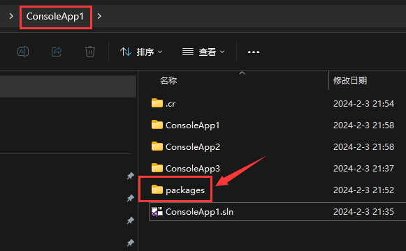

# 修改项目中packages包目录

修改.NET项目中引用的Packages包目录

[TOC]

---

通常情况下在.NET项目中会在解决方案同级的目录中生成一个packages包，解决方案各项目中引用的nuget包都会下载缓存到packages目录中，如下图所示


如果项目少这样的方式是没有问题的，但如果有这样一个场景

负责的项目有上百个（每个项目都对应一个解决方案.sln），每个项目引用的nuget包都大同小异那么每个项目中都有packages包，包所占用的空间会很大。那么怎么解决这个问题呢？这就是本文解决的问题。

## 一、解决的问题

例如你的项目都是在 E:\Work 目录下，你想将其中的所有项目的包文件(packages)都放在 E:\Work\packages 目录下，目录结构如下：

E:\Work

| -- Soluation A

| -- Soluation B

| -- Soluation C

.....

| -- packages

## 二、操作步骤

> 1. 关闭所有打开的项目（关闭Visual Studio）。
>
> 2. 在 E:\Work 目录下新建一个 ==NuGet.Config== 配置文件。
>
> 3. 打开 NuGet.Config 文件，输入如下内容：
>
>    ```xml
>    <?xml version="1.0" encoding="utf-8"?>
>    <configuration>
>      <solution>
>        <!-- 默认不将 packages 提交到源代码管理 -->
>        <add key="disableSourceControlIntegration" value="true"/>
>      </solution>
>      <config>
>        <!-- 指定这个目录为默认的 packages 目录 -->
>        <add key="repositorypath" value=".\packages"/>
>      </config>
>      <packageRestore>
>        <!-- 默认启用 packages 还原 -->
>        <add key="enabled" value="true"/>
>      </packageRestore>
>    </configuration>
>    ```
>>
> 4. 保存文件并退出。
>
> 5. 至此==新建项目==时，如果项目的目录在 E:\Work 中那么nuget中引用的packages包将从此目录(E:\Work\packages)中进行引用。

## 三、注意事项

1. 更改了NuGet.Config中的内容时一定要重新打开解决方案，否则更改将不会生效。

## 四、相关参考

1. [终于找到了：NuGet 修改包路径](https://blog.csdn.net/sinolover/article/details/104498645)