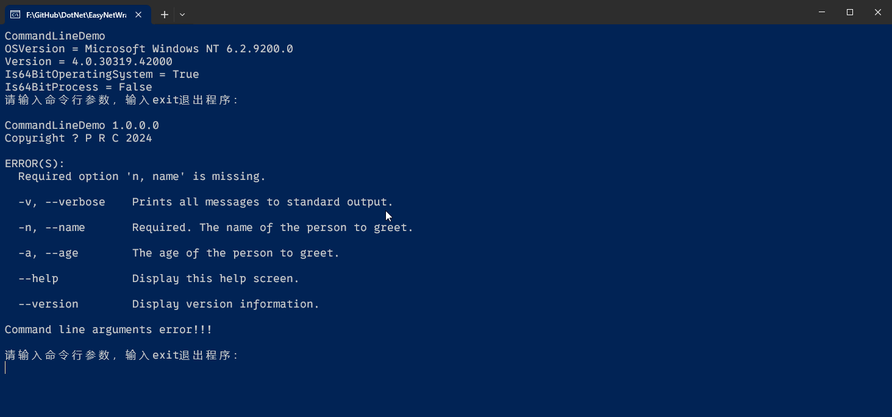
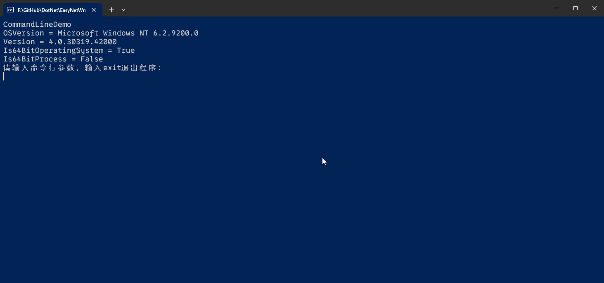
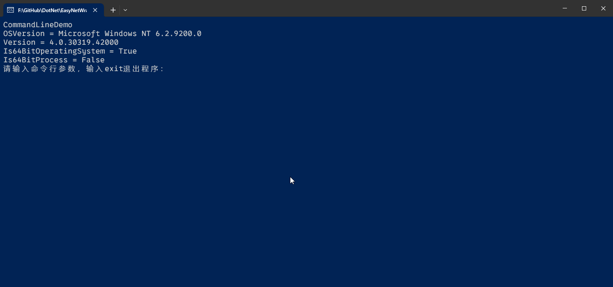
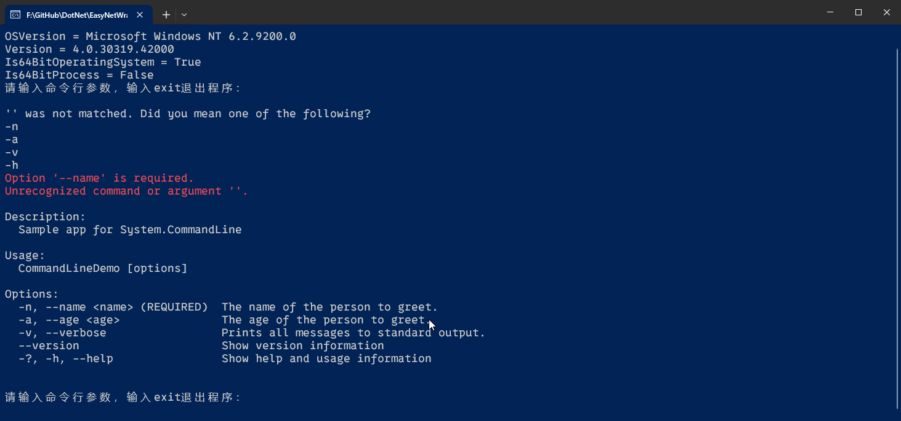

# 命令行参数解析处理

[TOC]

---

本文介绍命令行参数解析处理相关的类库。

## 1、[CommandLineParser](https://www.nuget.org/packages/CommandLineParser/)

<p><span style="color:blue;font-weight:bold;font-size:18px;">类库名称：</span><b>CommandLine</b></p>

<p><span style="color:blue;font-weight:bold;font-size:18px;">开源地址：</span><b><a href="https://github.com/commandlineparser/commandline">GitHub</a></b></p>

<p><span style="color:blue;font-weight:bold;font-size:18px;">使用协议：</span><b><a href="https://github.com/commandlineparser/commandline#MIT-1-ov-file">MIT license</a></b></p>

<p><span style="color:blue;font-weight:bold;font-size:18px;">NuGet地址：</span><b><a href="https://www.nuget.org/packages/CommandLineParser/2.9.1?_src=template">CommandLineParser</a></b></p>

<div style="font-weight:bold;font-size:16pt;padding-top:15px;padding-bottom:5px;">例子一，多参数解析</div>

```C#
        public class Options
        {
            [Option('v', "verbose", Required = false, HelpText = "Prints all messages to standard output.")]
            public bool Verbose { get; set; }

            [Option('n', "name", Required = true, HelpText = "The name of the person to greet.")]
            public string Name { get; set; }

            [Option('a', "age", Required = false, HelpText = "The age of the person to greet.")]
            public int Age { get; set; }
        }

        static void Main(string[] args)
        {
            Console.WriteLine("CommandLineDemo");
            Console.WriteLine($"OSVersion = {Environment.OSVersion}");
            Console.WriteLine($"Version = {Environment.Version}");
            Console.WriteLine($"Is64BitOperatingSystem = {Environment.Is64BitOperatingSystem}");
            Console.WriteLine($"Is64BitProcess = {Environment.Is64BitProcess}");

            //args=new string[] {"-n","John","-a","30"};
            //var arg = "-n xulh -a 30 -v true";
            //args = arg.Split();
            var line = string.Empty;

            Console.WriteLine("请输入命令行参数，输入exit退出程序：");
            while ((line = Console.ReadLine()) != "exit")
            {
                args = line.Split();
                // 方式一：
                Parser.Default.ParseArguments<Options>(args)
                   .WithParsed(RunOptions)
                   .WithNotParsed(HandleParseError);

                Console.WriteLine("请输入命令行参数，输入exit退出程序：");
            }

            Console.WriteLine("Press any key to exit...");
            Console.ReadLine();
        }

        static void RunOptions(Options options)
        {
            //if (options.Verbose)
            //{
            //    Console.WriteLine($"Hello, {options.Name}!");
            //}
            //else
            //{
            //    Console.WriteLine($"Hello, {options.Name}!");
            //}


            Console.WriteLine($"Hello, {options.Name}, verbose={options.Verbose}, age={options.Age}!{Environment.NewLine}");
        }

        private static void HandleParseError(IEnumerable<Error> enumerable)
        {
            Console.WriteLine($"Command line arguments error!!!{Environment.NewLine}");
        }
```

<div style="font-weight:bold;font-size:16pt;padding-top:15px;padding-bottom:5px;">运行效果</div>



<div style="font-weight:bold;font-size:16pt;padding-top:15px;padding-bottom:5px;">例子二，多种操作匹配</div>

```C#
        static void Main(string[] args)
        {
            Console.WriteLine("CommandLineDemo");
            Console.WriteLine($"OSVersion = {Environment.OSVersion}");
            Console.WriteLine($"Version = {Environment.Version}");
            Console.WriteLine($"Is64BitOperatingSystem = {Environment.Is64BitOperatingSystem}");
            Console.WriteLine($"Is64BitProcess = {Environment.Is64BitProcess}");

            //args=new string[] {"-n","John","-a","30"};
            //var arg = "-n xulh -a 30 -v true";
            //args = arg.Split();
            var line = string.Empty;

            Console.WriteLine("请输入命令行参数，输入exit退出程序：");
            while ((line = Console.ReadLine()) != "exit")
            {
                args = line.Split();

                // 方式二：
                var result = Parser.Default.ParseArguments<AddOptions, CommitOptions, CloneOptions>(args)
                .MapResult(
                (AddOptions opts) => RunAddAndReturnExitCode(opts),
                (CommitOptions opts) => RunCommitAndReturnExitCode(opts),
                (CloneOptions opts) => RunCloneAndReturnExitCode(opts),
                errs => -1);
                Console.WriteLine($"result = {result}");  

                Console.WriteLine("请输入命令行参数，输入exit退出程序：");
            }

            Console.WriteLine("Press any key to exit...");
            Console.ReadLine();
        }

        [Verb("add", HelpText = "Add file contents to the index.")]
        class AddOptions
        {
            //normal options here
        }
        [Verb("commit", HelpText = "Record changes to the repository.")]
        class CommitOptions
        {
            //commit options here
        }
        [Verb("clone", HelpText = "Clone a repository into a new directory.")]
        class CloneOptions
        {
            //clone options here
        }
        private static int RunCloneAndReturnExitCode(CloneOptions opts)
        {
            Console.WriteLine("RunCloneAndReturnExitCode");
            return 0;
        }

        private static int RunCommitAndReturnExitCode(CommitOptions opts)
        {
            Console.WriteLine("RunCommitAndReturnExitCode");
            return 2;
        }

        private static int RunAddAndReturnExitCode(AddOptions opts)
        {
            Console.WriteLine("RunAddAndReturnExitCode");
            return 1;
        }
```

<div style="font-weight:bold;font-size:16pt;padding-top:15px;padding-bottom:5px;">运行效果</div>



> [!TIPS]
>
> 更多操作详见 [GitHub](https://github.com/commandlineparser/commandline)

### 相关参考

1. [C#/.NET 使用 CommandLineParser 来标准化地解析命令行](https://www.cnblogs.com/walterlv/p/10236378.html)


## 2、[System.CommandLine](https://www.nuget.org/packages/System.CommandLine#versions-body-tab)

<p><span style="color:blue;font-weight:bold;font-size:18px;">类库名称：</span><b>command-line-api</b></p>

<p><span style="color:blue;font-weight:bold;font-size:18px;">开源地址：</span><b><a href="https://github.com/dotnet/command-line-api">GitHub</a></b></p>

<p><span style="color:blue;font-weight:bold;font-size:18px;">使用协议：</span><b><a href="https://github.com/dotnet/command-line-api#MIT-1-ov-file">MIT license</a></b></p>

<p><span style="color:blue;font-weight:bold;font-size:18px;">NuGet地址：</span><b><a href="https://www.nuget.org/packages/System.CommandLine#versions-body-tab">System.CommandLine</a></b></p>

<div style="font-weight:bold;font-size:16pt;padding-top:15px;padding-bottom:5px;">例子一，单个参数解析</div>

```C#
        static void Main(string[] args)
        {
            Console.WriteLine("CommandLineDemo");
            Console.WriteLine($"OSVersion = {Environment.OSVersion}");
            Console.WriteLine($"Version = {Environment.Version}");
            Console.WriteLine($"Is64BitOperatingSystem = {Environment.Is64BitOperatingSystem}");
            Console.WriteLine($"Is64BitProcess = {Environment.Is64BitProcess}");

            //args=new string[] {"-n","John","-a","30"};
            //var arg = "-n xulh -a 30 -v true";
            //args = arg.Split();
            var line = string.Empty;

            Console.WriteLine("请输入命令行参数，输入exit退出程序：");
            while ((line = Console.ReadLine()) != "exit")
            {
                args = line.Split();
                
                // System.CommandLine
                var fileOption = new System.CommandLine.Option<FileInfo>(name: "--file", description: "The file to read and display on the console.");
                fileOption.AddAlias("-f");
                var rootCommand = new System.CommandLine.RootCommand("Sample app for System.CommandLine");
                rootCommand.AddOption(fileOption);
                rootCommand.SetHandler((file) =>
                {
                    Console.WriteLine($"File: {file.FullName}");
                    //ReadFile(file);
                }, fileOption);
                // 调用
                rootCommand.Invoke(args);
                Console.WriteLine("请输入命令行参数，输入exit退出程序：");
            }

            Console.WriteLine("Press any key to exit...");
            Console.ReadLine();
        }
```

<div style="font-weight:bold;font-size:16pt;padding-top:15px;padding-bottom:5px;">运行效果</div>



<div style="font-weight:bold;font-size:16pt;padding-top:15px;padding-bottom:5px;">例子二，多参数解析</div>

```C#
        static void Main(string[] args)
        {
            Console.WriteLine("CommandLineDemo");
            Console.WriteLine($"OSVersion = {Environment.OSVersion}");
            Console.WriteLine($"Version = {Environment.Version}");
            Console.WriteLine($"Is64BitOperatingSystem = {Environment.Is64BitOperatingSystem}");
            Console.WriteLine($"Is64BitProcess = {Environment.Is64BitProcess}");

            //args=new string[] {"-n","John","-a","30"};
            //var arg = "-n xulh -a 30 -v true";
            //args = arg.Split();
            var line = string.Empty;

            Console.WriteLine("请输入命令行参数，输入exit退出程序：");
            while ((line = Console.ReadLine()) != "exit")
            {
                args = line.Split();

                // 多参数
                var option1 = new System.CommandLine.Option<string>("--name", "The name of the person to greet.");
                option1.IsRequired = true;
                option1.AddAlias("-n");
                var option2 = new System.CommandLine.Option<int>("--age", "The age of the person to greet.");
                option2.AddAlias("-a");
                var option3 = new System.CommandLine.Option<bool>("--verbose", "Prints all messages to standard output.");
                option3.AddAlias("-v");
                var rootCommand = new System.CommandLine.RootCommand("Sample app for System.CommandLine");
                rootCommand.Add(option1);
                rootCommand.Add(option2);
                rootCommand.Add(option3);
                rootCommand.SetHandler((name, age, verbose) =>
                {
                    Console.WriteLine($"Hello, {name}, verbose={verbose}, age={age}!");
                }, option1, option2, option3);
                rootCommand.Invoke(args);   

                Console.WriteLine("请输入命令行参数，输入exit退出程序：");
            }

            Console.WriteLine("Press any key to exit...");
            Console.ReadLine();
        }
```

<div style="font-weight:bold;font-size:16pt;padding-top:15px;padding-bottom:5px;">运行效果</div>



### 相关参考

1. [使用 System.CommandLine 分析命令行](https://learn.microsoft.com/zh-cn/archive/msdn-magazine/2019/march/net-parse-the-command-line-with-system-commandline)
2. [教程：System.CommandLine 入门](https://learn.microsoft.com/zh-cn/dotnet/standard/commandline/get-started-tutorial)