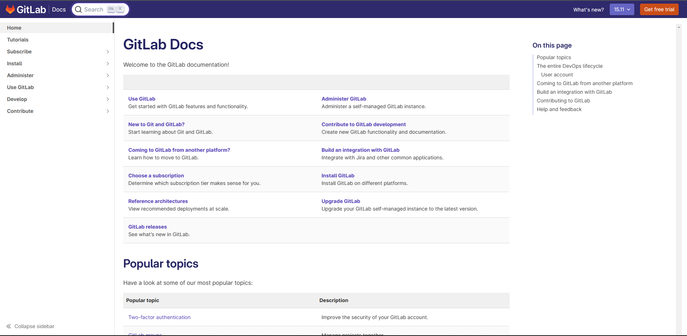
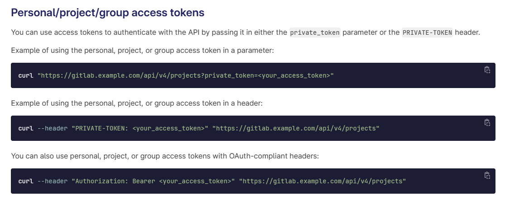

# GItLab API

[TOC]

---

        
<a style="color:white;" href="https://about.gitlab.com/">GitLab官网首页</a>

        

    

        
<a style="color:white;" href="https://docs.gitlab.com/">GitLab Docs官网首页</a>

        

    

> [!TIP]
>
> GitLab Docs首页网址`https://docs.gitlab.com/`后面输入 ==ee/== 打开 GitLab Docs
>
> 完整访问地址：https://docs.gitlab.com/ee/，如下图所示：

## GitLab使用相关

1. [创建个人访问令牌（Create a personal access token）](https://docs.gitlab.com/ee/user/profile/personal_access_tokens.html)

## API 相关

1. [GitLab REST API](https://docs.gitlab.com/ee/api/rest/)

2. [身份验证（Authentication）](https://docs.gitlab.com/ee/api/rest/#authentication)

3. [Personal/project/group access tokens](https://docs.gitlab.com/ee/api/rest/#personalprojectgroup-access-tokens)

   

   可以在请求地址中加入==private_token==参数进行设置，也可以在请求头中加入==PRIVATE-TOKEN==进行设置。

## 本地访问

打开GitLab首页，比如 http://192.168.160.100/

1. 打开帮助首页，在地址后面加上 ==/help== 比如 http://192.168.160.100/help 打开帮助页面；
2. 打开帮助首页，在地址后面加上 ==/help/api/README.md== 比如 http://192.168.160.100/help/api/README.md 打开API帮助页面；
3. 打开帮助首页，在地址后面加上 ==/help/api/api_resources.md== 比如 http://192.168.160.100/help/api/api_resources.md 打开Api列表界面；

## 其他参考

1. [gitLabApi文档信息总结](https://blog.csdn.net/xianpo/article/details/114300364)

