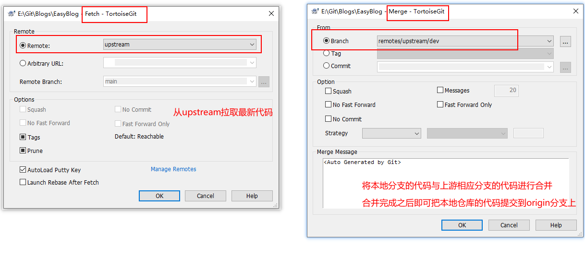

# Git命令

[toc]

---

## 提交修改并推送

保存修改到本地仓库并推送至服务器。

<h3 style="border-left:6px solid #2196F3;background:#ddffff;padding:14px;font-size:16px;letter-spacing:1px;">查看文件状态</h3>

<div style="display:inline-block;position:relative;background:#2196F3;color:white;text-align:center;padding: 0px 25px;            height:45px;line-height:45px;border-radius:5px 5px 5px 0px;letter-spacing:2px;">
        <div><a style="color:white;" href="https://git-scm.com/docs/git-status">git status</a></div>
        <div style="width:0px;height:0px;position: absolute;border:5px solid transparent;border-top:5px solid #1a76c0;            border-right:5px solid #1a76c0;left: 0px;bottom: -10px;"></div>
    </div>
<p style="margin-top:25px;"></p>

 ```bash
git status -s
 ```


<h3 style="border-left:6px solid #2196F3;background:#ddffff;padding:14px;font-size:16px;letter-spacing:1px;">添加提交文件</h3>

需要先添加提交文件（建立并提交索引）才能进行提交操作。

<div style="display:inline-block;position:relative;background:#2196F3;color:white;text-align:center;padding: 0px 25px;            height:45px;line-height:45px;border-radius:5px 5px 5px 0px;letter-spacing:2px;">
        <div><a style="color:white;" href="https://git-scm.com/docs/git-add">git add</a></div>
        <div style="width:0px;height:0px;position: absolute;border:5px solid transparent;border-top:5px solid #1a76c0;            border-right:5px solid #1a76c0;left: 0px;bottom: -10px;"></div>
    </div>
<p style="margin-top:25px;"></p>


```bash
git add .
```


<h3 style="border-left:6px solid #2196F3;background:#ddffff;padding:14px;font-size:16px;letter-spacing:1px;">撤销提交文件</h3>

<div style="display:inline-block;position:relative;background:#2196F3;color:white;text-align:center;padding: 0px 25px;            height:45px;line-height:45px;border-radius:5px 5px 5px 0px;letter-spacing:2px;">
        <div><a style="color:white;" href="https://git-scm.com/docs/git-reset">git reset</a></div>
        <div style="width:0px;height:0px;position: absolute;border:5px solid transparent;border-top:5px solid #1a76c0;            border-right:5px solid #1a76c0;left: 0px;bottom: -10px;"></div>
    </div>
<p style="margin-top:25px;"></p>


```bash
git reset
```


<h3 style="border-left:6px solid #2196F3;background:#ddffff;padding:14px;font-size:16px;letter-spacing:1px;">提交修改</h3>

<div style="display:inline-block;position:relative;background:#2196F3;color:white;text-align:center;padding: 0px 25px;            height:45px;line-height:45px;border-radius:5px 5px 5px 0px;letter-spacing:2px;">
        <div><a style="color:white;" href="https://git-scm.com/docs/git-commit">git commit</a></div>
        <div style="width:0px;height:0px;position: absolute;border:5px solid transparent;border-top:5px solid #1a76c0;            border-right:5px solid #1a76c0;left: 0px;bottom: -10px;"></div>
    </div>
<p style="margin-top:25px;"></p>


```bash
git commit -m “提交的说明”
```


<h3 style="border-left:6px solid #2196F3;background:#ddffff;padding:14px;font-size:16px;letter-spacing:1px;">Stage Change（添加修改文件/暂存修改文件） 并提交修改</h3>

```bash
git commit -a -m “提交的说明”
```


<h3 style="border-left:6px solid #2196F3;background:#ddffff;padding:14px;font-size:16px;letter-spacing:1px;">提交推送到远程仓库</h3>

<div style="display:inline-block;position:relative;background:#2196F3;color:white;text-align:center;padding: 0px 25px;            height:45px;line-height:45px;border-radius:5px 5px 5px 0px;letter-spacing:2px;">
        <div><a style="color:white;" href="https://git-scm.com/docs/git-push">git push</a></div>
        <div style="width:0px;height:0px;position: absolute;border:5px solid transparent;border-top:5px solid #1a76c0;            border-right:5px solid #1a76c0;left: 0px;bottom: -10px;"></div>
    </div>
<p style="margin-top:25px;"></p>


```bash
git push
```


## 暂存

暂存本地修改，然后把修改的文件恢复到修改之前。

<div style="display:inline-block;position:relative;background:#2196F3;color:white;text-align:center;padding: 0px 25px;            height:45px;line-height:45px;border-radius:5px 5px 5px 0px;letter-spacing:2px;">
        <div><a style="color:white;" href="https://git-scm.com/docs/git-stash">git-stash</a></div>
        <div style="width:0px;height:0px;position: absolute;border:5px solid transparent;border-top:5px solid #1a76c0;            border-right:5px solid #1a76c0;left: 0px;bottom: -10px;"></div>
    </div>
<p style="margin-top:10px;"></p>


<h3 style="border-left:6px solid #2196F3;background:#ddffff;padding:14px;font-size:16px;letter-spacing:1px;">暂存分支修改</h3>


```bash
git stash
// 或
git stash save 暂存名称
```


<h3 style="border-left:6px solid #2196F3;background:#ddffff;padding:14px;font-size:16px;letter-spacing:1px;">查看暂存信息</h3>

```bash
git stash list
```


<h3 style="border-left:6px solid #2196F3;background:#ddffff;padding:14px;font-size:16px;letter-spacing:1px;">恢复暂存修改，但不删除暂存</h3>

```bash
git stash apply
```

```bash
git stash apply 0 
// 等同于
git stash apply stash@{0}
```


<h3 style="border-left:6px solid #2196F3;background:#ddffff;padding:14px;font-size:16px;letter-spacing:1px;">删除暂存</h3>

<span style="color:red;">注意：</span>直接删除暂存则暂存的信息将丢失

```bash
git stash drop
```

```bash
git stash drop 0
// 等同于
git stash drop stash@{0}
```


<h3 style="border-left:6px solid #2196F3;background:#ddffff;padding:14px;font-size:16px;letter-spacing:1px;">恢复并删除暂存</h3>


```bash
git stash pop 0
// 等同于
git stash pop stash@{0}
```


## 分支操作

<div style="display:inline-block;position:relative;background:#2196F3;color:white;text-align:center;padding: 0px 25px;            height:45px;line-height:45px;border-radius:5px 5px 5px 0px;letter-spacing:2px;">
        <div><a style="color:white;" href="https://git-scm.com/docs/git-branch">git branch</a></div>
        <div style="width:0px;height:0px;position: absolute;border:5px solid transparent;border-top:5px solid #1a76c0;            border-right:5px solid #1a76c0;left: 0px;bottom: -10px;"></div>
    </div>
<p style="margin-top:10px;"></p>

<div style="font-weight:bold;font-size:16pt;padding-top:15px;padding-bottom:5px;">查看分支</div>

<h3 style="border-left:6px solid #2196F3;background:#ddffff;padding:14px;font-size:16px;letter-spacing:1px;">查看本地分支情况</h3>

1、可以查看本地分支名称与当前分支（*号开头的为当前分支）

```bash
git branch
```

2、以下命令支持通配符过滤，-l 为 --list的简写方式，格式为 git branch --list 通配符筛选

```bash
git branch --list
```

同

```bash
git branch -l
```

列出本地分支中以d开头的分支

```bash
git branch -l d*
```

3、列出本地分支名称，sha1，及最后一次提交信息

```bash
git branch -v
```

带上上游分支名称

```bash
git branch -vv
```


<h3 style="border-left:6px solid #2196F3;background:#ddffff;padding:14px;font-size:16px;letter-spacing:1px;">查看远程分支情况</h3>

```bash
git branch -r
```

同样支持和 -l 一起使用

```bash
git branch -r -l *main
```


<h3 style="border-left:6px solid #2196F3;background:#ddffff;padding:14px;font-size:16px;letter-spacing:1px;">查看本地分支和远程分支情况</h3>


```bash
git branch -a
```

支持与 --list 一起使用，比如如下的命令实现显示本地及远程分支中的main分支。

```
git branch -a -l *main
```


<h3 style="border-left:6px solid #2196F3;background:#ddffff;padding:14px;font-size:16px;letter-spacing:1px;">查看本地分支和追踪情况</h3>


```bash
git remote show origin
```

---


<div style="font-weight:bold;font-size:16pt;padding-top:15px;padding-bottom:5px;">创建分支</div>

<h3 style="border-left:6px solid #2196F3;background:#ddffff;padding:14px;font-size:16px;letter-spacing:1px;">以当前分支为基准分支创建新的分支</h3>

1、创建分支不改变当前分支

```bash
git branch 分支名称
// 例如，当前分支为main分支，创建mainNew分支
git branch mainNew
```

根据指定的基线分支创建新的分支

```
git branch 分支名称 远程分支名称
// 例如，以远程 origin/dev 为基线创建 dev 分支
git branch dev origin/dev
```

2、创建分支并切换当前分支到新分支，推荐使用git switch

```bash
git switch -c mainclone
```

或

```bash
git checkout -b mainclone
```

---

<div style="font-weight:bold;font-size:16pt;padding-top:15px;padding-bottom:5px;">切换分支</div>

<h3 style="border-left:6px solid #2196F3;background:#ddffff;padding:14px;font-size:16px;letter-spacing:1px;">切换当前分支</h3>

推荐使用 git switch

```bash
git switch 分支名称（分支名称不存在会提示错误）
// 例如
git switch main
```

同

```
git checkout 分支名称（分支名称不存在会提示错误）
// 例如
git checkout main
```

> [!NOTE]
>
> **git checkout 和 git switch 的区别**
>
> it checkout 是用于创建和切换分支的旧命令。它还可以用于恢复来自某个提交的修改。但是 git checkout 能做的不仅仅是这些，它还可以让你从任何分支复制文件或直接提交到当前工作区中，而无需切换分支。
>
> 实际上，git checkout 做了三件事情：
>
> 1）切换分支；
>
> 2）从暂存区复制文件到工作区（放弃当前修改）；
>
> 3）从其他区复制文件到工作区；
>
> 如果你不明白，那没关系，只需要记住：git checkout 能做的**不仅仅是分支的切换**，还有很多其他额外的功能，而这些额外的功能，增加了 git checkout 这个命令的复杂性。
>
> 因此，从 git 2.23 版本发布以后，引入了两个新的命令：**git switch** 和 **git restore**。
>
> 这样做的目的，是为了让人们**使用 git switch 来切换分支，使用 git restore 来撤销本地修改**。与此同时，git checkout 仍然被保存，用于提供更高级的选项来处理各种更加复杂的操作。
>
> **那么，git checkout 和 git switch 应该使用哪一个呢？**
>
> 如果是切换分支，请使用 git switch 命令而不是 git checkout。为什么？因为它就是为这个特定任务创建的。对于新的 git 用户，更容易记住 git switch 用于切换分支，git restore 用于恢复修改。
>
> 因此，对于切换和创建分支这个操作来说，使用 git switch 命令替代 git checkout 是被提倡的做法。
>
> 摘自：[git switch 和 checkout 之间有什么区别？](https://www.modb.pro/db/459519)

---


<h3 style="border-left:6px solid #2196F3;background:#ddffff;padding:14px;font-size:16px;letter-spacing:1px;">把远程分支同步到本地</h3>


```bash
git remote prune origin
```


<h3 style="border-left:6px solid #2196F3;background:#ddffff;padding:14px;font-size:16px;letter-spacing:1px;">删除本地分支</h3>

1、删除已经合并了的分支

```bash
git branch -d 分支名称
// 例如，以下命令删除develop分支
git branch -d develop
```

2、强制删除分支，-D 为 `--delete --force` 的简写


```bash
git branch -D 分支名称
// 例如，以下命令删除 develop 分支
git branch -D develop
```


## 查看工作区和暂存区的修改

> [!TIP]
>
> **工作区**
>
> 本地Coding的工作区，是Stage Change之前的状态
>
> **暂存区**
>
> 修改了代码后先要Stage Change，Stage Change之后的状态

<h3 style="border-left:6px solid #2196F3;background:#ddffff;padding:14px;font-size:16px;letter-spacing:1px;">查看还未暂存状态下修改的文件信息</h3>

```bash
git diff --name-only
```

查看还未暂存状态下修改的文件内容，列出了修改的地方，内容太多不直观，个人不太喜欢用，退出查看状态 ==英文输入状态下输入 q== 

```bash
git diff
```


<h3 style="border-left:6px solid #2196F3;background:#ddffff;padding:14px;font-size:16px;letter-spacing:1px;">查看暂存状态下修改的文件信息</h3>

```bash
git diff --cached --name-only
```

查看暂存状态下修改的文件内容，列出了修改的地方，内容太多不直观，个人不太喜欢用，退出查看状态 ==英文输入状态下输入 q== 

```bash
git diff --cached 
```


---

## 与上游保持同步

本节介绍Fork了其他人的项目代码，如何同步别人的最新代码到自己的仓库中。

<h3 style="border-left:6px solid #2196F3;background:#ddffff;padding:14px;font-size:16px;letter-spacing:1px;">1、查看自己的仓库是否已经关联了上游仓库</h3>

输入下面的命令，然后查看输出中是否有upstream的信息，没有上游仓库则按步骤2操作，否则按步骤3操作。

```bash
git remote -v
```

<h3 style="border-left:6px solid #2196F3;background:#ddffff;padding:14px;font-size:16px;letter-spacing:1px;">2、关联上游仓库</h3>

```bash
git remote add upstream 原始仓库地址
// 例如：
git remote add upstream https://github.com/schacon/blink
```

<h3 style="border-left:6px solid #2196F3;background:#ddffff;padding:14px;font-size:16px;letter-spacing:1px;">3、从远程仓库中拉取最新提交</h3>

```bash
git fetch upstream
```

<h3 style="border-left:6px solid #2196F3;background:#ddffff;padding:14px;font-size:16px;letter-spacing:1px;">4、将本地仓库与上游仓库中相应分支的代码进行合并</h3>

```bash
git merge upstream/develop
```

<h3 style="border-left:6px solid #2196F3;background:#ddffff;padding:14px;font-size:16px;letter-spacing:1px;">5、将合并的结果推送到自己仓库的远端分支</h3>

```bash
git push origin/develop
```

上述的过程也可以用 TortoiseGit 的相关菜单进行操作。




## 参考文章：

1. [git同步远程已删除的分支和删除本地多余的分支](https://www.cnblogs.com/saysmy/p/9166331.html)

1. [git常用命令-提交代码](https://www.cnblogs.com/nicoz/p/16968374.html)

