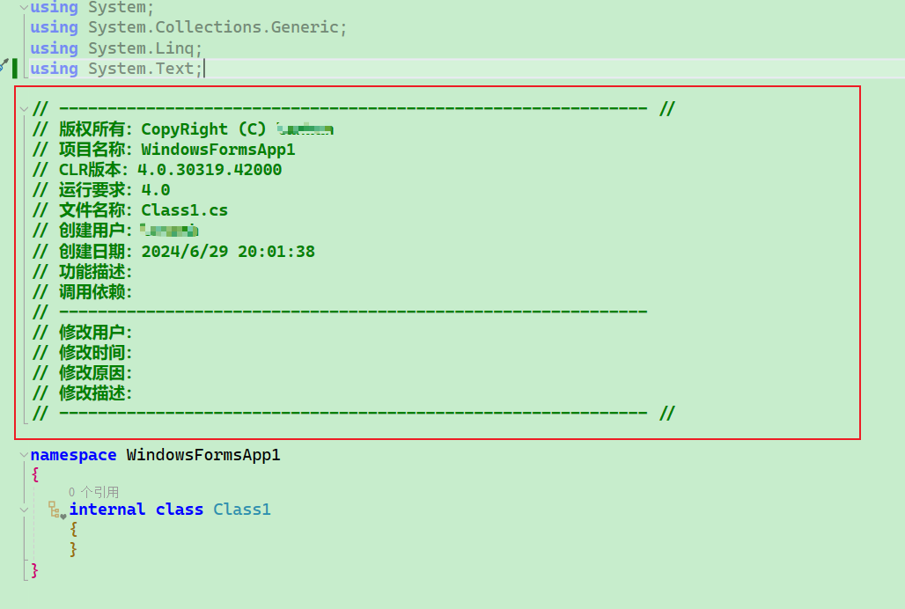
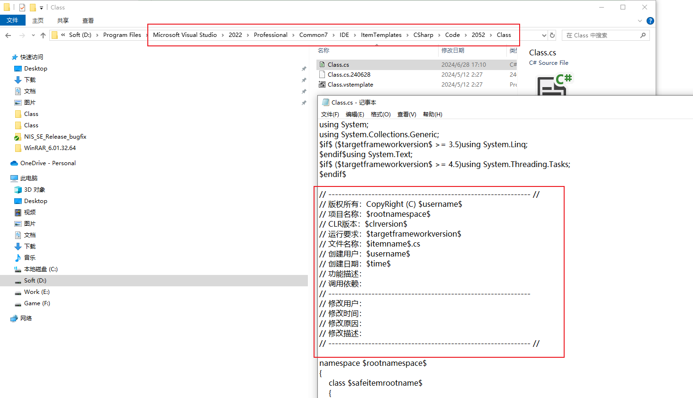

# Visual Studio 自定义项目和项模板

[TOC]

---

## 目的

本文实现的功能是为新建的项添加头部说明信息模板，例如：



## 功能实现

如下图所示，找到相应的目录，给指定的项添加相应的模板即可。



## 模板参数

实例化模板时，可替换模板中的值。 若要设置此功能，请使用模板参数。 模板参数可用于替换值，例如模板中的类名和命名空间。 当用户添加新项或项目时，后台运行的模板向导会替换这些参数。

### 声明和启用模板参数

模板参数以 $参数$ 的格式进行声明。 例如：

- $rootnamespace$
- $guid1$
- $guid5$

### 在模板中启用参数替换

1. 在模板的 .vstemplate 文件中，找到与要为之启用参数替换的项对应的 `ProjectItem` 元素。

2. 将 `ReplaceParameters` 元素的 `ProjectItem` 属性设置为 `true`。

3. 在项目项的代码文件中，在适当位置上包括参数。 例如，以下参数指定根命名空间用于文件中的命名空间：

   C#复制

   ```csharp
   namespace $rootnamespace$
   ```

### 保留的模板参数

下表列出可供任何模板使用的保留的模板参数：

| 参数                   | 说明                                                         |
| :--------------------- | :----------------------------------------------------------- |
| clrversion             | 公共语言运行时 (CLR) 的当前版本。                            |
| ext_*                  | 将 `ext_` 前缀添加到任何参数，以引用父模板的变量。 例如，`ext_safeprojectname`。 |
| guid[1-10]             | 一个用于替换项目文件中的项目 GUID 的 GUID。 可指定最多 10 个唯一的 GUID（例如，`guid1`）。 |
| itemname               | 在其中使用参数的文件的名称。                                 |
| machinename            | 当前的计算机名称（例如，Computer01）。                       |
| projectname            | 创建项目时由用户提供的名称。 此参数仅适用于项目模板。        |
| registeredorganization | 来自 HKLM\Software\Microsoft\Windows NT\CurrentVersion\RegisteredOrganization 的注册表项值。 |
| rootnamespace          | 当前项目的根命名空间，后跟当前项的子文件夹，用句点替换斜杠。 |
| defaultnamespace       | 当前项目的根命名空间。                                       |
| safeitemname           | 与 `itemname` 相同，但所有不安全字符和空格替换为了下划线。   |
| safeitemrootname       | 与 `safeitemname` 相同。                                     |
| safeprojectname        | 用户在创建项目时提供的名称，但名称中删除了所有不安全字符和空格。 此参数仅适用于项目模板。 |
| targetframeworkversion | 目标 .NET Framework 的当前版本。                             |
| time                   | 格式基于 Windows 用户设置的当前时间。 以 DD/MM/YYYY 00:00:00 时间格式为例。 |
| specifiedsolutionname  | 解决方案的名称。 取消“将解决方案和项目置于同一目录中”时检查具有`specifiedsolutionname`解决方案名称。 在未选中“创建解决方案目录”时，`specifiedsolutionname` 为空。 |
| userdomain             | 当前的用户域。                                               |
| username               | 当前的用户名称。                                             |
| webnamespace           | 当前网站的名称。 此参数在 Web 窗体模板中用于保证类名是唯一的。 如果网站在 Web 服务器的根目录下，则此模板参数解析为 Web 服务器的根目录。 |
| year                   | 以 YYYY 格式表示的当前年份。                                 |

> [!IMPORTANT]
>
> 模板参数区分大小写。

## 相关参考

1. [模板参数](https://learn.microsoft.com/zh-cn/visualstudio/ide/template-parameters?view=vs-2022)
2. [Visual Studio 自定义项目模板](https://blog.51cto.com/u_11283245/2945336)
3. [自定义项目和项模板](https://learn.microsoft.com/zh-cn/visualstudio/ide/customizing-project-and-item-templates?view=vs-2022)