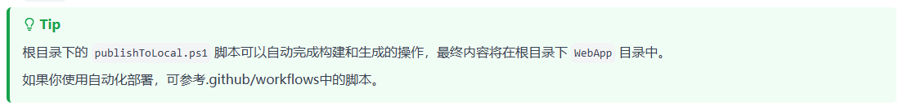
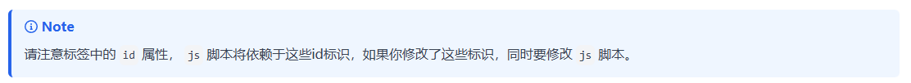

# Markdown编写语法说明

[TOC]

> [!important]
>
> 此中提供的markdown编写语法说明支持此博文中的语法格式在其他markdown编辑器上不一定支持

## 提示信息

介绍提示信息的输入和显示样式。

### 重要信息

markdown输入：

```markdown
> [!IMPORTANT]
> 重要的提示内容，格式如下面的图片，Typora中不支持因此使用图片展示
```


markdown输出：


### 提示信息

markdown输入：

```markdown
> [!TIP]
> 提示信息内容，格式如下面的图片，Typora中不支持因此使用图片展示
```


markdown输出：



### 注意信息

markdown输入：

```markdown
> [!NOTE]
> 注意信息内容，格式如下面的图片，Typora中不支持因此使用图片展示
```


markdown输出：




> [!NOTE] 
>
> Information the user should notice even if skimming. 

> [!TIP] 
>
> Optional information to help a user be more successful. 


> [!IMPORTANT] 
>
> Essential information required for user success.

> [!CAUTION] 
>
> Negative potential consequences of an action. 

> [!WARNING] 
>
> Dangerous certain consequences of an action.

## 颜色文字

### 蓝色粗体文字

`<span style="color:blue;font-weight:bold;">内容</span>`

**效果**

<span style="color:blue;font-weight:bold;">请在这写入内容，这为蓝色文字的效果</span>

### 高亮文字

`<mark>内容</mark>`

**效果**

<mark>高亮文字内容</mark>

### 带边框字体

`<span style="border-left:6px solid #2196F3;background:#ddffff;padding:14px;font-size:16px;letter-spacing:1px;">内容</span>`

**显示效果：**

<span style="border-left:6px solid #2196F3;background:#ddffff;padding:14px;font-size:16px;letter-spacing:1px;">左侧边框带宽度，颜色为蓝色</span>

