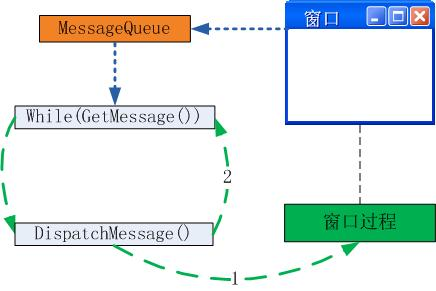
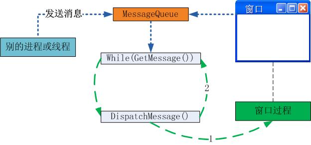
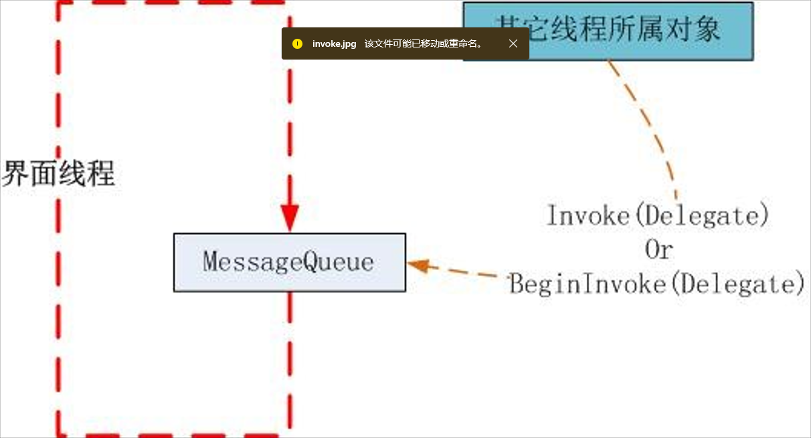

# Control.Invoke和Control.BeginInvoke

## 函数定义

[Control.Invoke 方法](https://learn.microsoft.com/zh-cn/dotnet/api/system.windows.forms.control.invoke?view=windowsdesktop-7.0)

> 在拥有此控件的基础窗口句柄的线程上执行委托。

[Control.BeginInvoke 方法](https://learn.microsoft.com/zh-cn/dotnet/api/system.windows.forms.control.begininvoke?view=windowsdesktop-7.0)

> 在创建控件的基础句柄所在线程上异步执行委托。

## Q&A

<span style="color:white;background-color:blue;">**Q：**什么时候会用到这两个方法？</span>

> **A：**在非UI线程中更新控件信息，比如控件的文本Text。

<span style="color:white;background-color:blue;">**Q：**这两个方法是在什么线程上执行？</span>

> **A：**这两个方法都是在UI线程（托管线程ID（ManagedThreadId）为1）上执行的。

<span style="color:white;background-color:blue;">**Q：**这两个方法的区别是什么？</span>

> **A：**Control.Invoke 方法在UI线程中执行。在非UI线程中，是阻塞执行的类似于Form的ShowDialog方法。
>
> ```C#
> public void SetTextAsync()
>      {
>          Console.WriteLine($"{this.ThreadId} -> s.1");
> 
>          this.textBox1.Invoke(new Action<string>((text) => {
> 
>              this.textBox1.Text = text;
>              Console.WriteLine($"{this.ThreadId} -> s.3");
>          }), "abc");
>          Console.WriteLine($"{this.ThreadId} -> s.2");
>      }
> ```
>
> 输出如下：
>
> 3 -> s.1
> 1 -> s.3
> 3 -> s.2
> 线程 0x8b64 已退出，返回值为 0 (0x0)。
>
> Control.BeginInvoke 方法也在UI线程中执行。在非UI线程中是非阻塞的类似于Form的Show方法。
>
> ```C#
>      public void SetTextAsync()
>      {
>          Console.WriteLine($"{this.ThreadId} -> s.1");
> 
>          this.textBox1.BeginInvoke(new Action<string>((text) => {
> 
>              this.textBox1.Text = text;
>              Console.WriteLine($"{this.ThreadId} -> s.3");
>          }), "abc");
>          Console.WriteLine($"{this.ThreadId} -> s.2");
>      }
> ```
>
> 输出如下：
>
> 3 -> s.1
> 3 -> s.2
> 线程 0x8474 已退出，返回值为 0 (0x0)。
> 1 -> s.3

## [Invoke and BeginInvoke转](https://www.cnblogs.com/worldreason/archive/2008/06/09/1216127.html)

在Invoke或者BeginInvoke的使用中无一例外地使用了委托Delegate，至于委托的本质请参考我的另一随笔：[对.net事件的看法](http://www.cnblogs.com/worldreason/archive/2008/05/10/1191575.html)。

### <span style="color:black;background-color:lightblue;">一、为什么Control类提供了Invoke和BeginInvoke机制？</span>

关于这个问题的最主要的原因已经是dotnet程序员众所周知的，我在此费点笔墨再次记录到自己的日志，以便日后提醒一下自己。

#### <span style="color:black;background-color:lightblue;">1、windows程序消息机制</span>

Windows GUI程序是基于消息机制的，有个主线程维护着一个消息泵。这个消息泵让windows程序生生不息。



Windows程序有个消息队列，窗体上的所有消息是这个队列里面消息的最主要来源。这里的while循环使用了GetMessage（）这个方法，这是个**阻塞**方法，也就是队列为空时方法就会被阻塞，从而这个while循环停止运动，这避免了一个程序把cpu无缘无故地耗尽，让其它程序难以得到响应。当然在某些需要cpu最大限度运动的程序里面就可以使用另外的方法，例如某些3d游戏或者及时战略游戏中，一般会使用PeekMessage（）这个方法，它不会被windows阻塞，从而保证整个游戏的流畅和比较高的帧速。

这个主线程维护着整个窗体以及上面的子控件。当它得到一个消息，就会调用DispatchMessage方法派遣消息，这会引起对窗体上的窗口过程的调用。窗口过程里面当然是程序员提供的窗体数据更新代码和其它代码。

#### <span style="color:black;background-color:lightblue;">2、dotnet里面的消息循环</span>

```
public static void Main(string[] args)
{
  Form f = new Form();

  Application.Run(f);
}
```

Dotnet窗体程序封装了上述的while循环，这个循环就是通过Application.Run方法启动的。

#### <span style="color:black;background-color:lightblue;">3、线程外操作GUI控件的问题</span>

如果从另外一个线程操作windows窗体上的控件，就会和主线程产生竞争，造成不可预料的结果，甚至死锁。因此windows GUI编程有一个规则，就是只能通过创建控件的线程来操作控件的数据，否则就可能产生不可预料的结果。

因此，dotnet里面，为了方便地解决这些问题，Control类实现了ISynchronizeInvoke接口，提供了Invoke和BeginInvoke方法来提供让其它线程更新GUI界面控件的机制。

```C#
public interface ISynchronizeInvoke
{
        [HostProtection(SecurityAction.LinkDemand, Synchronization=true, ExternalThreading=true)]

        IAsyncResult BeginInvoke(Delegate method, object[] args);

        object EndInvoke(IAsyncResult result);

        object Invoke(Delegate method, object[] args);

        bool InvokeRequired { get; }
}
```

如果从线程外操作windows窗体控件，那么就需要使用Invoke或者BeginInvoke方法，通过一个委托把调用封送到控件所属的线程上执行。

### <span style="color:black;background-color:lightblue;">二、消息机制---线程间和进程间通信机制</span>

#### <span style="color:black;background-color:lightblue;">1、window消息发送</span>

Windows消息机制是windows平台上的线程或者进程间通信机制之一。Windows消息值其实就是定义的一个数据结构，最重要的是消息的类型，它就是一个整数；然后就是消息的参数。消息的参数可以表示很多东西。

Windows提供了一些api用来向一个线程的消息队列发送消息。因此，一个线程可以向另一个线程的消息队列发送消息从而告诉对方做什么，这样就完成了线程间的通信。有些api发送消息需要一个窗口句柄，这种函数可以把消息发送到指定窗口的主线程消息队列；而有些则可以直接通过线程句柄，把消息发送到该线程消息队列中。



SendMessage是windows api，用来把一个消息发送到一个窗口的消息队列。这个方法是个阻塞方法，也就是操作系统会确保消息的确发送到目的消息队列，并且该消息被处理完毕以后，该函数才返回。返回之前，调用者将会被暂时阻塞。

PostMessage也是一个用来发送消息到窗口消息队列的api函数，但这个方法是非阻塞的。也就是它会马上返回，而不管消息是否真的发送到目的地，也就是调用者不会被阻塞。

#### <span style="color:black;background-color:lightblue;">2、Invoke and BeginInvoke</span>



Invoke或者BeginInvoke方法都需要一个委托对象作为参数。委托类似于回调函数的地址，因此调用者通过这两个方法就可以把需要调用的函数地址封送给界面线程。这些方法里面如果包含了更改控件状态的代码，那么由于最终执行这个方法的是界面线程，从而避免了竞争条件，避免了不可预料的问题。如果其它线程直接操作界面线程所属的控件，那么将会产生竞争条件，造成不可预料的结果。

使用Invoke完成一个委托方法的封送，就类似于使用SendMessage方法来给界面线程发送消息，是一个同步方法。也就是说在Invoke封送的方法被执行完毕前，Invoke方法不会返回，从而调用者线程将被阻塞。

使用BeginInvoke方法封送一个委托方法，类似于使用PostMessage进行通信，这是一个异步方法。也就是该方法封送完毕后马上返回，不会等待委托方法的执行结束，调用者线程将不会被阻塞。但是调用者也可以使用EndInvoke方法或者其它类似WaitHandle机制等待异步操作的完成。

==但是在内部实现上，Invoke和BeginInvoke都是用了PostMessage方法，从而避免了SendMessage带来的问题。而Invoke方法的同步阻塞是靠WaitHandle机制来完成的。==

#### <span style="color:black;background-color:lightblue;">3、使用场合问题</span>

如果你的后台线程在更新一个UI控件的状态后不需要等待，而是要继续往下处理，那么你就应该使用BeginInvoke来进行异步处理。

如果你的后台线程需要操作UI控件，并且需要等到该操作执行完毕才能继续执行，那么你就应该使用Invoke。否则，在后台线程和主截面线程共享某些状态数据的情况下，如果不同步调用，而是各自继续执行的话，可能会造成执行序列上的问题，虽然不发生死锁，但是会出现不可预料的显示结果或者数据处理错误。

可以看到ISynchronizeInvoke有一个属性，InvokeRequired。这个属性就是用来在编程的时候确定，一个对象访问UI控件的时候是否需要使用Invoke或者BeginInvoke来进行封送。如果不需要那么就可以直接更新。在调用者对象和UI对象同属一个线程的时候这个属性返回false。在后面的代码分析中我们可以看到，Control类对这一属性的实现就是在判断调用者和控件是否属于同一个线程的。

### <span style="color:black;background-color:lightblue;">三、Delegate.BeginInvoke</span>

通过一个委托来进行同步方法的异步调用，也是.net提供的异步调用机制之一。但是Delegate.BeginInvoke方法是从ThreadPool取出一个线程来执行这个方法，以获得异步执行效果的。也就是说，如果采用这种方式提交多个异步委托，那么这些调用的顺序无法得到保证。而且由于是使用线程池里面的线程来完成任务，使用频繁，会对系统的性能造成影响。

Delegate.BeginInvoke也是讲一个委托方法封送到其它线程，从而通过异步机制执行一个方法。调用者线程则可以在完成封送以后去继续它的工作。但是这个方法封送到的最终执行线程是运行库从ThreadPool里面选取的一个线程。

这里需要纠正一个误区，那就是Control类上的异步调用BeginInvoke并没有开辟新的线程完成委托任务，而是让界面控件的所属线程完成委托任务的。看来异步操作就是开辟新线程的说法不一定准确。 

### <span style="color:black;background-color:lightblue;">四、用Reflector察看一些相关代码</span>

#### <span style="color:black;background-color:lightblue;">1、Control.BeginInvoke and Control.Invoke</span>

```C#
public IAsyncResult BeginInvoke(Delegate method, params object[] args)
{
    using (new MultithreadSafeCallScope())
    {
        return (IAsyncResult) this.FindMarshalingControl().MarshaledInvoke(this, method, args, false);
    }
}
public object Invoke(Delegate method, params object[] args)
{
    using (new MultithreadSafeCallScope())
    {
        return this.FindMarshalingControl().MarshaledInvoke(this, method, args, true);
    }
}
```

这里的[FindMarshalingControl](http://www.aisto.com/roeder/dotnet/Default.aspx?Target=code://System.Windows.Forms:2.0.0.0:b77a5c561934e089/System.Windows.Forms.Control/FindMarshalingControl():System.Windows.Forms.Control)方法通过一个循环向上回溯，从当前控件开始回溯父控件，直到找到最顶级的父控件，用它作为封送对象。例如，我们调用窗体上一个进度条的Invoke方法封送委托，但是实际上会回溯到主窗体，通过这个控件对象来封送委托。因为主窗体是主线程消息队列相关的，发送给主窗体的消息才能发送到界面主线程消息队列。

我们可以看到Invoke和BeginInvoke方法使用了同样的实现，只是[MarshaledInvoke](http://www.aisto.com/roeder/dotnet/Default.aspx?Target=code://System.Windows.Forms:2.0.0.0:b77a5c561934e089/System.Windows.Forms.Control/MarshaledInvoke(System.Windows.Forms.Control,System.Delegate,Object[],Boolean):Object)方法的最后一个参数值不一样。

#### <span style="color:black;background-color:lightblue;">2、[MarshaledInvoke](http://www.aisto.com/roeder/dotnet/Default.aspx?Target=code://System.Windows.Forms:2.0.0.0:b77a5c561934e089/System.Windows.Forms.Control/MarshaledInvoke(System.Windows.Forms.Control,System.Delegate,Object[],Boolean):Object)</span>

```C#
private object MarshaledInvoke(Control caller, Delegate method, object[] args, bool synchronous)
{
    int num;
    if (!this.IsHandleCreated)
    {
        throw new InvalidOperationException(SR.GetString("ErrorNoMarshalingThread"));
    }
    if (((ActiveXImpl) this.Properties.GetObject(PropActiveXImpl)) != null)
    {
        IntSecurity.UnmanagedCode.Demand();
    }
    bool flag = false;
    if ((SafeNativeMethods.GetWindowThreadProcessId(new HandleRef(this, this.Handle), out num) == SafeNativeMethods.GetCurrentThreadId()) && synchronous)
    {
        flag = true;
    }
    ExecutionContext executionContext = null;
    if (!flag)
    {
        executionContext = ExecutionContext.Capture();
    }
    ThreadMethodEntry entry = new ThreadMethodEntry(caller, method, args, synchronous, executionContext);
    lock (this)
    {
        if (this.threadCallbackList == null)
        {
            this.threadCallbackList = new Queue();
        }
    }
    lock (this.threadCallbackList)
    {
        if (threadCallbackMessage == 0)
        {
            threadCallbackMessage = SafeNativeMethods.RegisterWindowMessage(Application.WindowMessagesVersion + "_ThreadCallbackMessage");
        }
        this.threadCallbackList.Enqueue(entry);
    }
    if (flag)
    {
        this.InvokeMarshaledCallbacks();
    }
    else
    {            //终于找到你了，PostMessage
        UnsafeNativeMethods.PostMessage(new HandleRef(this, this.Handle), threadCallbackMessage, IntPtr.Zero, IntPtr.Zero);
    }
    if (!synchronous) //如果是异步，那么马上返回吧
    {
        return entry;
    }
    if (!entry.IsCompleted) //同步调用没结束，阻塞起来等待吧
    {
        this.WaitForWaitHandle(entry.AsyncWaitHandle);
    }
    if (entry.exception != null)
    {
        throw entry.exception;
    }
    return entry.retVal;
}
```

怎么样，我们终于看到PostMessage了吧？通过windows消息机制实现了封送。而需要封送的委托方法作为消息的参数进行了传递。关于其它的代码这里不作进一步解释。

#### <span style="color:black;background-color:lightblue;">3、InvokeRequired</span>

```C#
public bool InvokeRequired
{
    get
    {
        using (new MultithreadSafeCallScope())
        {
            HandleRef ref2;
            int num;
            if (this.IsHandleCreated)
            {
                ref2 = new HandleRef(this, this.Handle);
            }
            else
            {
                Control wrapper = this.FindMarshalingControl();
                if (!wrapper.IsHandleCreated)
                {
                    return false;
                }
                ref2 = new HandleRef(wrapper, wrapper.Handle);
            }
            int windowThreadProcessId = SafeNativeMethods.GetWindowThreadProcessId(ref2, out num);
            int currentThreadId = SafeNativeMethods.GetCurrentThreadId();
            return (windowThreadProcessId != currentThreadId);
        }
    }
}
```

终于看到了，这是在判断windows窗体线程和当前的调用者线程是否是同一个，如果是同一个就没有必要封送了，直接访问这个GUI控件吧。否则，就不要那么直接表白了，就需要Invoke或者BeginInvoke做媒了。

## 相关参考

1. [Invoke and BeginInvoke](https://www.cnblogs.com/worldreason/archive/2008/06/09/1216127.html)