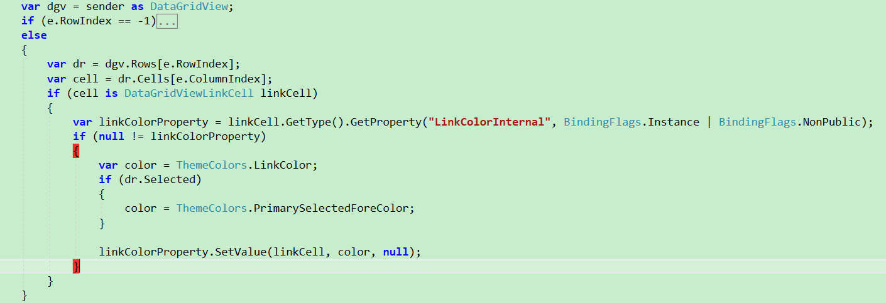
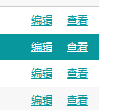

# DataGridView

[TOC]

## DataGridView使用笔记

1. <span style="color:blue;">如何更改DataGridView选中行中超链接单元格（DataGridViewLinkCell）的字体颜色？</span>

   > 有WinForm DataGridView使用经验的朋友会发现能设置DataGridViewLinkColumn列的字体颜色（LinkColor属性），但是选中行的字体颜色用的仍旧是设置的LinkColor值，如果LinkColor的颜色与选中行的背景色一样那么就无法看到超链接的文本（字体颜色与选中行的背景色一样），经过查找 [DataGridViewLinkCell.cs 源码](https://source.dot.net/#System.Windows.Forms/System/Windows/Forms/DataGridViewLinkCell.cs,1063) 源码发现无法直接修改DataGridViewLinkCell选中时的字体颜色。

   ==解决办法==

   在DataGridView的CellPainting事件中添加如下代码，通过反射在绘制单元格之前改变LinkColor的值：

   

   核心代码块为：

   ```C#
                   var dr = dgv.Rows[e.RowIndex];
                   var cell = dr.Cells[e.ColumnIndex];
                   if (cell is DataGridViewLinkCell linkCell)
                   {
                       var linkColorProperty = linkCell.GetType().GetProperty("LinkColorInternal", BindingFlags.Instance | BindingFlags.NonPublic);
                       if (null != linkColorProperty)
                       {
                           var color = ThemeColors.LinkColor;
                           if (dr.Selected)
                           {
                               color = ThemeColors.PrimarySelectedForeColor;
                           }
   
                           linkColorProperty.SetValue(linkCell, color, null);
                       }
                   }
   ```
   
   ==实现效果==
   
   
   
   