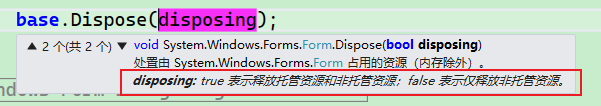

# WinForm中控件资源的释放

本文谈谈在WinForm程序中创建的控件资源是何时以及如何释放的。

<div style="display:inline-block;position:relative;background:#2196F3;color:white;text-align:center;padding: 0px 25px;            height:45px;line-height:45px;border-radius:5px 5px 5px 0px;letter-spacing:2px;">
        <div>一、控件资源释放相关的代码</div>
        <div style="width:0px;height:0px;position: absolute;border:5px solid transparent;border-top:5px solid #1a76c0;            border-right:5px solid #1a76c0;left: 0px;bottom: -10px;"></div>
</div>
<br />

[Dispose](https://source.dot.net/#System.ComponentModel.Primitives/System/ComponentModel/Component.cs,ec402748f4bd1220,references)


```C#
// Licensed to the .NET Foundation under one or more agreements.
// The .NET Foundation licenses this file to you under the MIT license.
 
namespace System.ComponentModel
{
    /// <summary>
    /// Provides the default implementation for the <see cref='System.ComponentModel.IComponent'/>
    /// interface and enables object-sharing between applications.
    /// </summary>
    [DesignerCategory("Component")]
    public class Component : MarshalByRefObject, IComponent
    {
        // 省略了若干代码.......
        
        ~Component() => Dispose(false);
        
        /// <summary>
        /// Disposes of the <see cref='System.ComponentModel.Component'/>.
        /// </summary>
        public void Dispose()
        {
            Dispose(true);
            GC.SuppressFinalize(this);
        }
        
        /// <summary>
        /// Disposes all the resources associated with this component.
        /// </summary>
        protected virtual void Dispose(bool disposing)
        {
            if (disposing)
            {
                lock (this)
                {
                    _site?.Container?.Remove(this);
                    if (_events != null)
                    {
                        ((EventHandler?)_events[s_eventDisposed])?.Invoke(this, EventArgs.Empty);
                    }
                }
            }
        }
        
        // 省略了若干代码.......
    }
}
```

<div style="border-left:6px solid #2196F3;background:#ddffff;padding:14px;font-size:16px;letter-spacing:1px;">上面的代码提供了以下几个重要的信息</div>

> 1. .NET中的资源分为**托管资源**和**非托管资源**。
> 2. 资源的释放过程分为**自动释放资源**和**手动释放资源**。
> 3. 自动释放资源的过程：
>    1. 托管资源：由CLR控制资源的释放，因此我们不必关心托管资源的释放。
>    2. 非托管资源：系统会自动调用析构函数，因此在有非托管资源时我们要在析构函数中实现非托管资源的释放。
> 4. 手动释放资源的过程：
>    1. 通过调用 Dispose() 方法来释放所有资源（托管资源和非托管资源都需要释放）。


<div style="display:inline-block;position:relative;background:#2196F3;color:white;text-align:center;padding: 0px 25px;            height:45px;line-height:45px;border-radius:5px 5px 5px 0px;letter-spacing:2px;">
        <div>二、困惑的点及解答（Q&A）</div>
        <div style="width:0px;height:0px;position: absolute;border:5px solid transparent;border-top:5px solid #1a76c0;            border-right:5px solid #1a76c0;left: 0px;bottom: -10px;"></div>
</div>
<br />

下面罗列了几个让人困惑的点进行逐个的解答。

<div>
	<div style="display:inline-block;position:relative;background:#2196F3;color:white;text-align:center;padding:0px 20px;height:45px;line-height:45px;letter-spacing:2px;">
		<div>1、IDisposable 接口相关</div>
		<div style="position:absolute;right:-22px;top:0px;height:45px;width:45px;background:#2196F3;transform:skew(45deg,0deg);z-index:-1;"></div>
	</div>
	<div style="background-color:#2196F3;height:3px;width:100%;"/>
</div>
<br />

[System.IDisposable 接口 - .NET | Microsoft Learn](https://learn.microsoft.com/zh-cn/dotnet/fundamentals/runtime-libraries/system-idisposable)

> [IDisposable](https://learn.microsoft.com/zh-cn/dotnet/api/system.idisposable) 接口的主要用途是释放非托管资源。 

上面的话摘自 MSDN 中 IDisposable  接口的说明。我想这也是这个接口设计的一个初衷，为什么会有这样的初衷呢？

> 1. 我们知道在 .NET 中的托管资源已经有 CLR 帮我们进行管理和释放了，因此我们不必关心托管资源的释放问题。
> 2. 由于系统无法自动释放非托管资源，因此必须要有一种规范的方式来解决非托管资源的释放问题，因此次接口的设计就是为了解决这个问题。

<div style="background:red;color:white;padding:15px;border-radius:6px;">但结合到上面的 Component 类的实现里，这个初衷其实就发生了些微妙的转变！！！IDisposable 接口的作用更像是提供手动释放资源的一种机制</div>



通过上面截图里的注释可知 IDisposable 接口的 `void Dispose();` 方法释放的不再仅限于非托管资源，而是所有的资源！所以我们知道：

> [!IMPORTANT]
>
> 1. 调用 Dispose(true); 时释放的是所有的资源，包括托管资源和非托管资源；
> 2. 调用 Dispose(false);时释放的是非托管资源；

有了此结论对于我们理解上面的代码就至关重要了！下面我们来逐个分析上面 Component 中释放资源相关的代码。


<div>
	<div style="display:inline-block;position:relative;background:#2196F3;color:white;text-align:center;padding:0px 20px;height:45px;line-height:45px;letter-spacing:2px;">
		<div>2、析构函数中为什么只释放非托管资源？</div>
		<div style="position:absolute;right:-22px;top:0px;height:45px;width:45px;background:#2196F3;transform:skew(45deg,0deg);z-index:-1;"></div>
	</div>
	<div style="background-color:#2196F3;height:3px;width:100%;"/>
</div>
<br />

```C#
// 析构函数，用于释放非托管资源
~Component() => Dispose(false);
```

> 在 .NET 中由于托管资源由 CLR 来管理我们不需要关心他们的回收问题，因此需要一种方式来释放和回收非托管资源。析构函数由系统来进行调用，因此我们只要在析构函数中实现非托管资源的释放和回收，那么就可以解决所有资源的释放和回收问题。所以上面的代码我们可以得到下面几个重要的信息：
>
> 1. 析构函数由系统自动调用。
> 2. 析构函数中释放的是非托管资源。由于析构函数是系统自动调用的因此只要析构函数中管理好相关的非托管资源那么也就实现了非托管资源的自动回收；


<div>
	<div style="display:inline-block;position:relative;background:#2196F3;color:white;text-align:center;padding:0px 20px;height:45px;line-height:45px;letter-spacing:2px;">
		<div>3、public void Dispose() 中为啥要调用 GC.SuppressFinalize(this); ？</div>
		<div style="position:absolute;right:-22px;top:0px;height:45px;width:45px;background:#2196F3;transform:skew(45deg,0deg);z-index:-1;"></div>
	</div>
	<div style="background-color:#2196F3;height:3px;width:100%;"/>
</div>
<br />

[GC.SuppressFinalize(Object) 方法 (System) | Microsoft Learn](https://learn.microsoft.com/zh-cn/dotnet/api/system.gc.suppressfinalize?view=net-9.0)

```C#
/// <summary>
/// 手动释放所有的资源（包含托管资源和非托管资源）
 /// </summary>
public void Dispose()
{
    Dispose(true);
    GC.SuppressFinalize(this);
}
```

> 此代码段包含了如下两个重要的信息：
>
> 1. 此函数不会自动的被调用，需要显示或者隐式的调用。
> 2. 此函数释放的是所有的资源，而不仅是非托管资源，托管资源也会被释放。

那如果手动的调用了  `Dispose();` 方法释放了所有资源，而系统又自动调用了析构函数来释放非托管资源，那不就导致了非托管资源的重复释放吗？回答是肯定的，因此 `GC.SuppressFinalize(this);` 的作用就是为了抑制系统不要调用此对象的析构函数（对象的终结器），因为所有的资源都通过手动调用Dispose(true);函数释放处理过了。

可以用下面的类来验证此结论

```C#
    public class MyObject : IDisposable
    {
        public MyObject()
        {
            System.Diagnostics.Debug.WriteLine($"MyObject -> ManagedThreadId = {System.Threading.Thread.CurrentThread.ManagedThreadId}");
        }
        ~MyObject()
        {
            this.Dispose(false);
        }

        public void Dispose()
        {
            this.Dispose(true);

            // 手动调用 Dispose(); 方式时可以通过注释下面的行来验证析构函数（类终结器）是否会被调用
            GC.SuppressFinalize(this);
        }

        /// <summary>
        /// 释放资源
        /// </summary>
        /// <param name="disposing">true - 表示释放托管资源和非托管资源；false - 表示紧释放非托管资源</param>
        private void Dispose(bool disposing)
        {
            System.Diagnostics.Debug.WriteLine($"MyObject -> Dispose(disposing:{disposing})");
        }
    }
```


<div style="display:inline-block;position:relative;background:#2196F3;color:white;text-align:center;padding: 0px 25px;            height:45px;line-height:45px;border-radius:5px 5px 5px 0px;letter-spacing:2px;">
        <div>三、相关参考</div>
        <div style="width:0px;height:0px;position: absolute;border:5px solid transparent;border-top:5px solid #1a76c0;            border-right:5px solid #1a76c0;left: 0px;bottom: -10px;"></div>
</div>
<br />


- [改善C#程序的建议4：C#中标准Dispose模式的实现 - 陆敏技 - 博客园](https://www.cnblogs.com/luminji/archive/2011/03/29/1997812.html)
