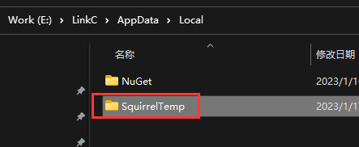
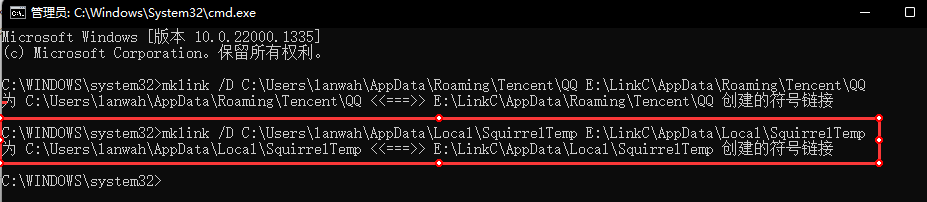

# mklink

[TOC]

创建目录或文件符号或硬链接。

**本文主要介绍的是创建目录的符号链接，用于解决硬盘空间不足把内容映射到其他盘符的情况。**
## 语法
`mklink /D dir1 dir2`
其中dir1，dir2为目录的路径，上面的命令功能是：把dir2目录映射到dir1，dir1是一个目录的快捷方式，dir2中存放真实的数据，但对dir1中文件的操作会影响dir2。

## 举例
C盘存在 **C:\Users\lanwah\AppData\Local\SquirrelTemp** 文件夹，由于C盘空间不足因此把此目录移动到 **E:\LinkC\AppData\Local** 目录下，操作步骤如下：
1. 在 **C:\Users\lanwah\AppData\Local** 目录选中 **SquirrelTemp** 文件夹，右键菜单选择 **复制**。
2. 在 **E:\LinkC\AppData\Local** 目录下直接粘贴，最终如下:
   。
3. 2步骤确认操作成功，无提示无报错的前提下，找到 **C:\Users\userName\AppData\Local\SquirrelTemp** 文件夹直接删除。
4. 以管理员身份运行Cmd命令，输入如下内容
   `mklink /D C:\Users\lanwah\AppData\Local\SquirrelTemp E:\LinkC\AppData\Local\SquirrelTemp`
   此命令的意思为在 C:\Users\lanwah\AppData\Local\SquirrelTemp 路径创建 E:\LinkC\AppData\Local\SquirrelTemp 目录的快捷方式。这样对C:\Users\lanwah\AppData\Local\SquirrelTemp目录的访问其实访问的是E:\LinkC\AppData\Local\SquirrelTemp目录。
   运行效果如下:
   
5. 至此操作完成。

## 注意点

==如果路径中包含空格，则路径需要用引号引起来，如下：==
`mklink /d "C:\Program Files\Docker\Docker" "E:\LinkC\Program Files\Docker"`

---
## 参考

1. [MSDoc/mklink](https://learn.microsoft.com/zh-cn/windows-server/administration/windows-commands/mklink)