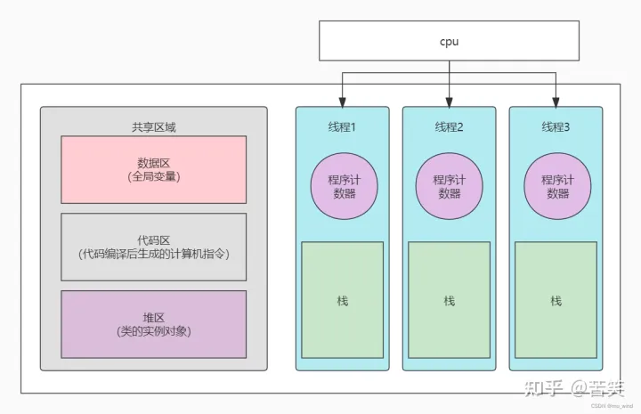

# 进程与线程

[TOC]

---

开始前先看一组非常传神的图例，相信可以帮助你更好理解进程与线程的概念：

## 进程

### 定义

什么是进程？

> 进程是一个具有一定独立功能的程序在一个数据集合上依次动态执行的过程。进程是计算机中正在运行的程序的实例，包括程序计数器、寄存器和程序变量的当前值。

### 特点

进程具有哪些特点?

- 进程之间相互独立，每个进程运行在自己的地址空间中，互不干扰。

- 进程具有独立的执行顺序和执行状态，可以创建、终止、挂起、恢复和等待其他进程。

- 进程拥有自己的进程控制块（Process Control Block，PCB），用于记录进程的状态信息，如进程ID、寄存器、内存分配和打开的文件等。

- 进程是操作系统进行资源分配和调度的基本单位（CPU除外，线程是处理器任务调度和执行的基本单位）。

- 进程之间相互独立，通过进程间通信（Inter-Process Communication，IPC）来实现数据共享和通信。

- 每个进程都至少包含一个线程。

## 线程

### 定义

什么是线程？

> 线程是进程中的实体，是进程的执行单元，是cpu调度和分派的基本单位。
>
> 它是比进程更小的能独立运行的基本单位。线程自己基本上不拥有系统资源，只拥有一点在运行中必不可少的资源，但是它可以和同属于一个进程的其他线程共享进程所拥有的的全部资源。一个进程可以包含多个线程，它们共享进程的地址空间和系统资源。

### 特点

线程具有哪些特点?

- 线程是进程中的执行单元，一个进程可以包含多个线程。
- 线程间共享进程的资源，包括内存、文件句柄等。
- 线程是并发执行的最小单位。

## 进程与线程的联系与区别

### 联系

- 每个进程都至少包含一个线程。一个进程可以包含多个线程，它们共享进程的地址空间和系统资源。
- 一个线程可以创建和撤销另一个线程。
- 同一个进程中的多个线程之间可以并发执行。

### 区别

- ==进程是操作系统资源分配的基本单位，而线程是处理器任务调度和执行的基本单位。==
- 一个进程至少有一个线程，线程是进程的一部分，所以线程也被称为轻权进程或者轻量级进程。
- 每个进程都有独立的地址空间，进程之间的切换会有较大的开销；线程可以看做轻量级的进程，同一个进程内的线程共享进程的地址空间，每个线程都有自己独立的运行栈和程序计数器，线程之间切换的开销小。
- 一个进程崩溃后，在保护模式下其他进程不会被影响，但是一个线程崩溃可能导致整个进程被操作系统杀掉，所以多进程要比多线程健壮。

## 扩展

### 并行与并发

一个CPU在一个瞬间只能处理一个任务。

但为什么在我们人类视角，哪怕是单核心计算机也能同时做很多事情，比如同时听音乐和浏览网页，作为整个系统唯一可以完成计算任务的 CPU 是如何保证两个进程“同时进行”的呢？

时间片轮转调度！

每个进程会被操作系统分配一个时间片，即每次被 CPU 选中来执行当前进程所用的时间。时间一到，无论进程是否运行结束，操作系统都会强制将 CPU 这个资源转到另一个进程去执行。

为什么要这样做呢？

因为只有一个单核 CPU，假如没有这种轮转调度机制，那它该去处理写文档的进程还是该去处理听音乐的进程？无论执行哪个进程，另一个进程肯定是不被执行，程序自然就是无运行的状态。如果 CPU 一会儿处理 word 进程一会儿处理听音乐的进程，起初看起来好像会觉得两个进程都很卡，但是 CPU 的执行速度已经快到让人们感觉不到这种切换的顿挫感，就真的好像两个进程在“并行运行”。

随着多核心CPU的出现，真正的并行得以实现。

所谓的进程上下文，就是一个进程在执行的时候，CPU的所有寄存器中的值、进程的状态以及堆栈上的内容，当内核需要切换到另一个进程时，它需要保存当前进程的所有状态，即保存当前进程的进程上下文，以便再次执行该进程时，能够恢复切换时的状态，继续执行。

## 相关参考

1. [线程与进程，你真的理解了吗](https://zhuanlan.zhihu.com/p/519803985)
2. [进程与线程的关系和区别](https://www.cnblogs.com/linyu51/p/13339238.html)
