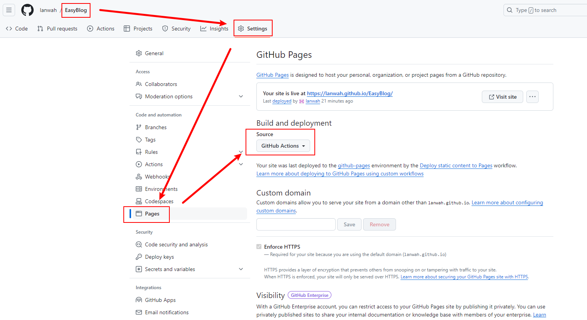

# 使用EasyBlog搭建自己的Markdown网站

原文链接：[【.NET项目分享】免费开源的静态博客生成工具EasyBlog,5分钟拥有自己的博客](https://www.cnblogs.com/msdeveloper/p/18201819/open-dotnet-easyblog)

[视频介绍](https://www.bilibili.com/video/BV1Vp42127Np/?spm_id_from=333.337.search-card.all.click&vd_source=7989703b95b1c04d56c116d2748f5059)

## 搭建步骤

1. 打开作者开源的项目地址：[GitHub - AterDev/EasyBlog: Easy and fast static blog website](https://github.com/AterDev/EasyBlog)

2. 点击`Fork`按钮，并创建自己的仓库。 并取消选择 Copy the main branch only。

   

3. 进入自己的GitHub仓库，点击`Actions`，启用workflows。

   

4. 点击`Settings`，找到Pages配置，在Build and deployment 选项中选择`GitHub Actions`.

   

5. 至此设置完成，从自己的仓库拉取**EasyBlog**的代码，切换到**main**分支，修改配置和编写markdown文章即可，markdown文章必须存放在Content目录。

## 注意事项

1. 文章分类目前有以下限制，如下图所示：

A、Markdown文章分类目前不支持二级分类；

B、创建分类的方式为在 ==Content== 目录新建子文件夹，文件夹的名称为分类的名称；

2. Fork的代码分支有3个，分别是main、dev、master。会自动构建的代码分支为**main**，只要往main分支推送了markdown文章就会触发自动构建。
2. 注意目前文章导航只支持1级标题。
2. 注意目前图片和文字不支持显示在同一行。

## 相关参考

1、[【.NET项目分享】免费开源的静态博客生成工具EasyBlog,5分钟拥有自己的博客 - TypingLearn - 博客园 (cnblogs.com)](https://www.cnblogs.com/msdeveloper/p/18201819/open-dotnet-easyblog)

2、[GitHub EasyBlog](https://github.com/AterDev/EasyBlog)

3、[作者提供的项目展示地址](https://blog.dusi.dev/)
