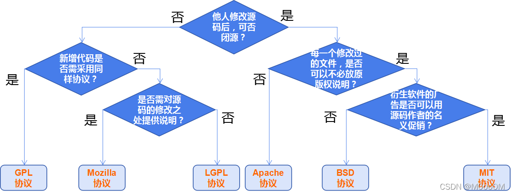
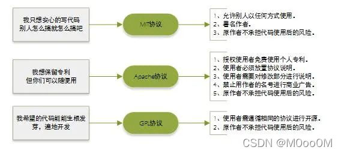
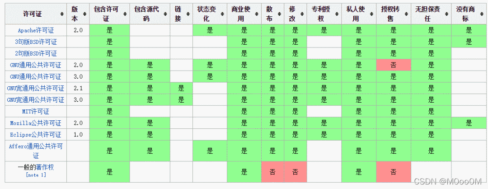

# 开源软件许可协议介绍

[TOC]

---

开源协议：https://opensource.org/licenses/

## 什么是开源许可证

开源许可证是一种法律许可。通过它，版权拥有人明确允许，用户可以免费地使用、修改、共享版权软件。

版权法默认禁止共享，也就是说，没有许可证的软件，就等同于保留版权，虽然开源了，用户只能看看源码，不能用，一用就会侵犯版权。所以软件开源的话，必须明确地授予用户开源许可证。

## 开源许可证的种类

目前，国际公认的开源许可证共有[80多种](https://opensource.org/licenses/alphabetical)。它们的共同特征是，都允许用户免费地使用、修改、共享源码，但是都有各自的使用条件。

如果一种开源许可证没有任何使用条件，连保留作者信息都不需要，那么就等同于放弃版权了。这时，软件可以直接声明进入"公共领域"（public domain）。

根据使用条件的不同，开源许可证分成两大类。

- 宽松式（permissive）许可证
- Copyleft 许可证

### 宽松式许可证

#### 特点

宽松式许可证（permissive license）是最基本的类型，对用户几乎没有限制。==用户可以修改代码后闭源==。

它有三个基本特点。

**（1）没有使用限制**

用户可以使用代码，做任何想做的事情。

**（2）没有担保**

不保证代码质量，用户自担风险。

**（3）披露要求（notice requirement）**

用户必须披露原始作者。

#### 常见的宽松式许可证

常见的宽松式许可证有四种。它们都允许用户任意使用代码，区别在于要求用户遵守的条件不同。

**（1）BSD（二条款版）**

分发软件时，必须保留原始的许可证声明。

**（2） BSD（三条款版）**

分发软件时，必须保留原始的许可证声明。不得使用原始作者的名字为软件促销。

**（3）MIT**

分发软件时，必须保留原始的许可证声明，与 BSD（二条款版）基本一致。

**（4）Apache 2**

分发软件时，必须保留原始的许可证声明。凡是修改过的文件，必须向用户说明该文件修改过；没有修改过的文件，必须保持许可证不变。

### Copyleft 许可证

#### Copyleft 的含义

Copyleft 是[理查德·斯托曼](http://www.ruanyifeng.com/blog/2005/03/post_112.html)发明的一个词，作为 Copyright （版权）的反义词。

Copyright 直译是"复制权"，这是版权制度的核心，意为不经许可，用户无权复制。作为反义词，Copyleft 的含义是==不经许可，用户可以随意复制==。

但是，它带有前提条件，比宽松式许可证的限制要多。

- 如果分发二进制格式，必须提供源码
- 修改后的源码，必须与修改前保持许可证一致
- 不得在原始许可证以外，附加其他限制

上面三个条件的核心就是：==修改后的 Copyleft 代码不得闭源。==

#### 常见Copyleft许可证

常见的 Copyleft 许可证也有四种（对用户的限制从最强到最弱排序）。

**（1）Affero GPL (AGPL)**

如果云服务（即 SAAS）用到的代码是该许可证，那么云服务的代码也必须开源。

**（2）GPL**

如果项目包含了 GPL 许可证的代码，那么整个项目都必须使用 GPL 许可证。

**（3）LGPL**

如果项目采用动态链接调用该许可证的库，项目可以不用开源。

**（4）Mozilla（MPL）**

只要该许可证的代码在单独的文件中，新增的其他文件可以不用开源。

## 常见协议详细介绍

按照许可协议限制从左至右越来越宽松，MIT协议限制最少，[BSD](https://so.csdn.net/so/search?q=BSD&spm=1001.2101.3001.7020)协议对商业运用最好。

### [MIT协议](./MIT协议介绍.md)

MIT源自麻省理工学院(Massachusetts Institute of Technology, MIT)，又称X11协议。作者只想保留版权，而无任何其他了限制。MIT与BSD类似，但是比BSD协议更加宽松，是目前最少限制的协议。这个协议唯一的条件就是==在修改后的代码或者发行包包含原作者的许可信息==。适用商业软件。使用MIT的软件项目有：jquery、Node.js。

### [BSD协议](./BSD协议介绍.md)

BSD是"Berkeley Software Distribution"的缩写，意思是"伯克利软件发行版"。

BSD开源协议：是一个给于使用者很大自由的协议。可以自由的使用，修改源代码，也可以将修改后的代码作为开源或者专有软件再发布。当你发布使用了BSD协议的代码，或则以BSD协议代码为基础做二次开发自己的产品时，需要满足三个条件：

1. 如果再发布的产品中包含源代码，则在源代码中必须带有原来代码中的BSD协议。

2. 如果再发布的只是二进制类库/软件，则需要在类库/软件的文档和版权声明中包含原来代码中的BSD协议。

3. 不可以用开源代码的作者/机构名字和原来产品的名字做市场推广。

BSD代码鼓励代码共享，但需要尊重代码作者的著作权。BSD由于允许使用者修改和重新发布代码，也允许使用或在BSD代码上开发商业软件发布和销售，因此是对商业集成很友好的协议。而很多的公司企业在选用开源产品的时候都首选BSD协议，因为可以完全控制这些第三方的代码，在必要的时候可以修改或者二次开发。

### Apache License

Apache License(Apache许可证)，是Apache软件基金会发布的一个自由软件许可证。Apache Licence是著名的非盈利开源组织Apache采用的协议。该协议和BSD类似，同样鼓励代码共享和最终原作者的著作权，同样允许源代码修改和再发布。但是也需要遵循以下条件：

需要给代码的用户一份Apache Licence。

如果修改了代码，需要在被修改的文件中说明。

在衍生的代码中(修改和有源代码衍生的代码中)需要带有原来代码中的协议，商标，专利声明和其他原来作者规定需要包含的说明。

如果再发布的产品中包含一个Notice文件，则在Notice文件中需要带有Apache Licence。你可以在Notice中增加自己的许可，但是不可以表现为对Apache Licence构成更改。

Apache Licence是对商业应用友好的许可。使用者也可以在需要的时候修改代码来满足并作为开源或商业产品发布/销售。

使用这个协议的好处是:

永久权利，一旦被授权，永久拥有。

全球范围的权利，在一个国家获得授权，适用于所有国家。假如你在美国，许可是从印度授权的，也没有问题。

授权免费，无版税， 前期、后期均无任何费用。

授权无排他性，任何人都可以获得授权。

授权不可撤消，一旦获得授权，没有任何人可以取消。比如，你基于该产品代码开发了衍生产品，你不用担心会在某一天被禁止使用该代码。

### GPL

GPL(GNU General Public License)：GNU通用公共许可协议。

Linux采用了GPL。GPL协议和BSD，Apache Licence等鼓励代码重用的许可很不一样。GPL的出发点是代码的开源/免费使用和引用/修改/衍生代码的开源/免费使用，但不允许修改后和衍生的代码做为闭源的商业软件发布和销售。这也就是为什么我们能用免费的各种Linux，包括商业公司的Linux和Linux上各种各样的由个人，组织，以及商业软件公司开发的免费软件了。

### LGPL

LGPL是GPL的一个为主要为类库使用设计的开源协议。和GPL要求任何使用/修改/衍生之GPL类库的的软件必须采用GPL协议不同。LGPL允许商业软件通过类库引用(link)方式使用LGPL类库而不需要开源商业软件的代码。这使得采用LGPL协议的开源代码可以被商业软件作为类库引用并发布和销售。

但是如果修改LGPL协议的代码或者衍生，则所有修改的代码，涉及修改部分的额外代码和衍生的代码都必须采用LGPL协议。因此LGPL协议的开源代码很适合作为第三方类库被商业软件引用，但不适合希望以LGPL协议代码为基础，通过修改和衍生的方式做二次开发的商业软件采用。

GPL/LGPL都保障原作者的知识产权，避免有人利用开源代码复制并开发类似的产品。

### MPL(Mozilla Public License 1.1)

MPL协议允许免费重发布、免费修改，但要求修改后的代码版权归软件的发起者 。这种授权维护了商业软件的利益，他要求基于这种软件的修改无偿贡献版权给该软件。这样，围绕该软件的所有代码的版权都集中在发起开发人的手中。但MPL是允许修改，无偿使用得。MPL软件对链接没有要求。

### EPL(Eclipse Public License 1.0)

EPL允许Recipients任意使用、复制、分发、传播、展示、修改以及改后闭源的二次商业发布。

使用EPL协议，需要遵守以下规则：

- 当一个Contributors将源码的整体或部分再次开源发布的时候，必须继续遵循EPL开源协议来发布，而不能改用其他协议发布。除非你得到了原"源码"Owner 的授权。
- EPL协议下，你可以将源码不做任何修改来商业发布。但如果你要发布修改后的源码，或者当你再发布的是Object Code的时候，你必须声明它的Source Code是可以获取的，而且要告知获取方法。
- 当你需要将EPL下的源码作为一部分跟其他私有的源码混和着成为一个Project发布的时候，你可以将整个Project/Product以私人的协议发布，但要声明哪一部分代码是EPL下的，而且声明那部分代码继续遵循EPL。
- 独立的模块(Separate Module)，不需要开源。

### Creative Commons知识共享协议

Creative Commons(CC)许可协议并不能说是真正的开源协议，他们大多是被使用于设计类的工程上。CC 协议种类繁多，每一种都授权特定的权利。一个CC许可协议具有四个基本部分，这几个部分可以单独起作用，也可以组合起来。下面是这几部分的简介：

1. 署名，作品上必须附有作品的归属如此之后，作品可以被修改，分发，复制和其他用途。

2. 相同方式共享，作品可以被修改、分发或其它操作，但所有的衍生品都要置于CC许可协议下。

3. 非商业用途，作品可以被修改、分发等等，但不能用于商业目的。但语言上对什么是"商业"的说明十分含糊不清 (没有提供精确的定义)，所以你可以在你的工程里对其进行说明。例如，有些人简单的解释"非商业"为不能出售这个作品。而另外一些人认为你甚至不能在有广告的网站上使用它们。还有些人认为"商业"仅仅指你用它获取利益。

4. 禁止衍生作品，CC许可协议的这些条款可以自由组合使用。大多数的比较严格的CC协议会声明 "署名权，非商业用途，禁止衍生"条款，这意味着你可以自由的分享这个作品，但你不能改变它和对其收费，而且必须声明作品的归属。这个许可协议非常的有用，他可以让你的作品传播出去，但又可以对作品的使用保留部分或完全的控制。最少限制的CC协议类型当属 "署名"协议，这意味着只要人们能维护你的名誉，他们对你的作品怎么使用都行。

CC 许可协议更多的是在设计类工程中使用，而不是开发类，但没有人或妨碍你将之使用与后者。只是你必须要清楚各部分条款能覆盖到的和不能覆盖到的权利。

版权声明：本文为CSDN博主「KKBABA16」的原创文章，遵循CC 4.0 BY-SA版权协议，转载请附上原文出处链接及本声明。
原文链接：https://blog.csdn.net/M0oo0M/article/details/122354757

## 相关参考

1. [开源许可证教程](http://www.ruanyifeng.com/blog/2017/10/open-source-license-tutorial.html)
2. [开源软件许可协议MIT、BSD、Apache、LPGL、Mozilla、GPL的区别](https://blog.csdn.net/M0oo0M/article/details/122354757)
3. [各种开源协议介绍](https://www.runoob.com/w3cnote/open-source-license.html)