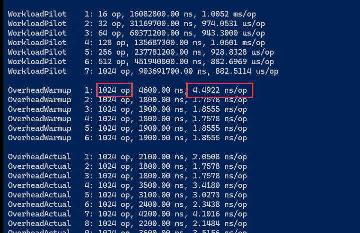

# BenchmarkDotNet

[TOC]

---

## 官方开源地址和文档

**GitHub：**[GitHub - dotnet/BenchmarkDotNet: Powerful .NET library for benchmarking](https://github.com/dotnet/BenchmarkDotNet)

**文档首页：**[Overview | BenchmarkDotNet](https://benchmarkdotnet.org/articles/overview.html)

## How it works

 https://benchmarkdotnet.org/articles/guides/how-it-works.html

BenchmarkDotNet follows the following steps to run your benchmarks:

1. `BenchmarkRunner` generates an isolated project per each runtime settings and builds it in Release mode.

2. Next, we take each method/job/params combination and try to measure its performance by launching benchmark process several times (`LaunchCount`).

3. An invocation of the workload method is an operation . A bunch of operation is an iteration . If you have an  IterationSetup  method, it will be invoked before each iteration, but not between operations. We have the following type of iterations:

   - `Pilot`: The best operation count will be chosen.
   - `OverheadWarmup`, `OverheadWorkload`: BenchmarkDotNet overhead will be evaluated.
   - `ActualWarmup`: Warmup of the workload method.
   - `ActualWorkload`: Actual measurements.
   - `Result` = `ActualWorkload` - `<MedianOverhead>`
   
4. After all of the measurements, BenchmarkDotNet creates:

   - An instance of the `Summary` class that contains all information about benchmark runs.
   - A set of files that contains summary in human-readable and machine-readable formats.
   - A set of plots.

## Choosing RunStrategy

If you run a benchmark, you always (explicitly or implicitly) use a [job](https://benchmarkdotnet.org/articles/configs/jobs.html). Each `Job` has the `RunStrategy` parameter which allows switching between different benchmark modes. The default `RunStrategy` is `Throughput`, and it works fine for most cases. However, other strategies are also useful in some specific cases.

 https://benchmarkdotnet.org/articles/guides/choosing-run-strategy.html

## 简单使用示例

Program.cs

```C#
    /// <summary>
    /// https://benchmarkdotnet.org/articles/overview.html
    /// </summary>
    internal class Program
    {
        static void Main(string[] args)
        {
            //var hashHelper = new Md5VsSha256();
            //var byte1 = hashHelper.Md5();
            //var byte2 = hashHelper.Sha256();
            //var isEqual = byte1.SequenceEqual(byte2);


            var summary = BenchmarkRunner.Run<Md5VsSha256>();
            Console.ReadLine();
        }
    }
```

Md5VsSha256.cs

```C#
    [MemoryDiagnoser]
    //[SimpleJob(RunStrategy.ColdStart)]
    [SimpleJob(RunStrategy.ColdStart, iterationCount: 5)]
    public class Md5VsSha256
    {
        private const int N = 10000;
        private readonly byte[] data;

        private readonly SHA256 sha256 = SHA256.Create();
        private readonly MD5 md5 = MD5.Create();

        public Md5VsSha256()
        {
            data = new byte[N];
            new Random(42).NextBytes(data);
        }

        [Benchmark]
        public byte[] Sha256() => sha256.ComputeHash(data);

        [Benchmark(Baseline = true)]
        public byte[] Md5() => md5.ComputeHash(data);
    }
```


## BenchmarkDotNet打印列的含义

| 列名      | 含义                                                         |
| --------- | ------------------------------------------------------------ |
| Method    | 测试方法的名称                                               |
| Mean      | 测试运行的平均时间                                           |
| Error     | 测试运行的标准误差，标准误差是测试结果的离散程度的度量，标准误差越小，表示测试结果越稳定 |
| StdDev    | 所有测试运行的标准偏差，标准偏差是测试结果的离散程度的度量，标准偏差越小，表示测试结果越接近平均值。 |
| Median    | 所有测试运行的中位数。中位数是测试结果的中间值，如果测试结果的个数为奇数，则中位数为中间的那个值；如果测试结果的个数为偶数，则中位数为中间两个值的平均值。 |
| Ratio     | 每个测试运行的平均时间与基准测试运行的平均时间的比值。基准测试是性能最好的测试，它的比值为 1.0。其他测试的比值表示它们相对于基准测试的性能表现，比值越小，表示性能越好。 |
| RatioSD   | 所有测试运行的比值的标准偏差。标准偏差越小，表示比值的离散程度越小，测试结果更稳定。 |
| Gen 0     | 所有测试运行期间生成的第 0 代垃圾回收的次数。垃圾回收是 .NET 运行时自动回收不再使用的内存的机制，Generational Garbage Collection 是 .NET 中的一种垃圾回收算法。 |
| Gen 1     | 所有测试运行期间生成的第 1 代垃圾回收的次数。                |
| Gen 2     | 所有测试运行期间生成的第 2 代垃圾回收的次数。                |
| Allocated | 所有测试运行期间分配的内存总量。                             |
|           |                                                              |

## Benchmark输出列

| 列                | 含义                                                         |
| ----------------- | ------------------------------------------------------------ |
| [MemoryDiagnoser] | 输出内存分配及回收信息，会输出：<br />Gen0<br />Gen1<br />Gen2<br />Allocated<br />Alloc Ratio 列信息 |
| [RankColum]       | 输出排名信息，会输出：<br />Rank 列信息                      |
| MinColumn         |                                                              |
| MaxColumn         |                                                              |
| MeanColumn        |                                                              |
| MedianColumn      | 所有测试运行的中位数。中位数是测试结果的中间值，如果测试结果的个数为奇数，则中位数为中间的那个值；如果测试结果的个数为偶数，则中位数为中间两个值的平均值。 |

## Benchmark特性

| 特性                               | 作用于                                                | 含义                                                         |
| ---------------------------------- | ----------------------------------------------------- | ------------------------------------------------------------ |
| Benchmark                          | AttributeTargets.Method                               |                                                              |
| [Benchmark(Baseline = true)]       | AttributeTargets.Method                               | 定义基线方法，详见：[IntroBenchmarkBaseline](https://benchmarkdotnet.org/articles/samples/IntroBenchmarkBaseline.html) |
| [Params(true, false)]              | AttributeTargets.Property<br />AttributeTargets.Field | [IntroParams](https://benchmarkdotnet.org/articles/samples/IntroParams.html) |
| [Arguments(100, 10)]               | AttributeTargets.Method                               | [IntroArguments](https://benchmarkdotnet.org/articles/samples/IntroArguments.html) |
| [SimpleJob(RunStrategy.ColdStart)] | AttributeTargets.Class                                | 冷启动模式，没有试点和预热阶段，详见：[IntroColdStart](https://benchmarkdotnet.org/articles/samples/IntroColdStart.html) |
| [DryJob]                           | AttributeTargets.Class                                | 只运行基准一次，会输出反汇编结果，详见：[IntroDisassemblyDry](https://benchmarkdotnet.org/articles/samples/IntroDisassemblyDry.html) |
| [GlobalSetup]<br />[GlobalCleanup] | AttributeTargets.Method                               | [IntroSetupCleanupGlobal](https://benchmarkdotnet.org/articles/samples/IntroSetupCleanupGlobal.html) |
|                                    |                                                       |                                                              |

## Q&A

<span style="color:blue;font-weight:bold;">RunStrategy.ColdStart中各个参数的含义是什么？</span>

>warmupCount -  预热次数，ColdStart时此配置无效，对应的是操作输出信息中 **WorkloadWarmup** 的次数
>
>launchCount 测试的并发度，配置值为N，当N大于-1时表示一个测试方法运行N遍测试。
>
>iterationCount - 每个测试方法的迭代次数，对应的是操作输出信息中 **WorkloadActual** 的次数
>
>invocationCount - 每个测试方法的调用次数，如下图所示：
>
>

## 相关参考

1. [性能基准测试工具 --- BenchmarkDotNet](https://blog.csdn.net/mzl87/article/details/130868312)

## 版权特别声明

本文只用于记录本人使用BenchmarkDotNet时的一些参考，不做任何其他用途，其中参考的文章在 **相关参考** 中也给出了原文地址。