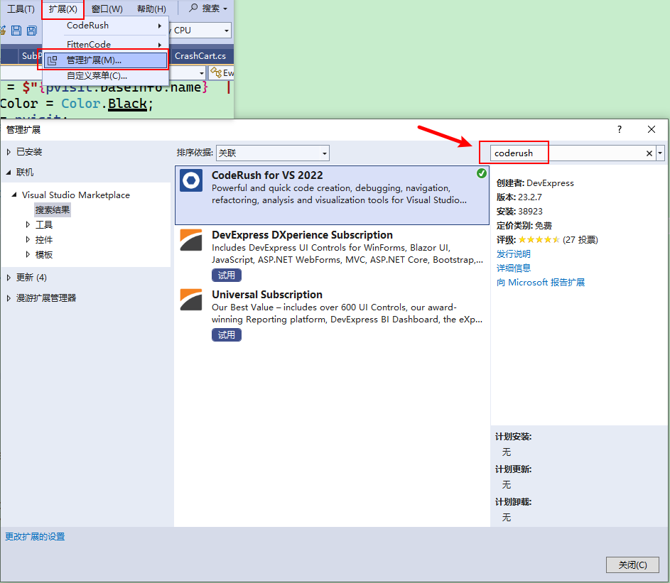
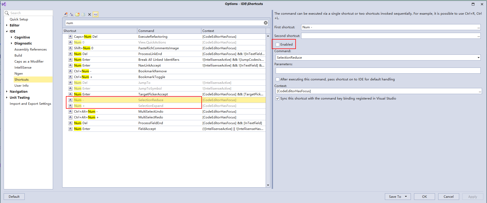
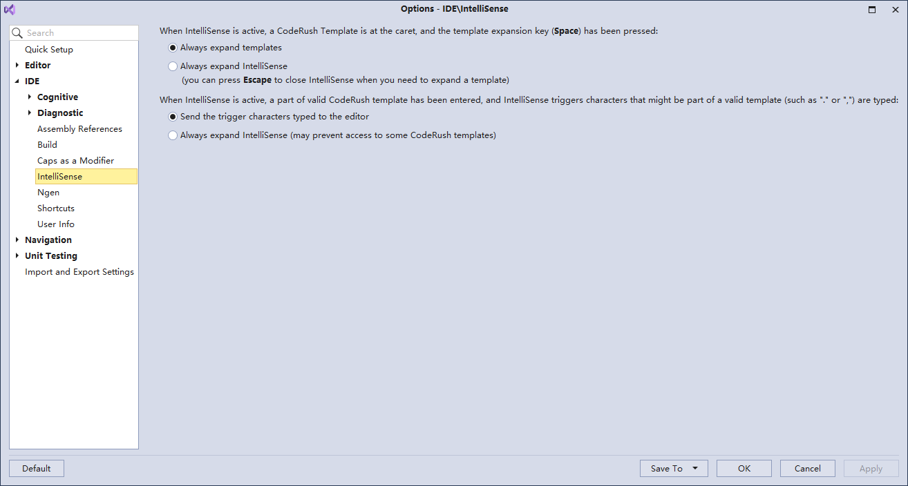

# CodeRush

[TOC]

---

此文用于记录CodeRush的使用和配置。

## CodeRush常用快捷键

### [Keyboard Shortcuts](https://docs.devexpress.com/CodeRushForRoslyn/403630/getting-started/keyboard-shortcuts)

1. [Shortcuts](https://docs.devexpress.com/CodeRushForRoslyn/403628/getting-started/keyboard-shortcuts/shortcuts)

2. [Caps as a Modifier](https://docs.devexpress.com/CodeRushForRoslyn/403629/getting-started/keyboard-shortcuts/caps-as-a-modifier)

3. [CodeRush Shortcuts](https://docs.devexpress.com/CodeRushForRoslyn/401983/getting-started/keyboard-shortcuts/coderush-shortcuts)

### 常用快捷键

| 快捷键               | 功能说明                                                     | 前置条件                                                     |
| -------------------- | ------------------------------------------------------------ | ------------------------------------------------------------ |
| `CapsLock + Space`   | **折叠代码：** 1、显示/隐式转换； 2、表达式和非表达式转换； 3、分解初始化/非分解初始化； 4、变量内联。 | 焦点在要处理的代码行上                                       |
| `CapsLock + Delete`  | **删除未使用的代码：** 1、删除多余的类型限定符； 2、删除未使用的函数； 3、删除未使用的参数。 | 焦点在要处理的代码行上                                       |
| `CapsLock + Insert`  | **新增代码：** 1、新增函数参数； 2、生成基类构造函数； 3、向接口中添加属性或函数。 | 焦点在要处理的代码行上                                       |
| `CapsLock + Up/Down` | 在方法间移动                                                 | 焦点在方法的定义上                                           |
| `Alt + Up/Down`      | 切换方法的访问修饰符（默认不启用）                           | 焦点在方法的定义上                                           |
| `CTRL+C`             | 复制                                                         | 编辑器有焦点                                                 |
| `CTRL+X`             | 剪切                                                         | 编辑器有焦点                                                 |
| `CTRL+W`             | 扩大选择                                                     | 编辑器有焦点                                                 |
| `CTRL+SHIFT+W`       | 减少选择                                                     | 编辑器有焦点                                                 |
| `/`                  | 添加注释/取消注释                                            | 选择多行文本 选择的是一行文本此快捷键不生效 按数字键盘上的/此快捷键不生效 |
| `B`                  | 添加 {} 形成代码块                                           | 选择多行文本                                                 |
| `C`                  | 添加 try/catch 代码块                                        | 选择多行文本                                                 |
| `T`                  | 添加 try/catch/finally 代码块                                | 选择多行文本                                                 |
| `F`                  | 添加 try/finally 代码块                                      | 选择多行文本                                                 |
| r                    | return                                                       |                                                              |
| rt                   | return true;                                                 |                                                              |
| rf                   | return false;                                                |                                                              |
| rn                   | return null;                                                 |                                                              |
| s                    | 设置值                                                       | 依赖于剪贴板的变量                                           |
| st                   | 剪贴板的变量设置为true                                       |                                                              |
| sf                   | 剪贴板的变量设置为false                                      |                                                              |
| sn                   | 剪贴板的变量设置为null                                       |                                                              |
| n                    | 不等于                                                       | 依赖于剪贴板的变量                                           |
| nt                   | 剪贴板的变量不等于为true                                     |                                                              |
| nf                   | 剪贴板的变量不等于为false                                    |                                                              |
| nn                   | 剪贴板的变量不等于为null                                     |                                                              |
| s.e                  | string.Empty                                                 |                                                              |
| p.e                  | Point.Empty                                                  |                                                              |
| v+类型，如 vs        | string varName;                                              |                                                              |
| n+类型，如 ns        | string @string = string.Empty;                               |                                                              |
| m+类型，如 ms        | string MethodName() {      }                     |                                                              |
| a+类型，如 as        | public string PropertyName { get; set; }                     |                                                              |
| p+类型，如 ps        | string propertyName;  public string PropertyName {     get => propertyName;     set => propertyName = value; } |                                                              |
| nl.s                 | List<string> list = new List<string>();                      |                                                              |
| nd.s,i               | Dictionary<string, int> dictionary = new Dictionary<string, int>(); |                                                              |
|                      |                                                              |                                                              |

## 相关文档下载

[CodeRush 快捷键和模板](./CodeRush/CodeRushShortcutsAndTemplates.pdf)

[CodeRush学习指引项目](./CodeRush/LearningSolution.rar)

## Visual Studio 2022安装CodeRush扩展

如下图所示，找到【扩展】 -> 【管理扩展】 在打开的界面中左侧选择【联机】，右侧的搜索栏中输入 <mark>coderush</mark> 回车检索，在查询结果中选中相应的插件安装即可。

## Q&A

Num+/Num- 快捷键是什么？

> [!TIP]
>
> 此两个快捷键是指数字键盘上的 + 号和 - 号，此两个快捷键默认是不启用的。详见
>
> 

Visual Studio智能感知与CodeRush冲突如何解决？

> 
>
> 此处的配置解决了两个问题：
>
> 1. CodeRush模块输入高于IDE的智能感知；
> 2. IDE中支持输入.或,输入，以便CodeRush模板中需要的组合输入，比如输入：`nd.s,i` 触发的是 `Dictionary<string, int> dictionary = new Dictionary<string, int>();`

