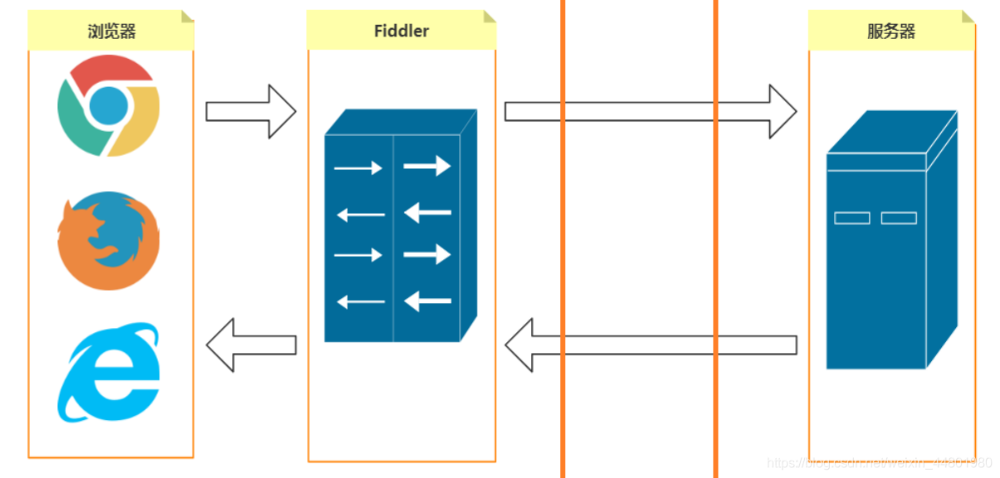
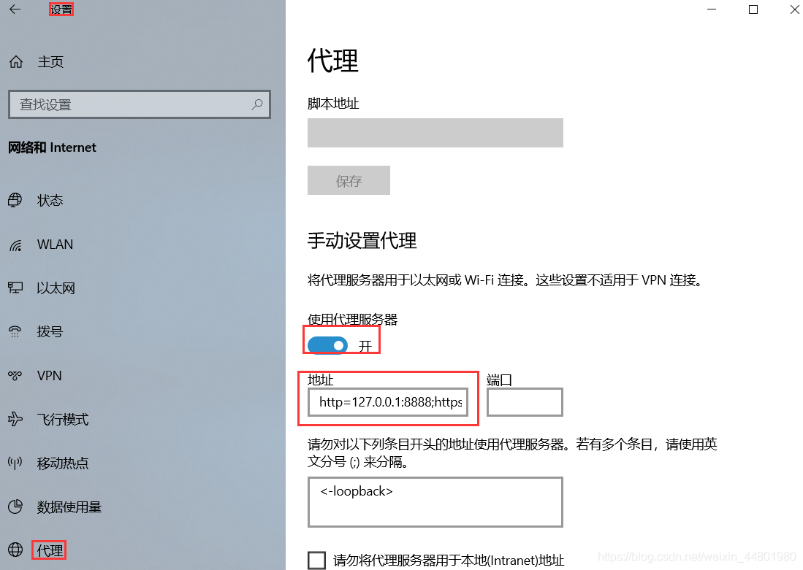
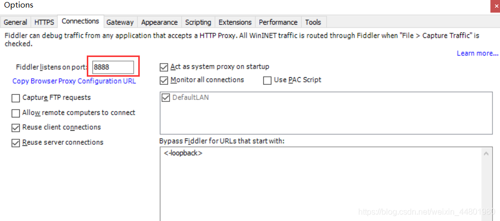
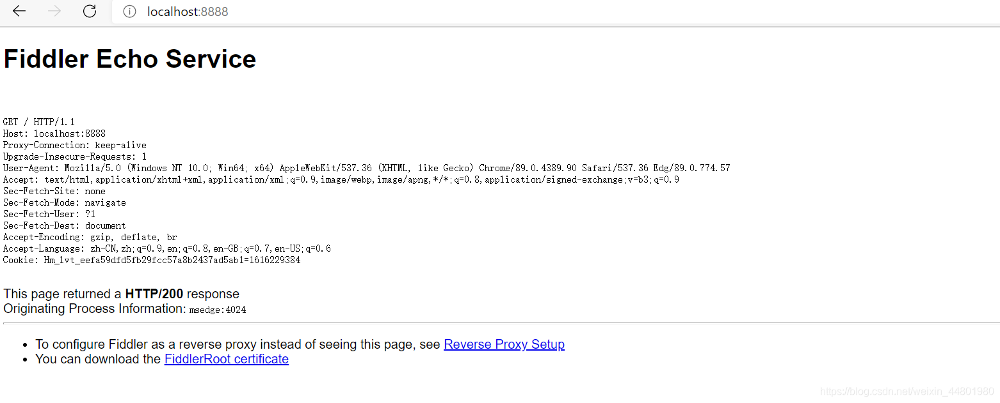
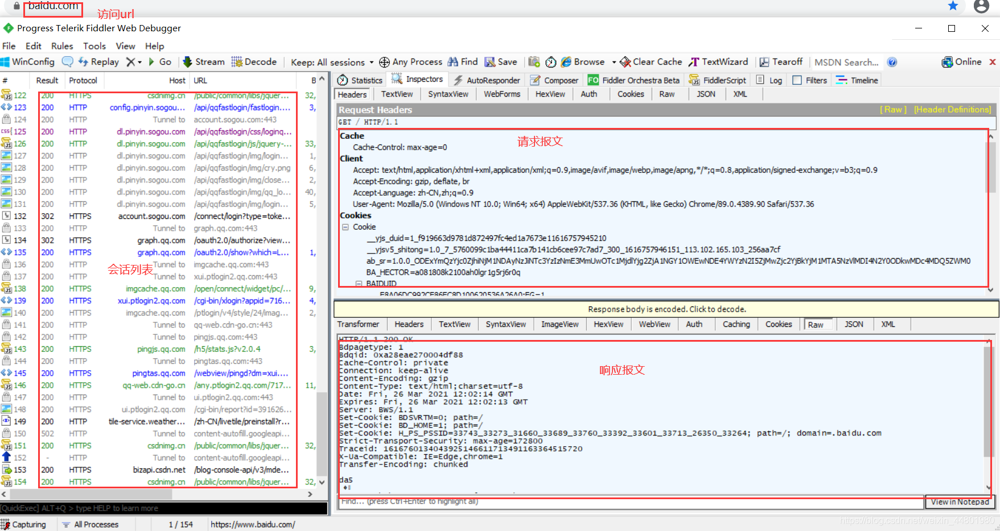
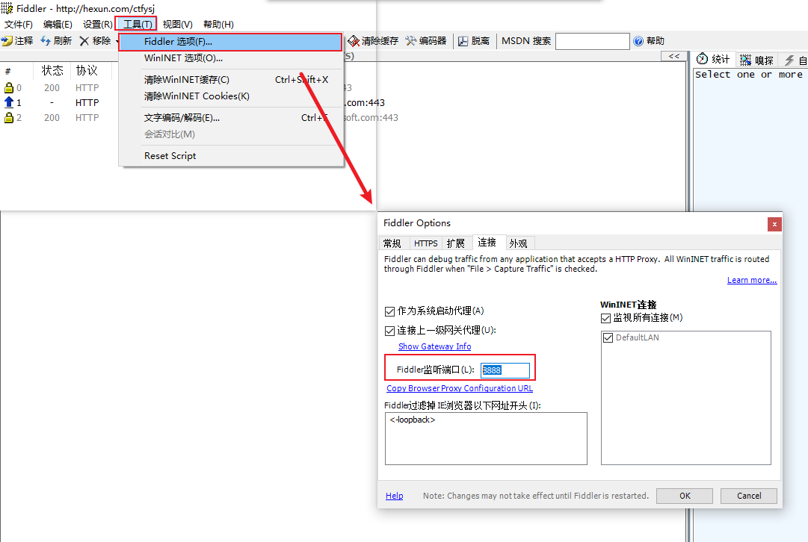
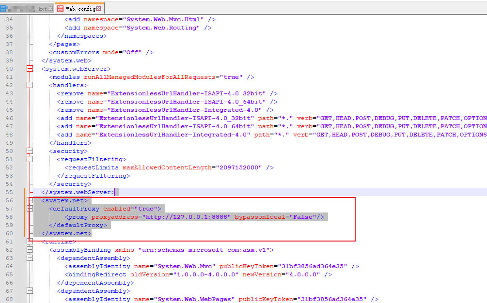

# Fiddler介绍

[TOC]

---

[Fiddler官网](https://www.telerik.com/fiddler)

[Download Fiddler Classic](https://www.telerik.com/download/fiddler)

Fiddler是一个http协议调试代理工具，它能够记录并检查所有你的电脑和互联网之间的http通讯，设置[断点](https://baike.baidu.com/item/断点/4602?fromModule=lemma_inlink)，查看所有的“进出”Fiddler的数据（指[cookie](https://baike.baidu.com/item/cookie/1119?fromModule=lemma_inlink),html,js,css等文件）。 Fiddler 要比其他的网络[调试器](https://baike.baidu.com/item/调试器/3351943?fromModule=lemma_inlink)要更加简单，因为它不仅仅暴露http通讯还提供了一个用户友好的格式。 [1]

## Fiddler 不同版本功能说明

[各版本介绍(Which Fiddler Do I Need?)](https://www.telerik.com/fiddler)

### Fiddler Everywhere

**收费版本**

适用于 MacOS、Windows 和 Linux 的 Web 调试代理
适用于MacOS，Windows和Linux的最强大的Web调试代理工具，具有增强的UI。
通过内置的团队协作有效地共享您的发现并添加上下文。 自定义、保存和共享规则，轻松处理复杂的请求。
无限制地共享已保存的会话和请求，以提高效率，并获得专门的电子邮件支持以保持正轨。
调试功能在 Fiddler Everywhere中得到了增强，使您可以毫不费力地将调试和测试提升到一个新的水平。

### Fiddler Classic（经典版）

**免费版本**

适用于 Windows 的 Web 调试代理
适用于 **Windows 的原始受信任且安全（免费）**的调试代理服务器工具。
成功记录、检查和更改 HTTP 网络请求和服务器响应。在创纪录的时间内从错误到修复。
轻松导入/导出各种格式的请求，并消除猜测工作
编写自定义脚本以加快故障排除工作。
快速调试，更快地开发 Web 通信代码，让您有更多时间执行其他任务

### Fiddler Jam

**收费版本**

基于网络的故障排除解决方案
基于 Web 的端到端故障排除解决方案，适用于需要在更短的时间内从错误中修复的支持团队。
通过三个简单的步骤捕获 Web 流量、Web 控制台日志和 Web 应用屏幕截图。设置简单，无需编程。
在团队中安全地共享所有捕获的日志，以快速提供有价值的数据以查找解决方案。

### Fiddler Cap

**免费版本**

适用于 Windows 的基于桌面的捕获应用程序
仅限 Windows 的 Fiddler 轻量级版本，专为非技术用户捕获数据而设计。

### Fiddler Core

**收费版本**

嵌入式 .NET 库
可靠而强大的 .NET 库允许您捕获和修改 HTTP 和 HTTPS 流量，以确保一切顺利安全地运行。

### Fiddler2与Fiddler4

Fiddler有Fiddler2和Fiddler4，两者区别在于，基于的framework不同，也就是系统支持不一样，功能原理都是一样的；电脑操作系统低于win7或是XP系统用Fiddler2就行，win7或win7以上版本，用Fiddler4 版本，建议都用Fiddler4版本；

---

版权声明：本文为CSDN博主「入间同学」的原创文章，遵循CC 4.0 BY-SA版权协议，转载请附上原文出处链接及本声明。
原文链接：https://blog.csdn.net/weixin_43967360/article/details/124983641

## 下载与安装

[Using Fiddler](https://docs.telerik.com/fiddler/configure-fiddler/tasks/installfiddler#using-fiddler)

### 下载

官网下载地址：[Download Fiddler Classic](https://www.telerik.com/download/fiddler)

### 安装

双击下载好的安装包根据提示安装即可。

## Fiddler使用

[Fiddler Classic Documentation](https://docs.telerik.com/fiddler/configure-fiddler/tasks/configurefiddler?_ga=2.96053087.216122959.1684379818-1056071854.1684379818&_gl=1*7ktkd7*_ga*MTA1NjA3MTg1NC4xNjg0Mzc5ODE4*_ga_9JSNBCSF54*MTY4NDQ4NjczMC42LjEuMTY4NDQ4NzkwOS41OC4wLjA.)

[Configure Fiddler Classic to Decrypt HTTPS Traffic](https://docs.telerik.com/fiddler/configure-fiddler/tasks/decrypthttps#configure-fiddler-classic-to-decrypt-https-traffic)

### Fiddler 工作原理

Fiddler 是在客户端和服务端之间建立的的 HTTP 代理服务器，能够监听客户端发出的请求和服务端返回的响应结果。



#### 图解

1. 在客户端和服务器之间，建立了一个HTTP代理服务器。
2. 当启动的时候，Fiddler会默认把自己设置为系统代理，来监听客户端的HTTP/HTTPS请求。
3. 默认代理地址为：127.0.0.1 默认端口为：8888。
4. 浏览器访问WEB网站的时候，请求报文会先发送到Fiddler。
5. Fiddler 再把请求报文转发给服务器。
6. Web服务器返回的响应报文，也会先到Fiddler，Fiddler 再把响应报文返回给浏览器。

#### 原理解析

Fiddler 启动的时候，会把自己设置为系统代理。

双击启动Fiddler 后，依次点击操作系统的开始菜单–>设置–>网络和Internet–>代理，可以看到手动设置代理这里，<使用代理服务器>的开关变为「开」，地址的内容为Fiddler的代理地址，端口为8888。如图：


我们还可以看一下Fiddler操作界面。依次点击Fiddler菜单栏–>Tools–Options，选Connections，可以看到Fiddler默认的端口是8888。如图：



由此，充分说明Fiddler作为一个服务器启动，它默认占用的端口为8888，启动的同时，会自动去修改操作系统的代理设置。

此外，我们还可以在浏览器的地址栏中，输入：http://localhost:8888 ，可以看到出现一个和Fiddler相关的网页。



当关闭Fiddler后，系统代理开关又自动变回「关」状态，地址栏中内容变为空，客户端请求和服务端响应不再通过Fiddler进行代理转发。

#### 抓包

当我们访问网页时，浏览器会通过 HTTP(S) 协议向服务端请求资源，当开启 Fiddler 后，HTTP 请求不会直接发送给服务端，而是需要通过 Fiddler代理进行转发，服务端收到请求进行响应，服务端响应同样会通过 Fiddler代理进行转发。在 Fiddler 左侧的会话列表，我们可以看到刚才浏览过的所有网页，会话列表中的1 条 session 对应 1 个（HTTP/HTTPS）请求。



---

版权声明：本文为CSDN博主「卢同学.」的原创文章，遵循CC 4.0 BY-SA版权协议，转载请附上原文出处链接及本声明。
原文链接：https://blog.csdn.net/weixin_44801980/article/details/115253982

### Fiddler 抓取 https 设置

推荐阅读：[Fiddler 抓取 https 设置详解（图文）](https://www.cnblogs.com/pyforseo/articles/16937950.html)


### Fiddler 抓取IIS/ASP.NET 数据



如上图所示，确认下Fiddler监听端口，==一般默认为 8888== 。



修改 Web.config 添加如上配置，注意端口号和**Fiddler监听端口**一致即可。

```xml
<system.net>
    <defaultProxy enabled="true">
        <proxy proxyaddress="http://127.0.0.1:8888" bypassonlocal="False"/>
    </defaultProxy>
</system.net>
```

#### 相关参考

[Capturing IIS / ASP.NET traffic in Fiddler - Joseph Woodward | Software Engineer & Go lover based in Somerset, England](https://josephwoodward.co.uk/2016/04/capturing-asp-net-traffic-in-fiddler)

[在Fiddler中捕获IIS / ASP.NET流量 - 玄魄冰 - 博客园 (cnblogs.com)](https://www.cnblogs.com/ksport/p/14134879.html)


### 常用快捷键

| 快捷键     | 含义             |
| ---------- | ---------------- |
| `CTRL + X` | 删除左侧所有会话 |
|            |                  |
|            |                  |


## 参考文章

1. [百度百科 Fiddler](https://baike.baidu.com/item/Fiddler/2868968?fr=aladdin)
2. [Fiddler 不同版本功能说明](https://blog.csdn.net/weixin_43967360/article/details/124983641)
3. [Fiddler 工作原理和使用](https://blog.csdn.net/weixin_44801980/article/details/115253982)
4. [Fiddler抓取HTTPS最全（强）攻略，后悔没有早知道](https://blog.csdn.net/xfw17397388089/article/details/125640855)
5. [Fiddler 抓取 https 设置详解（图文）](https://www.cnblogs.com/pyforseo/articles/16937950.html)