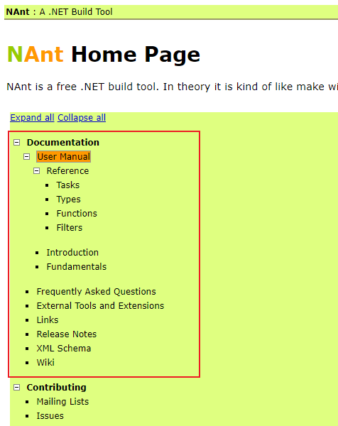
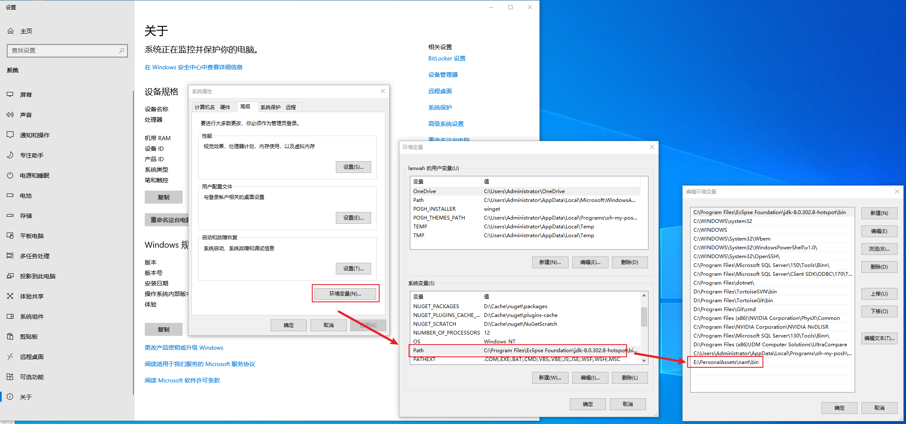
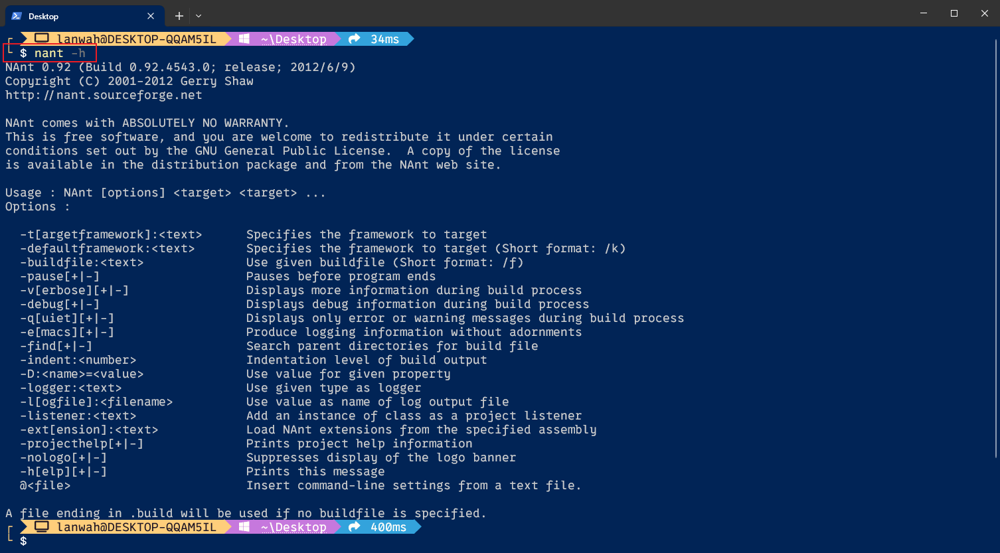
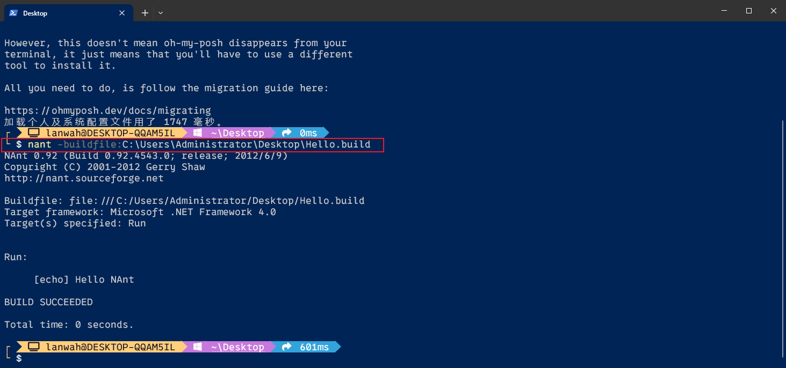

# NAnt工具使用

[TOC]

---

NAnt is a free .NET build tool. In theory it is kind of like make without make's wrinkles. In practice it's a lot like [Ant](http://ant.apache.org/).

## 一、NAnt官网

https://nant.sourceforge.net/

**Git:** https://github.com/nant/nant

<h3 style="border-left:6px solid #2196F3;background:#ddffff;padding:14px;font-size:16px;letter-spacing:1px;">NAnt 0.92 下载</h3>

https://sourceforge.net/projects/nant/files/nant/0.92/


## 二、帮助文档

<div style="display:inline-block;position:relative;background:#2196F3;color:white;text-align:center;padding: 0px 25px;            height:45px;line-height:45px;border-radius:5px 5px 5px 0px;letter-spacing:2px;">
        <div><a style="color:white;" href="https://nant.sourceforge.net/release/latest/help/">在线文档</a></div>
        <div style="width:0px;height:0px;position: absolute;border:5px solid transparent;border-top:5px solid #1a76c0;            border-right:5px solid #1a76c0;left: 0px;bottom: -10px;"></div>
    </div>
<p style="margin-top:10px;"></p>




<div style="display:inline-block;position:relative;background:#2196F3;color:white;text-align:center;padding: 0px 25px;            height:45px;line-height:45px;border-radius:5px 5px 5px 0px;letter-spacing:2px;">
        <div><a style="color:white;" href="">离线文档</a></div>
        <div style="width:0px;height:0px;position: absolute;border:5px solid transparent;border-top:5px solid #1a76c0;            border-right:5px solid #1a76c0;left: 0px;bottom: -10px;"></div>
    </div>
<p style="margin-top:10px;"></p>

NAnt 程序安装目录下的 **\doc\help\index.html**


## 三、安装与配置

1. 从官网下载相应的二进制文件，比如 **[nant-0.92-bin.zip](https://sourceforge.net/projects/nant/files/nant/0.92/nant-0.92-bin.zip/download)**

2. 把他解压到某个目录，比如：E:\PersonalAssets\nant

3. 在系统环境变量中添加NAnt的bin目录，如下图所示

   

4. 打开命令行，输入 `nant -h` 显示如下信息，则说明已成功配置。

   


## 四、 使用

* 编写执行脚本文件，如下图所示 **Hello.build**

  ```xml
  <?xml version="1.0" encoding="utf-8"?>
  <project name="EchoDemo" default="Run">	
  	<target name="Run">
  		<echo message="Hello NAnt"/>
  	</target>
  </project>
  ```

* 执行命令：`nant -buildfile:C:\Users\Administrator\Desktop\Hello.build`




## 五、配置参数详解

### 5.1 Projects 参数

https://nant.sourceforge.net/release/latest/help/fundamentals/projects.html


### 5.2 Targets

https://nant.sourceforge.net/release/latest/help/fundamentals/targets.html


### 5.3 Tasks

https://nant.sourceforge.net/release/latest/help/fundamentals/tasks.html

#### Task Reference

https://nant.sourceforge.net/release/latest/help/tasks/index.html

<h3 style="border-left:6px solid #2196F3;background:#ddffff;padding:14px;font-size:16px;letter-spacing:1px;"><a href="https://nant.sourceforge.net/release/latest/help/tasks/echo.html">&lt;echo&gt;</a></h3>

```xml
<?xml version="1.0" encoding="utf-8"?>
<project name="EchoDemo" default="Run">
	<target name="Run">
		<!-- 输出单行信息 -->
		<echo message="Hello NAnt" />

		<!-- <echo message="level is :${level}" /> -->

		<!-- Debug 下输出的信息(nant -buildfile:C:\Users\Administrator\Desktop\echo.build -debug) -->
		<echo message="Hello NAnt in debug model ." level="Debug"/>
		
		<!-- Error 下输出的信息(nant -buildfile:C:\Users\Administrator\Desktop\echo.build -q) -->
		<echo message="Hello NAnt in Error model ." level="Error"/>

		<!-- 输出多行信息 -->
		<echo>第一行信息
第二行信息
第三行信息</echo>

		<!-- 函数调用 -->
		<!-- <echo message="Base build directory = ${nant.project.basedir}" /> -->
		<echo message="Base build directory = ${project::get-base-directory()}" />

		<!-- 输出到文件 -->
		<echo file="buildmessage.txt">Base build directory = ${project::get-base-directory()}</echo>
	</target>
</project>
```

<div style="font-weight:bold;font-size:16pt;padding-top:15px;">See Also</div>

1. **[Level](https://nant.sourceforge.net/release/latest/help/enums/NAnt.Core.Level.html)**


<h3 style="border-left:6px solid #2196F3;background:#ddffff;padding:14px;font-size:16px;letter-spacing:1px;"><a href="https://nant.sourceforge.net/release/latest/help/tasks/loadfile.html">&lt;loadfile&gt;</a></h3>

```xml
<?xml version="1.0" encoding="utf-8"?>
<project name="LoadfileDemo" default="Run">
    <description>loadfile 使用示例</description>
    <!-- 参数定义 -->
    <property name="fileName" value="projectName.txt" />

    <!-- 从文件加载数据到 message 参数中 -->
    <loadfile file="${fileName}" encoding="utf-8" property="message" />

    <!-- 从文件加载数据到 content 参数中，并把文件内容中的 @NOW@ 进行替换 -->
    <loadfile file="${fileName}" encoding="utf-8" property="content">
        <filterchain>
            <replacetokens>
                <token key="NOW" value="${datetime::now()}" />
            </replacetokens>
        </filterchain>
    </loadfile>
    
    <!-- 从文件加载数据到 content2 参数中，并使用replacestring把文件内容中的 NOW 进行替换 -->
    <loadfile file="${fileName}" encoding="utf-8" property="content2">
        <filterchain>
            <replacestring from="@NOW@" to="2024年7月26日 16点30分" />
            <replacestring from="NOW" to="2024年7月26日 16点13分" />
        </filterchain>
    </loadfile>

    <target name="Run">
        <echo message="从 ${fileName} 文件加载数据" />
        <echo message="文件内容：${message}" />
        <echo />
        <echo message="替换处理后的文件内容：${content}" />
        <echo />
        <echo message="替换处理后的文件内容：${content2}" />
    </target>
</project>
```

<div style="font-weight:bold;font-size:16pt;padding-top:15px;">See Also</div>

1. **[filterchain](https://nant.sourceforge.net/release/latest/help/types/filterchain.html)**
2. **[Filter Reference](https://nant.sourceforge.net/release/latest/help/filters/index.html)**
3. **[replacetokens](https://nant.sourceforge.net/release/latest/help/filters/replacetokens.html)**
4. **[replacestring](https://nant.sourceforge.net/release/latest/help/filters/replacestring.html)**


## 六、相关参考

1. **[NAnt 简介](https://blog.csdn.net/weixin_33709219/article/details/90329243)**