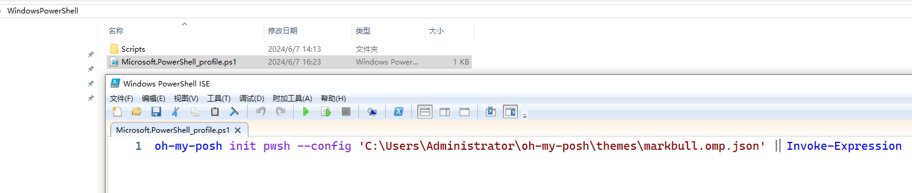
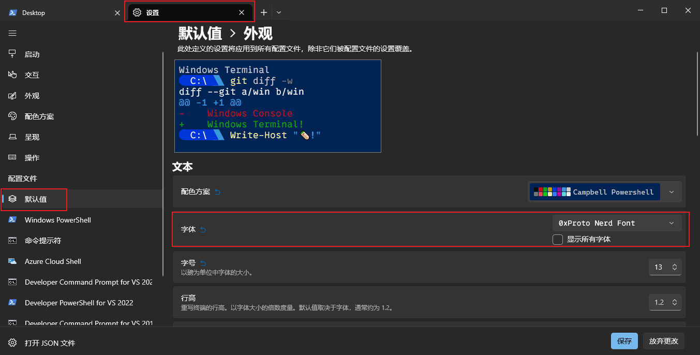
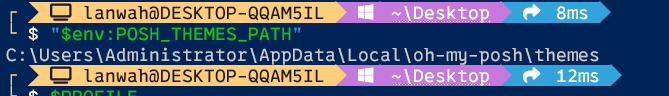
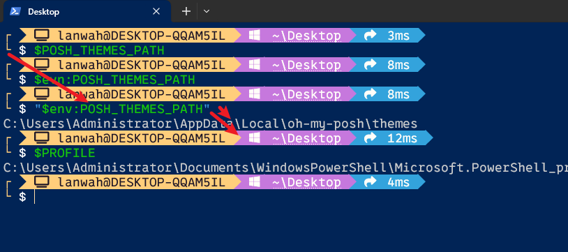

# Oh My Posh 安装与使用

[TOC]

---

本文介绍 [Windows Terminal](https://github.com/microsoft/terminal). 集成 [Oh My Posh](https://ohmyposh.dev/docs/installation/windows) .

## Introduction

Oh My Posh 介绍。

[Introduction | Oh My Posh](https://ohmyposh.dev/docs/)


---

## Installation

Windows Terminal 安装 Oh My Posh.

[Windows | Oh My Posh](https://ohmyposh.dev/docs/installation/windows)


---

## Themes

Oh My Posh 主题。

<div style="font-weight:bold;font-size:16pt;padding-top:15px;padding-bottom:5px;">GitHub主题下载</div>

 https://github.com/JanDeDobbeleer/oh-my-posh.git

<div style="font-weight:bold;font-size:16pt;padding-top:15px;padding-bottom:5px;">主题风格查看</div>

[Themes | Oh My Posh](https://ohmyposh.dev/docs/themes)

### 配置使用主题

[Customize | Oh My Posh](https://ohmyposh.dev/docs/installation/customize)

<h4 style="border-left:6px solid #2196F3;background:#ddffff;padding:14px;font-size:16px;letter-spacing:1px;">1、配置应用主题</h4>

```powershell
oh-my-posh init pwsh --config 'C:/Users/Posh/jandedobbeleer.omp.json' | Invoke-Expression
```

> [!IMPORTANT]
>
> 注意把 'C:/Users/Posh/jandedobbeleer.omp.json' 换成相应的主题路径。

<h4 style="border-left:6px solid #2196F3;background:#ddffff;padding:14px;font-size:16px;letter-spacing:1px;">2、重新加载配置文件以使更改生效</h4>

```powershell
. $PROFILE
```

上面两部操作完成之后关闭 PowerShell ，然后再次打开，如果应用的主题没生效那么有两种可能。

1、`$PROFILE` 文件不存在，可以在 PowerShell 中输入下面命令查看 `$PROFILE` 文件路径，然后验证文件是否存在。


若文件不存在，则执行如下命令，创建文件：

```powershell
New-Item -Path $PROFILE -Type File -Force
```

2、文件存在，但是脚本文件内容为空，则手动把设置主题的脚本加到脚本文件中，如下所示：



---

## 安装字体

主题需配合相应的字体使用，不然显示会不正确。

[Fonts | Oh My Posh](https://ohmyposh.dev/docs/installation/fonts)

下载安装完成之后应用到  PowerShell 中。



## 建议

<h3 style="border-left:6px solid #2196F3;background:#ddffff;padding:14px;font-size:16px;letter-spacing:1px;">1、环境变量中可设置 POSH_THEMES_PATH 用于引用主题文件目录</h3>

可以在 PowerShell中输入如下指令查看配置的路径

```
"$env:POSH_THEMES_PATH"
```



我用的主题是 **markbull.omp.json** 此主题有个不好的地方是管理指令的目录和耗时信息其实是上一个指令的。



如上图所示，输入的指令之后是相应指令的输出，然后跟着的是耗时，但是左侧的关联却是不对的。


---

## FAQ

<div style="color:blue;font-weight:bold;font-size:16pt;">1、A parameter cannot be found that matches parameter name 'Key'.</div>

> 相关问题：[Get-PSReadLineKeyHandler : A parameter cannot be found that matches parameter name 'Key'. · Issue #3136 · JanDeDobbeleer/oh-my-posh (github.com)](https://github.com/JanDeDobbeleer/oh-my-posh/issues/3136)
>
> 解决办法：[PowerShell/PSReadLine: A bash inspired readline implementation for PowerShell (github.com)](https://github.com/PowerShell/PSReadLine#install-from-powershellgallery-preferred)

