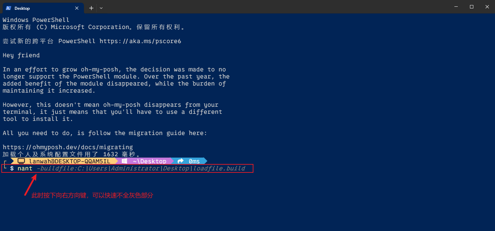
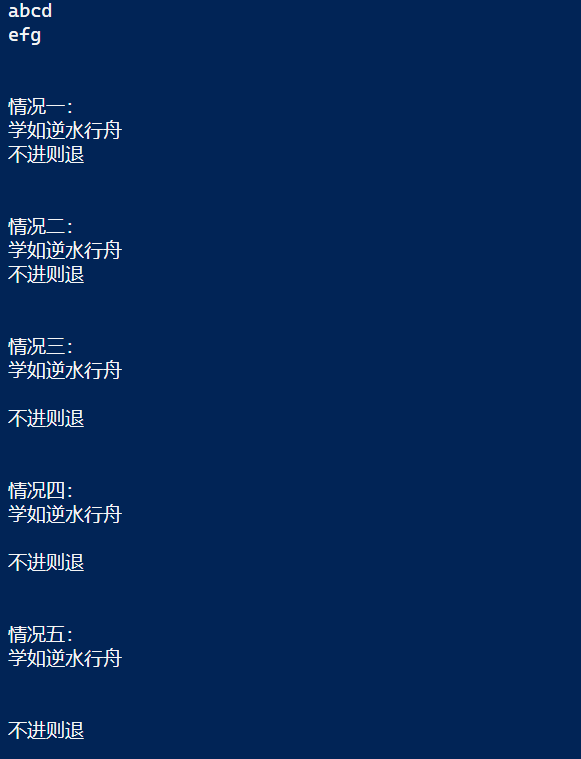
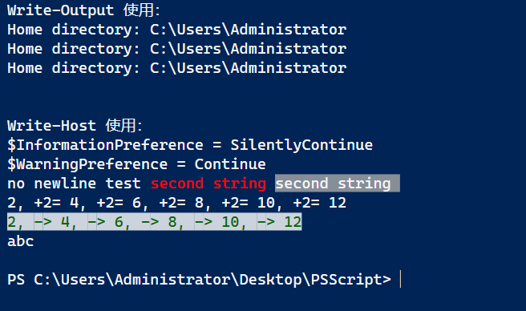
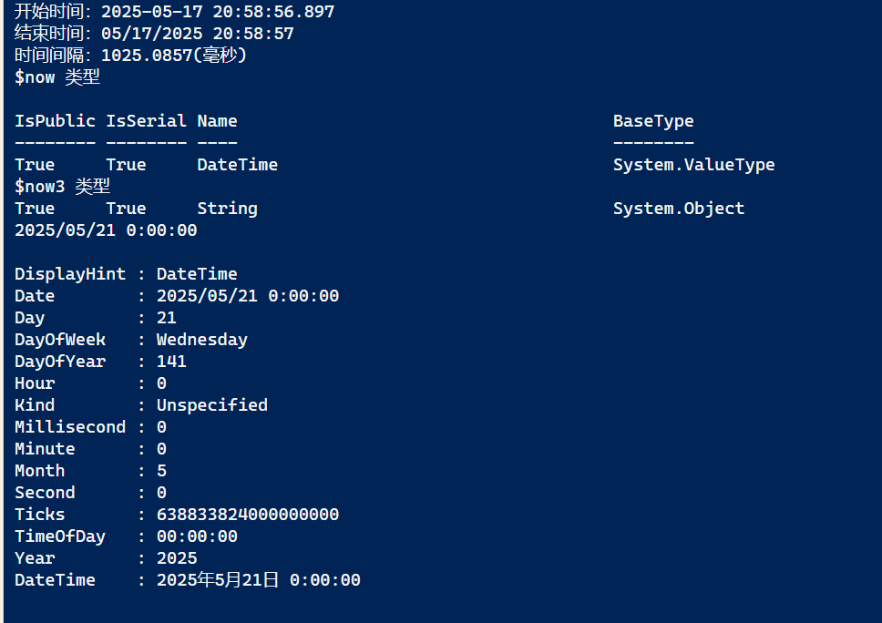

# PowerShell

[TOC]

---

PowerShell 是一种跨平台的任务自动化解决方案，由命令行 shell、脚本语言和配置管理框架组成。 PowerShell 在 Windows、Linux 和 macOS 上运行。

[MS Doc PowerShell](https://learn.microsoft.com/zh-cn/powershell/)

## 确定当前PowerShell版本

在 PowerShell 控制台中输入

```powershell
$PSVersionTable
```

[2 种实用方法：轻松查看 Windows PowerShell 版本号 - 系统极客](https://www.sysgeek.cn/windows-powershell-version-check/)


## PowerShell命令参考

[Get-Help](https://learn.microsoft.com/zh-cn/powershell/module/microsoft.powershell.core/get-help?view=powershell-7.4)

## 命令行 Shell

PowerShell 是新式命令 shell，其中包括其他常用 shell 的最佳功能。 与大多数仅接受并返回文本的 shell 不同，PowerShell 接受并返回 .NET 对象。 shell 包括以下功能：

- 可靠的命令行[历史记录](https://learn.microsoft.com/zh-cn/powershell/module/microsoft.powershell.core/about/about_history)
- Tab 自动补全和命令预测（请参阅 [about_PSReadLine](https://learn.microsoft.com/zh-cn/powershell/module/psreadline/about/about_psreadline)）
- 支持命令和参数[别名](https://learn.microsoft.com/zh-cn/powershell/module/microsoft.powershell.core/about/about_aliases)
- 用于链接命令的[管道](https://learn.microsoft.com/zh-cn/powershell/module/microsoft.powershell.core/about/about_pipelines)
- 控制台内[帮助](https://learn.microsoft.com/zh-cn/powershell/module/microsoft.powershell.core/get-help)系统，类似于 Unix `man` 页面

## 脚本语言

作为一种脚本语言，PowerShell 通常用于自动执行系统管理。 它还用于经常在 CI/CD 环境中生成、测试和部署解决方案。 PowerShell 是在 .NET 公共语言运行时 (CLR) 上构建的。 所有输入和输出都是 .NET 对象。 无需分析文本输出即可从输出中提取信息。 PowerShell 脚本语言包含以下功能：

- 可通过[函数](https://learn.microsoft.com/zh-cn/powershell/module/microsoft.powershell.core/about/about_functions_advanced)、[类](https://learn.microsoft.com/zh-cn/powershell/module/microsoft.powershell.core/about/about_classes)、[脚本](https://learn.microsoft.com/zh-cn/powershell/module/microsoft.powershell.core/about/about_scripts)和[模块](https://learn.microsoft.com/zh-cn/powershell/module/microsoft.powershell.core/about/about_modules)进行扩展
- 便于输出的可扩展[格式系统](https://learn.microsoft.com/zh-cn/powershell/module/microsoft.powershell.core/about/about_format.ps1xml)
- 用于创建动态类型的可扩展[类型系统](https://learn.microsoft.com/zh-cn/powershell/module/microsoft.powershell.core/about/about_types.ps1xml)
- 对常用数据格式（例如 [CSV](https://learn.microsoft.com/zh-cn/powershell/module/microsoft.powershell.utility/convertfrom-csv)、[JSON](https://learn.microsoft.com/zh-cn/powershell/module/microsoft.powershell.utility/convertfrom-json) 和 [XML](https://learn.microsoft.com/zh-cn/powershell/module/microsoft.powershell.utility/convertto-xml)）的内置支持

## 自动化平台

PowerShell 的可扩展性质使 PowerShell 模块的生态系统能够部署和管理使用的几乎所有技术。 例如：

Microsoft

- [Azure](https://learn.microsoft.com/zh-cn/powershell/azure)
- [Windows](https://learn.microsoft.com/zh-cn/powershell/windows/get-started)
- [Exchange](https://learn.microsoft.com/zh-cn/powershell/exchange/exchange-management-shell)
- [SQL](https://learn.microsoft.com/zh-cn/sql/powershell/sql-server-powershell)

第三方

- [AWS](https://aws.amazon.com/powershell/)
- [VMWare](https://core.vmware.com/vmware-powercli)
- [Google Cloud](https://cloud.google.com/powershell/)

### 配置管理

PowerShell Desired State Configuration ([DSC](https://learn.microsoft.com/zh-cn/powershell/scripting/dsc/overview/dscforengineers)) 是 PowerShell 中的一个管理框架，可让你使用“配置即代码”来管理企业基础结构。 借助 DSC 可以：

- 为可重复部署创建声明性[配置](https://learn.microsoft.com/zh-cn/powershell/scripting/dsc/configurations/configurations)和自定义脚本
- 强制执行配置设置并报告配置偏移
- 使用[推送或请求](https://learn.microsoft.com/zh-cn/powershell/scripting/dsc/pull-server/enactingconfigurations)模型部署配置

## PowerShell Markdown最佳做法

[Markdown best practices](https://learn.microsoft.com/zh-cn/powershell/scripting/community/contributing/general-markdown?view=powershell-7.4)

## PowerShell相关学习模块

[PowerShell](https://learn.microsoft.com/zh-cn/training/browse/?terms=PowerShell)

- [PowerShell 简介](https://learn.microsoft.com/zh-cn/training/modules/introduction-to-powershell/)
- [Windows PowerShell 入门](https://learn.microsoft.com/zh-cn/training/paths/get-started-windows-powershell/)
- [编写你的第一个 PowerShell 代码](https://learn.microsoft.com/zh-cn/training/modules/powershell-write-first/)

### PowerShell cmdlet

PowerShell 随附数百个预安装命令。 PowerShell 命令称为 cmdlet（读作 command-let）。

每个 cmdlet 的名称都包含一个“谓词-名词”对。 例如 `Get-Process`。 这种命名约定便于人们了解 cmdlet 的作用。 还能让你更轻松地找到所查找的命令。 当你查找要使用的 cmdlet 时，可以根据谓词或名词进行筛选。

#### 使用 cmdlet 探索 PowerShell

当你第一次学习 PowerShell 时，它可能会让人望而生畏，因为似乎要学习许多内容。 PowerShell 经过专门设计，你可以在需要它时一次学习少量知识。

PowerShell 包含 cmdlet，它们可帮助你探索 PowerShell。 通过使用下面三个 cmdlet，可以了解有哪些命令可用、这些命令执行什么操作，以及它们在什么类型上运行。

- `Get-Verb`。 运行此命令时，将返回大多数命令遵循的谓词的列表。 响应包括有关这些谓词的功能的说明。 由于大多数命令都遵循这种命名约定，因此它对命令的功能设置了预期目标。 如果你要创建命令，这有助于选择适当的命令和命令名称。
- `Get-Command`。 此命令会检索计算机上安装的所有命令的列表。
- `Get-Member`。 它在基于对象的输出上运行，并且能够发现可用于命令的对象、属性和方法。
- `Get-Help`。 以命令名称为参数调用此命令，将显示一个帮助页面，其中说明了命令的各个部分。

通过使用这些命令，可以了解几乎所有关于 PowerShell 的知识。

#### 谓词

谓词是 PowerShell 中的一个重要概念。 它是大多数 cmdlet 都遵循的一种命名标准。 你在编写自己的命令时，也应遵循此命名标准。 其中的思路是，谓词表示你尝试执行的操作，例如读取数据或更改数据。 PowerShell 有一个标准化的谓词列表。 要获取所有可用谓词的完整列表，请使用 `Get-Verb` cmdlet：

```powershell
Get-Verb
```

cmdlet 返回一个很长的谓词列表。 “说明”为谓词的用途提供上下文。 下面是前几行的输出：

```Output
Verb    AliasPrefix   Group     Description
----    -----------   -----     -----------
Add     a             Common    Adds a resource to a container, or attaches an item to another item
Clear   cl            Common    Removes all the resources from a container but does not delete the container
Close   cs            Common    Changes the state of a resource to make it inaccessible, unavailable, or unusab…
Copy    cp            Common    Copies a resource to another name or to another container
Enter   et            Common    Specifies an action that allows the user to move into a resource
Exit    ex            Common    Sets the current environment or context to the most recently used context
...
```

### 使用 Get-Command 查找命令

`Get-Command` cmdlet 将返回系统上安装的所有可用命令的列表。 返回的列表会非常大。 可以通过使用参数或帮助程序 cmdlet 筛选响应来限制返回的信息量。


#### 根据名称筛选

你可以使用不同的参数筛选 `Get-Command` 的输出。 通过筛选，可以查找具有特定属性的命令。 使用 Name 参数，可以按名称查找特定命令。

```powershell
Get-Command -Name Get-Process
```

```Output
CommandType     Name              Version    Source
-----------     ----              -------    ------
Cmdlet          Get-Process       7.0.0.0    Microsoft.PowerShell.Management
```

如果想要查找所有适用于进程的命令，该怎么办？ 可以使用通配符 `*` 来匹配其他形式的字符串。 例如：

```powershell
Get-Command -Name *-Process
```

```Output
CommandType     Name              Version    Source
-----------     ----              -------    ------
Cmdlet          Debug-Process     7.0.0.0    Microsoft.PowerShell.Management
Cmdlet          Get-Process       7.0.0.0    Microsoft.PowerShell.Management
Cmdlet          Start-Process     7.0.0.0    Microsoft.PowerShell.Management
Cmdlet          Stop-Process      7.0.0.0    Microsoft.PowerShell.Management
Cmdlet          Wait-Process      7.0.0.0    Microsoft.PowerShell.Management
```

### 根据名词和谓词进行筛选

还有其他可筛选谓词和名词值的参数。 命令名称的谓词部分位于最左侧。 谓词应为 `Get-Verb` cmdlet 返回的值之一。 命令的最右边是名词部分。 名词可以是任何内容。

- 根据谓词进行筛选。 在命令 `Get-Process` 中，谓词部分为 `Get`。 要筛选谓词部分，请使用 Verb 参数。

  ```powershell
  Get-Command -Verb 'Get'
  ```

  此示例列举出使用谓词 `Get` 的所有命令。

- 根据名词进行筛选。 在命令 `Get-Process` 中，名词部分是 `Process`。 要筛选名词，请使用 Noun 参数。 以下示例返回包含以字母 `U` 开头的名词的所有 cmdlet。

  ```powershell
  Get-Command -Noun U*
  ```

此外，还可以组合参数来缩小搜索范围，例如：

```powershell
Get-Command -Verb Get -Noun U*
```

```Output
CommandType     Name                         Version    Source
-----------     ----                         -------    ------
Cmdlet          Get-UICulture                7.0.0.0    Microsoft.PowerShell.Utility
Cmdlet          Get-Unique                   7.0.0.0    Microsoft.PowerShell.Utility
Cmdlet          Get-Uptime                   7.0.0.0    Microsoft.PowerShell.Utility
```

#### 使用帮助程序 cmdlet 筛选结果

还可以使用其他 cmdlet 来筛选结果。

- `Select-Object`。 此通用命令可帮助你从一个或多个对象中选取特定属性。 还可以限制返回的项目数。 以下示例返回当前会话中前 5 个可用命令的 Name 和 Source 属性值。

  ```powershell
  Get-Command | Select-Object -First 5 -Property Name, Source
  ```

  ```Output
  Name                      Source
  ----                      ------
  Add-AppPackage            Appx
  Add-AppPackageVolume      Appx
  Add-AppProvisionedPackage Dism
  Add-AssertionOperator     Pester
  Add-ProvisionedAppPackage Dism
  ```

  有关详细信息，请参阅 [Select-Object](https://learn.microsoft.com/zh-cn/powershell/module/microsoft.powershell.utility/select-object?view=powershell-7.4)。

- `Where-Object`。 此 cmdlet 允许根据属性值筛选返回的对象。 命令采用可以测试属性值的表达式。 以下示例返回以 `p` 开头的 `ProcessName` 的所有进程。

  ```powershell
  Get-Process | Where-Object {$_.ProcessName -like "p*"}
  ```

  `Get-Process` cmdlet 返回进程对象的集合。 要对响应进行筛选，可以使用管道将输出“发送”到 `Where-Object`。 使用管道“发送”表示通过管道 `|` 字符连接两个或更多个命令。 一个命令的输出作为下一个命令的输入发送。 `Where-Object` 的筛选表达式使用 `-like` 运算符来匹配以字母 `p` 开头的进程。

## 使用 Get-Member 浏览对象

当你能够找到所需的 cmdlet 后，需要进一步了解它生成的内容， `Get-Member` cmdlet 将显示对象的类型、属性和方法。 将你要检查的输出发送到 `Get-Member`。

```powershell
Get-Process | Get-Member
```

结果显示返回的 `TypeName` 类型以及对象的所有属性和方法。 下面是此类结果的一段摘录：

```Output
TypeName: System.Diagnostics.Process

Name        MemberType     Definition
----        ----------     ----------
Handles     AliasProperty  Handles = Handlecount
Name        AliasProperty  Name = ProcessName
...
```

使用 MemberType 参数可以限制返回的信息。

```powershell
Get-Process | Get-Member -MemberType Method
```

默认情况下，PowerShell 仅显示几个属性。 前面的示例显示了 `Name`、`MemberType` 和 `Definition` 成员。 可以使用 `Select-Object` 来指定要查看的属性。 例如，你希望仅显示 `Name` 和 `Definition` 属性：

```powershell
Get-Process | Get-Member | Select-Object Name, Definition
```

### 按参数类型搜索

`Get-Member` 向我们展示了 `Get-Process` 返回 Process 类型对象。 `Get-Command` 的 ParameterType 参数可用于查找将 Process 对象作为输入的其他命令。

```powershell
Get-Command -ParameterType Process
```

```Output
CommandType     Name                         Version    Source
-----------     ----                         -------    ------
Cmdlet          Debug-Process                7.0.0.0    Microsoft.PowerShell.Managem…
Cmdlet          Enter-PSHostProcess          7.1.0.0    Microsoft.PowerShell.Core
Cmdlet          Get-Process                  7.0.0.0    Microsoft.PowerShell.Managem…
Cmdlet          Get-PSHostProcessInfo        7.1.0.0    Microsoft.PowerShell.Core
Cmdlet          Stop-Process                 7.0.0.0    Microsoft.PowerShell.Managem…
Cmdlet          Wait-Process                 7.0.0.0    Microsoft.PowerShell.Managem…
```

了解命令的输出类型有助于缩小相关命令的搜索范围。

## 关于主题

[关于主题 - PowerShell | Microsoft Learn](https://learn.microsoft.com/zh-cn/powershell/module/microsoft.powershell.core/about/about?view=powershell-7.4)

### [about_History](https://learn.microsoft.com/zh-cn/powershell/module/microsoft.powershell.core/about/about_history?view=powershell-7.4)




## 相关参考

- [探索 PowerShell](https://learn.microsoft.com/zh-cn/powershell/scripting/discover-powershell?view=powershell-7.4)
- [探究 Windows PowerShell ISE - PowerShell | Microsoft Learn](https://learn.microsoft.com/zh-cn/powershell/scripting/windows-powershell/ise/exploring-the-windows-powershell-ise?view=powershell-5.1)
- [Powershell - 数组 | Powershell 教程](https://www.w3ccoo.com/powershell/powershell_array.html)
- [powershell、cmd终端修改编码 - xututu6 - 博客园](https://www.cnblogs.com/xututu6/p/16574454.html)


---


# 命令相关

本节介绍 PowerShell 命令相关。

[PowerShell 文档 - PowerShell | Microsoft Learn](https://learn.microsoft.com/zh-cn/powershell/)

[PowerShell 模块浏览器 - PowerShell | Microsoft Learn](https://learn.microsoft.com/zh-cn/powershell/module/)

[Windows PowerShell 语言规范 3.0 - PowerShell | Microsoft Learn](https://learn.microsoft.com/zh-cn/powershell/scripting/lang-spec/chapter-01?view=powershell-7.5)

[Microsoft.PowerShell.Management Module - PowerShell | Microsoft Learn](https://learn.microsoft.com/zh-cn/powershell/module/microsoft.powershell.management/?view=powershell-7.5)

[关于主题 - PowerShell | Microsoft Learn](https://learn.microsoft.com/zh-cn/powershell/module/microsoft.powershell.core/about/about?view=powershell-7.5)

[PowerShell Module | Writing a Windows PowerShell Module - PowerShell | Microsoft Learn](https://learn.microsoft.com/zh-cn/powershell/scripting/developer/module/writing-a-windows-powershell-module?view=powershell-7.5)


## [PowerShell 运算符 | about_Operators - PowerShell | Microsoft Learn](https://learn.microsoft.com/zh-cn/powershell/module/microsoft.powershell.core/about/about_operators?view=powershell-7.5)

> 运算符是可在命令或表达式中使用的语言元素。 PowerShell 支持多种类型的运算符来帮助你操作值。


## [PowerShell 作用域 | about_Scopes - PowerShell | Microsoft Learn](https://learn.microsoft.com/zh-cn/powershell/module/microsoft.powershell.core/about/about_scopes?view=powershell-7.5)

> PowerShell 通过限制可以读取和更改的地方，来保护对变量、别名、函数和 PowerShell 驱动器 (PSDrives) 的访问。
>
> PowerShell 使用范围规则来确保不会对其他作用域中的项进行意外更改。


## 各项须知内容


### [关于数组的各项须知内容 - PowerShell | Microsoft Learn](https://learn.microsoft.com/zh-cn/powershell/scripting/learn/deep-dives/everything-about-arrays?view=powershell-7.5)

> [数组](https://learn.microsoft.com/zh-cn/powershell/module/microsoft.powershell.core/about/about_arrays)是大多数编程语言的一项基本语言功能。 它们是值或对象的集合，在编程中难免会用到。 让我们来深入了解一下数组以及它们提供的一切。


### [关于 if 语句的各项须知内容 - PowerShell | Microsoft Learn](https://learn.microsoft.com/zh-cn/powershell/scripting/learn/deep-dives/everything-about-if?view=powershell-7.5)

> 与许多其他语言一样，PowerShell 提供了用于在脚本中有条件地执行代码的语句。 其中一个语句是 [If](https://learn.microsoft.com/zh-cn/powershell/module/microsoft.powershell.core/about/about_if) 语句。 今天，我们将深入探讨 PowerShell 中最基本的命令之一。


## 模块

[在 Windows PowerShell 脚本中使用函数和模块 - Training | Microsoft Learn](https://learn.microsoft.com/zh-cn/training/modules/use-functions-modules-windows-powershell-scripts/)

[15 函数与模块之模块的创建与使用](https://zglg.work/powershell-zero/15)


## 运行 PowerShell 脚本

[How to Run a script - PowerShell - SS64.com](https://ss64.com/ps/syntax-run.html)

[如何运行PowerShell的脚本文件 - 中道学友 - 博客园](https://www.cnblogs.com/awpatp/archive/2012/07/17/2595018.html)

[& 运算符 | about_Operators - PowerShell | Microsoft Learn](https://learn.microsoft.com/zh-cn/powershell/module/microsoft.powershell.core/about/about_operators?view=powershell-7.5#call-operator-)

[about_Operators - PowerShell | Microsoft Learn](https://learn.microsoft.com/zh-cn/powershell/module/microsoft.powershell.core/about/about_operators?view=powershell-7.5#dot-sourcing-operator-)


## 功能对比


- [从入门到精通：掌握 CMD 与 PowerShell 之间的秘密-天翼云](https://www.ctyun.cn/zhishi/p-410373)


## 注释

- **单行注释**

  > \# 这是一个单行注释

- **多行注释**

  > <# 这是多行注释
  >    注意开头和结尾，
  >    此中内容可以跨越多行
  > #>

**例子**

```powershell
# 这是单行注释，以 # 开头。
# 获取当前时间
$now = Get-Date
# 输出时间
"开始时间：" + $now

# 休眠 1 秒
Start-Sleep -Seconds 1

# 获取当前时间
$now2 = Get-Date
# 输出时间
"结束时间：" + $now2

<# 这是多行注释
   注意开头和结尾，
   此中内容可以跨越多行
#>

# 获取两个时间差
# 写法一
#$timeSpan = New-TimeSpan -End $now2 -Start $now

# 写法二
$timeSpan = New-TimeSpan -Start $now -End $now2

# 构造时间差
#$timeSpan = New-TimeSpan -Minutes 1

# 输出时间差，总毫秒数
$timeSpan.TotalMilliseconds
```


## 换行

```powershell
<#
    脚本功能：输出换行
    `n 换行符
    [System.Environment]::NewLine 换行符
#>

# `n 换行符
"abcd`nefg"

$newLine = [System.Environment]::NewLine

$newLine

# 注意如下情况的差别

"情况一："
"学如逆水行舟"
"不进则退"
$newLine

"情况二："
"学如逆水行舟"

"不进则退"
$newLine

"情况三："
"学如逆水行舟"
""
"不进则退"
$newLine

"情况四："
"学如逆水行舟"+$newLine
"不进则退"
$newLine

"情况五："
"学如逆水行舟"
$newLine
"不进则退"
$newLine
```

**执行结果**



**相关参考**

- [PowerShell 中的换行符 | D栈 - Delft Stack](https://www.delftstack.com/zh/howto/powershell/powershell-line-break/)


## 数组

```powershell
<#
    脚本功能：数组使用
#>

# 清空屏幕
cls

'Object[] 使用'
# System.Array
#$intArry = 1, 2, 3, 4
#$intArry = 1..3
$intArry = @(1, 3, 5, 7)
#$intArry = @(1..5)
#$intArry = [System.Collections.ArrayList]::new()
#$intArry = New-Object [int[]] 5
#$intArry = New-Object 'int[]' 5
# Add 会返回索引
#$intArry.Add(1)
#$intArry.Add("A")
#$intArry.Add(2)
#$intArry.RemoveAt(1)
#$intArry.Remove("2")
# 修改元素
$intArry[2] = 8
# 添加元素
$intArry += 7
$intArry
"数组长度 = "+$intArry.Count
$intArry.GetType()
#$intArry | ForEach-Object {"Item:[$PSItem]"}
#$intArry | ForEach-Object {"Item:[$_]"}
#$intArry[0, 1, 3]
#$intArry[-1]

[System.Environment]::NewLine

'Int32[] 使用'
$arry2 = [int[]](1..8)
$arry2
$arry2.GetType()

[System.Environment]::NewLine

'List<> 使用'
$list = [System.Collections.Generic.List[int]]::new()
$list
$list.GetType()
$list.Add(1)
$list.Add(2)
$list.Add(3)
$list
#$list.Add("A")
$list.RemoveAt(1)
$list.Remove(3)
#$list.RemoveAt(-1)
$list
#$list[-1]

```

**相关参考**

- [阵 列 - PowerShell | Microsoft Learn](https://learn.microsoft.com/zh-cn/powershell/scripting/lang-spec/chapter-09?view=powershell-7.5)
- [关于数组的各项须知内容 - PowerShell | Microsoft Learn](https://learn.microsoft.com/zh-cn/powershell/scripting/learn/deep-dives/everything-about-arrays?view=powershell-7.5)
- [Powershell - 数组 | Powershell 教程](https://www.w3ccoo.com/powershell/powershell_array.html#google_vignette)
- [如何在 PowerShell 中初始化自定义对象的数组 | D栈 - Delft Stack](https://www.delftstack.com/zh/howto/powershell/intializing-an-array-of-custom-objects-in-powershell/)
- [如何在 PowerShell 中创建数组、哈希表和字典 | D栈 - Delft Stack](https://www.delftstack.com/zh/howto/powershell/create-an-array-hashtable-and-dictionary/)
- [Powershell 数据容器：数组、ArrayList 与 哈希表-阿里云开发者社区](https://developer.aliyun.com/article/1212561)


## 打印输出

```
<#
    脚本功能：打印输出内容
    1、Write-Output 等同于 echo 等同于 直接输出
    2、Write-Host 纯显示输出，可以控制输出颜色
#>

# 清屏
#cls
'Write-Output 使用：'
Write-Output "Home directory: $HOME"
echo "Home directory: $HOME"
"Home directory: $HOME"

'$InformationPreference = ' + $InformationPreference
'$WarningPreference = ' + $WarningPreference
#$InformationPreference = 'Continue'
#$InformationPreference = 'SilentlyContinue'
#'$InformationPreference = ' + $InformationPreference
Write-Host "no newline test " -NoNewline
Write-Host "second string " -ForegroundColor Red -NoNewline
Write-Host "second string " -BackgroundColor Gray
Write-Host (2,4,6,8,10,12) -Separator ", +2= "
Write-Host (2,4,6,8,10,12) -Separator ", -> " -ForegroundColor DarkGreen -BackgroundColor White
# 以下两行的作用没理解
#Write-Host "I won't print" -InformationAction Ignore
#Write-Host "I won't print" 6> $null
Write-Host "abc"

```

**执行结果**




**相关参考**

- [Write-Output (Microsoft.PowerShell.Utility) - PowerShell | Microsoft Learn](https://learn.microsoft.com/zh-cn/powershell/module/microsoft.powershell.utility/write-output?view=powershell-7.5)
- [Write-Debug (Microsoft.PowerShell.Utility) - PowerShell | Microsoft Learn](https://learn.microsoft.com/zh-cn/powershell/module/microsoft.powershell.utility/write-debug?view=powershell-7.5)
  - [about_Preference_Variables - PowerShell | Microsoft Learn](https://learn.microsoft.com/zh-cn/powershell/module/microsoft.powershell.core/about/about_preference_variables?view=powershell-7.5)
  - [about_Preference_Variables - PowerShell | Microsoft Learn | $DebugPreference](https://learn.microsoft.com/zh-cn/powershell/module/microsoft.powershell.core/about/about_preference_variables?view=powershell-7.5#debugpreference)

- [Write-Host (Microsoft.PowerShell.Utility) - PowerShell | Microsoft Learn](https://learn.microsoft.com/zh-cn/powershell/module/microsoft.powershell.utility/write-host?view=powershell-7.5)
- [about_Output_Streams - PowerShell | Microsoft Learn](https://learn.microsoft.com/zh-cn/powershell/module/microsoft.powershell.core/about/about_output_streams?view=powershell-7.5)
- [Write-Information (Microsoft.PowerShell.Utility) - PowerShell | Microsoft Learn](https://learn.microsoft.com/zh-cn/powershell/module/microsoft.powershell.utility/write-information?view=powershell-7.5)
- [如何在 Windows PowerShell 中输出结果 | D栈 - Delft Stack](https://www.delftstack.com/zh/howto/powershell/write-output-in-powershell/)


## 工作流

- [about_Workflows - PowerShell | Microsoft Learn](https://learn.microsoft.com/zh-cn/powershell/module/psworkflow/about/about_workflows?view=powershell-5.1)
- [PSWorkflow Module - PowerShell | Microsoft Learn](https://learn.microsoft.com/zh-cn/powershell/module/psworkflow/?view=powershell-5.1)
- [尽解powershell的workflow - PowerShell免费软件 - 博客园](https://www.cnblogs.com/piapia/p/11556402.html)


## 命令


### ForEach-Object

[ForEach-Object (Microsoft.PowerShell.Core) - PowerShell | Microsoft Learn](https://learn.microsoft.com/zh-cn/powershell/module/microsoft.powershell.core/foreach-object?view=powershell-7.5)

```powershell
# 使用例子
1, 2, 3 | ForEach-Object {$_}
```


### ForEach-Object Parallel


**相关参考**

- [PowerShell ForEach-Object Parallel Feature - PowerShell Team](https://devblogs.microsoft.com/powershell/powershell-foreach-object-parallel-feature/)


### Get-Date/New-TimeSpan

```powershell
<#
    脚本功能：演示时间命令 Get-Date/New-TimeSpan
#>

# 获取当前时间
$now = Get-Date
# 输出时间
"开始时间：" + $now.ToString("yyyy-MM-dd HH:mm:ss.fff")

# 休眠 1 秒
Start-Sleep -Seconds 1

# 获取当前时间
$now2 = Get-Date
# 输出时间
"结束时间：" + $now2

# 获取两个时间差
# 写法一
#$timeSpan = New-TimeSpan -End $now2 -Start $now

# 写法二
$timeSpan = New-TimeSpan -Start $now -End $now2

# 构造时间差
#$timeSpan = New-TimeSpan -Minutes 1

# 输出时间差，总毫秒数
"时间间隔：" + $timeSpan.TotalMilliseconds + "(毫秒)"

'$now 类型'
$now.GetType()

# 时间通过 -Format 格式化输出后是字符串
$now3 = Get-Date -Format "yyyy-MM-dd HH:mm:ss"
'$now3 类型'
$now3.GetType()

# 字符串转日期
$dateString = "2025-05-21"
#$date = [System.DateTime]::Parse($dateString)
#$date = [System.DateTime]::ParseExact($dateString, "yyyy-MM-dd", $null)
#$date = [System.DateTime]$dateString
#[System.DateTime]$date = $dateString
$date = Get-Date $dateString
$date.ToString()
$date
```

**执行结果**



**相关参考**

- [如何在 PowerShell 中将字符串转换为日期时间 | D栈 - Delft Stack](https://www.delftstack.com/zh/howto/powershell/convert-a-string-to-datetime-in-powershell/#google_vignette)
- [在 PowerShell 中格式化日期时间 | D栈 - Delft Stack](https://www.delftstack.com/zh/howto/powershell/format-a-datetime-in-powershell/)


### Select-Object

选择对象或对象属性，作为一个新的对象返回。

[Select-Object (Microsoft.PowerShell.Utility) - PowerShell | Microsoft Learn](https://learn.microsoft.com/zh-cn/powershell/module/microsoft.powershell.utility/select-object?view=powershell-7.5)


### Where-Object

根据集合的属性值从集合中选择对象。

[Where-Object (Microsoft.PowerShell.Core) - PowerShell | Microsoft Learn](https://learn.microsoft.com/zh-cn/powershell/module/microsoft.powershell.core/where-object?view=powershell-7.5)


# IDE

PowerShell  IDE相关

## Windows PowerShell ISE

- [Windows PowerShell ISE 简介 - PowerShell | Microsoft Learn](https://learn.microsoft.com/zh-cn/powershell/scripting/windows-powershell/ise/introducing-the-windows-powershell-ise?view=powershell-7.5)

Windows PowerShell 集成脚本环境 (ISE) 是 Windows PowerShell 的主机应用程序。 在 ISE 中，可以在单个基于 Windows 的图形用户界面中运行命令并编写、测试和调试脚本。 ISE 提供多行编辑、Tab 自动补全、语法颜色设置、选择性执行、上下文相关帮助以及对从右到左语言的支持。 将菜单项和键盘快捷方式映射到许多将会在 Windows PowerShell 控制台中执行的相同任务。 例如，在 ISE 中调试脚本时，可以右键单击编辑窗格中的代码行来设置断点。


### 支持

ISE 先随 Windows PowerShell V2 一起引入，然后随 PowerShell V3 一起重新设计。 包括 Windows PowerShell V5.1 在内的所有支持的 Windows PowerShell 版本都支持 ISE。

> [!NOTE]
>
> PowerShell ISE 不再处于主动功能开发状态。 作为 Windows 的随附组件，它仍会获得安全性和高优先级服务修补程序的官方支持。 目前没有从 Windows 中删除 ISE 的计划。
>
> PowerShell v6 及更高版本中不支持 ISE。 寻求替换 ISE 的用户应使用 [Visual Studio Code](https://code.visualstudio.com/) 和 [PowerShell 扩展](https://marketplace.visualstudio.com/items?itemName=ms-vscode.PowerShell)。


### 关键功能

Windows PowerShell ISE 中的关键功能包括：

- 多行编辑：若要在“命令”窗格中的当前行下插入一个空行，请按 SHIFT+ENTER。
- 选择性执行：要运行部分脚本，请选择要运行的文本，然后单击“运行脚本”按钮 。 或者，按 F5。
- 上下文相关帮助：键入 `Invoke-Item`，然后按 F1。 帮助文件将打开到 `Invoke-Item` cmdlet 的文章。

Windows PowerShell ISE 允许你自定义其外观的某些方面。 它还具有其自己的 Windows PowerShell 配置文件脚本。


### 启动 Windows PowerShell ISE

单击“开始” ，选择“Windows PowerShell” ，然后单击“Windows PowerShell ISE” 。 或者，可以在任何命令 shell 或“运行”框中键入 `powershell_ise.exe`。


### 在 Windows PowerShell ISE 中获取帮助

在“帮助”菜单上，单击“Windows PowerShell 帮助”。 或者，按 F1。 打开的文件介绍了 Windows PowerShell ISE 和 Windows PowerShell，其中包括 `Get-Help` cmdlet 中提供的所有帮助。


### 升级更新

- [Windows11终端升级PowerShell7 - HashFlag - 博客园](https://www.cnblogs.com/wylshkjj/p/18730955)


---

以下是关于 **Windows PowerShell ISE** 的详细介绍，涵盖功能、优劣势及版本信息，结合官方文档与社区资源整理：

### **一、核心功能**

1. **脚本编辑与调试**
   - **多行编辑**：支持在命令窗格中编写多行代码，通过 `Shift+Enter` 插入新行，适合复杂脚本编写。
   - **语法高亮与智能感知（IntelliSense）**：自动补全命令、参数和路径，提升编码效率（PowerShell 3.0+新增）。
   - **调试工具**：支持设置断点、逐行执行、查看变量值，并集成调试控制台（如 `Set-PsDebug -Trace`）。
   - **选择性执行**：选中部分代码后按 `F8` 或点击“运行选择”按钮，快速测试脚本片段。

2. **交互式运行与输出管理**
   - **命令执行**：支持运行 PowerShell 命令、脚本和模块，输出结果可复制或清除（如 `Clear-Host`）。
   - **远程会话**：通过“新建远程 PowerShell 选项卡”连接远程计算机。
3. **界面与自定义**
   - **窗格布局**：可调整脚本窗格、控制台窗格的布局和大小，支持多标签页管理多个脚本。
   - **主题与字体**：自定义文本大小、颜色方案，通过 `$psISE` 变量扩展菜单功能。
   - **配置文件**：使用 `Microsoft.PowerShellISE_profile.ps1` 存储自定义函数、别名等。
4. **辅助工具与扩展**
   - **上下文帮助**：光标置于命令上按 `F1` 直接打开相关帮助文档。
   - **代码片段（Snippets）**：预置常用代码模板，支持通过 `Ctrl+J` 快速插入（PowerShell 3.0+）。
   - **附加工具集成**：如命令浏览器、Git 支持模块（需第三方扩展）。


### **二、优势与劣势**

| **优势**                                                     | **劣势**                                                     |
| ------------------------------------------------------------ | ------------------------------------------------------------ |
| **预装免费**：随 Windows 系统自带（需启用功能），无需额外安装 | **功能局限**：缺乏高级 IDE 特性（如版本控制集成、插件生态）  |
| **易用性强**：图形化界面适合初学者，提供直观的调试和编辑体验 | **停止更新**：自 PowerShell 5.1 后不再开发新功能，仅维护安全补丁 |
| **轻量高效**：启动速度快，资源占用低，适合快速执行简单脚本   | **跨平台限制**：仅支持 Windows，不兼容 PowerShell Core（v6+） |
| **内置调试支持**：断点设置、变量监控等功能集成度高           | **协作不足**：缺少团队协作工具（如实时共享、注释）           |


### **三、版本演进与兼容性**

1. **历史版本**
   - **PowerShell 2.0（2009）**：首次引入 ISE，提供基础脚本编辑与调试功能
   - **PowerShell 3.0（2012）**：重大更新，新增 IntelliSense、代码片段、自动保存、控制台窗格合并等
   - **PowerShell 4.0（2013）**：支持远程脚本调试与工作流调试，增强 DSC 配置的 IntelliSense
   - **PowerShell 5.0/5.1（2016）**：强化类（Class）支持、错误指示器，优化调试性能
2. **系统兼容性**
   - **支持系统**：Windows 7 SP1 至 Windows 11/Server 2022（需 GUI 环境）
   - **依赖项**：需 .NET Framework 3.0+，部分功能（如远程处理）需额外组件
   - **替代方案**：微软推荐迁移至 **Visual Studio Code + PowerShell 扩展**，支持跨平台和持续更新
3. **版本生命周期**
   - **终止开发**：ISE 自 PowerShell 5.1 后停止功能更新，仅提供安全维护
   - **替代路线**：PowerShell 7+ 用户需使用 VS Code 或其他现代编辑器


### **四、适用场景建议**

- **推荐使用**
  - 初学者学习 PowerShell 语法与调试基础。
  - 快速执行本地脚本或简单自动化任务。
- **不建议使用**：
  - 大型项目开发（需版本控制、协作工具）。
  - 跨平台环境或 PowerShell Core 开发。


### **五、总结**

Windows PowerShell ISE 作为经典脚本工具，凭借易用性和轻量化在早期版本中广受欢迎，但其功能限制和停止更新的现状使其逐渐被 VS Code 取代。对于仍在使用 PowerShell 5.1 及以下版本的用户，ISE 仍是高效选择；而新项目或跨平台需求应优先考虑现代开发环境。


### 六、相关参考

- [about_Windows_PowerShell_ISE | Microsoft Learn](https://learn.microsoft.com/zh-cn/previous-versions/dd347589(v=technet.10))
- [about_Windows_PowerShell_ISE - PowerShell | Microsoft Learn](https://learn.microsoft.com/zh-cn/powershell/module/microsoft.powershell.core/about/about_windows_powershell_ise?view=powershell-5.1)
- [Windows PowerShell ISE 简介 - PowerShell | Microsoft Learn](https://learn.microsoft.com/zh-cn/powershell/scripting/windows-powershell/ise/introducing-the-windows-powershell-ise?view=powershell-7.4)
- [PowerShell 5.0 ISE 中的新增功能 - PowerShell | Microsoft Learn](https://learn.microsoft.com/zh-cn/previous-versions/powershell/scripting/windows-powershell/whats-new/what-s-new-in-the-powershell-50-ise?view=powershell-7.3)
- [Powershell语言的软件开发工具_powershell开发工具-CSDN博客](https://blog.csdn.net/2501_90770591/article/details/145960247)
- [PowerShell ISE 介绍与使用指南 - kyle_7Qc - 博客园](https://www.cnblogs.com/kyle-7Qc/p/18782204)


## PowerShell Studio

[Welcome to PowerShell Studio](https://info.sapien.com/manuals/powershell_studio/index.html)


# 相关书籍


## [PowerShell 101 | 介绍 - PowerShell | Microsoft Learn](https://learn.microsoft.com/zh-cn/powershell/scripting/learn/ps101/00-introduction?view=powershell-7.5)

