# SonarQube扫描C#代码

[SonarQube官网](https://www.sonarsource.com/)

> SonarQube是一款静态代码质量分析工具，支持Java、Python、PHP、JavaScript、CSS等25种以上的语言，而且能够集成在IDE、Jenkins、Git等服务中，方便随时查看代码质量分析报告。

## 用SonarQube实现什么功能？

> 用SonarQube扫描C#代码并上传扫描结果到服务器。

## SonarLint for Visual Studio 是什么？

> SonarLint是一个IDE扩展，可以帮助您在编写代码时检测和修复质量问题。就像拼写检查器一样，SonarLint可以在提交代码之前修复缺陷。你可以直接从VS Marketplace获得它，然后它会在你编写代码时检测新的bug和质量问题(c#， VB)。. NET、JavaScript、TypeScript、C和c++)。

[SonarLint官网](https://www.sonarsource.com/products/sonarlint/features/visual-studio/)

[SonarLint for Visual Studio 2022](https://marketplace.visualstudio.com/items?itemName=SonarSource.SonarLintforVisualStudio2022)

**Git：**[sonarlint-visualstudio](https://github.com/SonarSource/sonarlint-visualstudio)

[sonarlint-visualstudio/wiki](https://github.com/SonarSource/sonarlint-visualstudio/wiki)

注意：SonarLint for Visual Studio插件可以检测代码的问题，但是无法把检测报告上传服务器。

## 使用SonarQube扫描检测C#/.NET代码并上传到服务器

[Quickstart: Analyzing .NET projects with SonarQube, MSBuild or Visual Studio Online, and third-party analyzers (StyleCop, ReSharper)](https://devblogs.microsoft.com/devops/quickstart-analyzing-net-projects-with-sonarqube-msbuild-or-visual-studio-online-and-third-party-analyzers-stylecop-resharper/)

**Git：**[sonar-scanner-msbuild](https://github.com/SonarSource/sonar-scanner-msbuild/releases)

### 一、配置MSBuild

如下图所示，在命令行中使用 `msbuild -ver` 查看MSBuild的版本号，如果无法运行此命令则需要在环境变量中添加MSBuild的Bin目录。

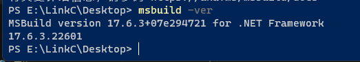

如下图所示，找到MSBuild的Bin目录，并添加到环境变量中。

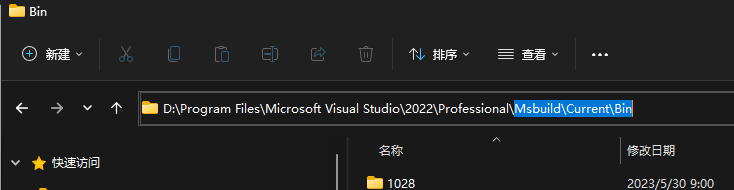

确保此步骤中运行

`MSBuild -ver`

能够正确运行并显示相应的版本信息

### 二、下载安装 SonarScanner for MSBuild

1、从 https://github.com/SonarSource/sonar-scanner-msbuild/releases 地址下载安装sonar-scanner-msbuild程序，解压后在环境变量中配置此程序的路径。

2、打开sonar-scanner-msbuild程序目录，如下图所示，配置**sonar.host.url，sonar.login，sonar.password**信息。

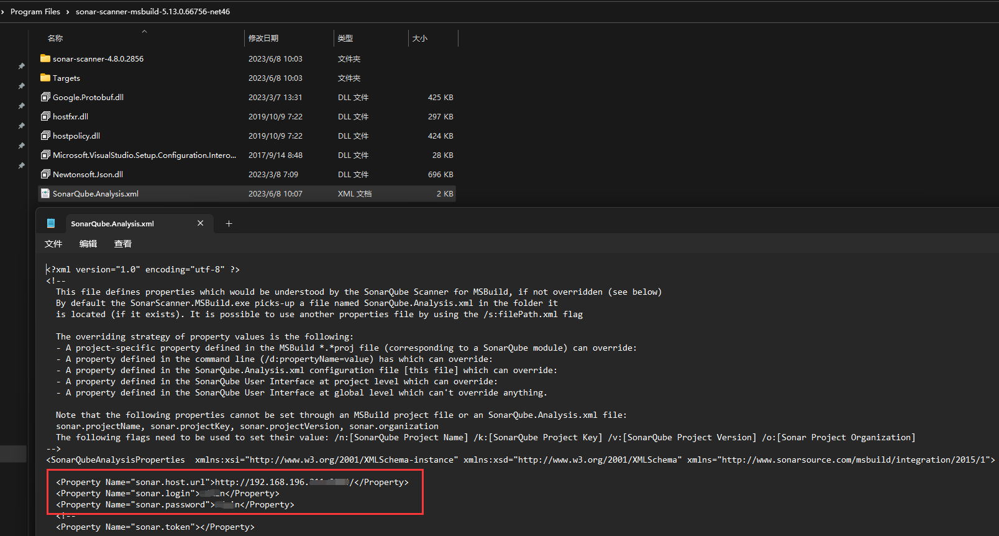

3、在命令行中输入 `SonarScanner.MSBuild -h` 查看相应的信息，如下图所示

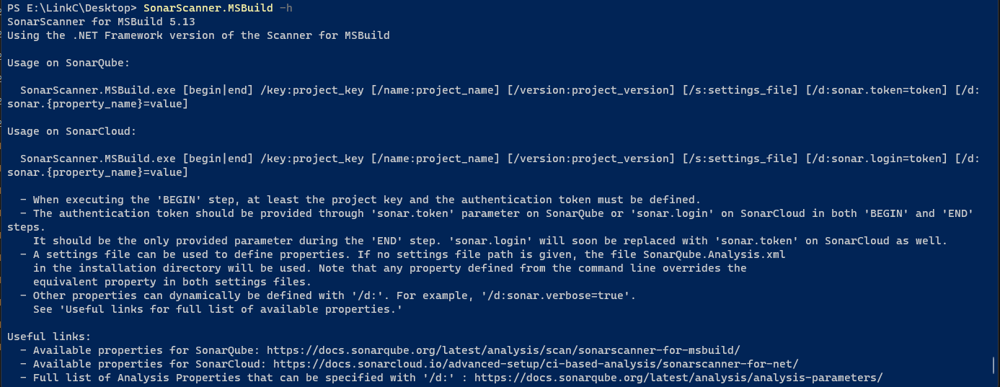

确保此步骤中运行

`SonarScanner.MSBuild -h`

能够正确运行并显示相应信息。

==至此准备工作完成，开始生成代码检测信息并上传检测报告到服务器==

### 三、使用SonarQube分析C#代码并上传服务器

1、如下图所示进入程序目录右键菜单并选择**在终端中打开**。

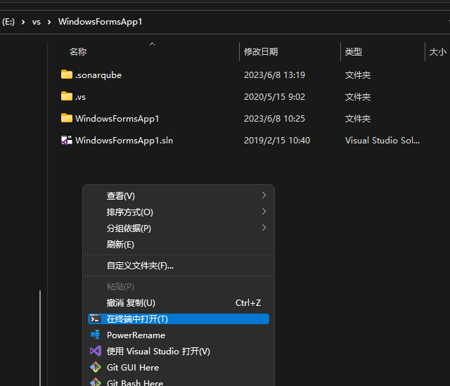

2、如下图所示，运行

`SonarScanner.MSBuild.exe begin /k:"WindowsFormsApp1" /n:"WindowsFormsApp1" /v:"1.0"`

命令，出现成功标记后会在程序目录生成 **.sonarqube** 文件夹。
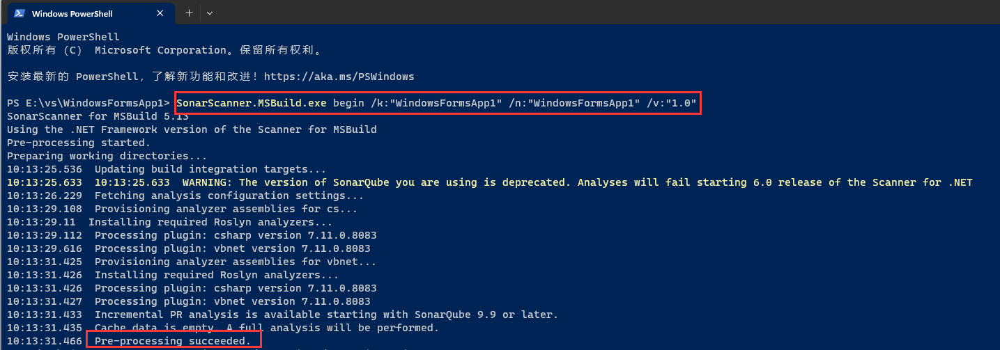

> **/key(简写k)：**对应projectKey即项目的唯一代码，如两套源代码使用同一个projectKey那扫描的结果将混在一起，所以一个项目需要有一个单独的projectKey
>
> **/name(简写n)：**对应projectName即项目的名称，为项目的一个显示的名称，建立使用完整的项目名称
>
> **/version(简写v)：**对应projectVersion即项目的版本，项目在不同的时期版本也是不一样的，如果方便，可以在sonarQube的服务器中查看到不同的版本代码其中问题的变化

3、通过MSBuild编译项目

输入 `MSBuild.exe /t:Rebuild /p:Configuration=Release` 编译项目

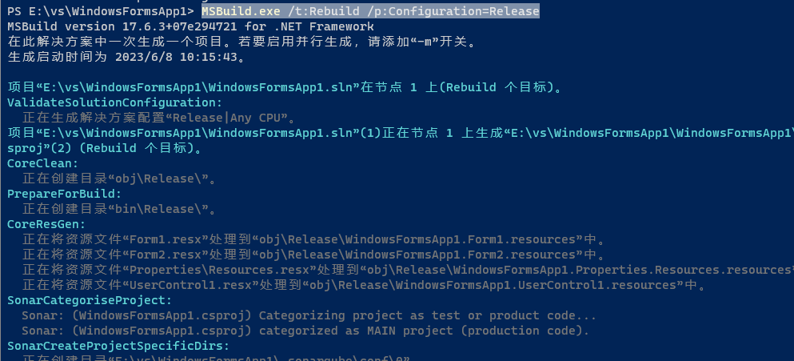

**MSBuild命令介绍**

| 命令                                                    | 含义                              |
| ------------------------------------------------------- | --------------------------------- |
| `MSBuild -t:Rebuild`                                    | 默认为Debug模式                   |
| `MSBuild -t:Rebuild -p:Configuration=Release`           | 指定编译模式为Release             |
| `MSBuild MyApp.sln -t:Rebuild -p:Configuration=Release` | 指定.sln解决方案和编译模式Release |

编译完成后出现如下提示
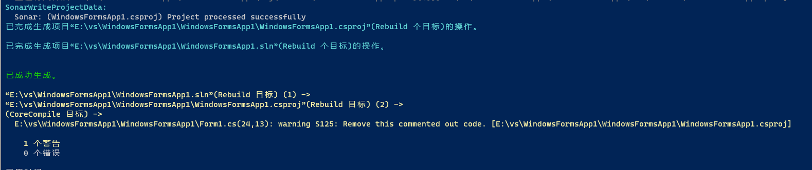

4、上传扫描结果到服务器

运行
`SonarScanner.MSBuild.exe end`

命令，如下图所示

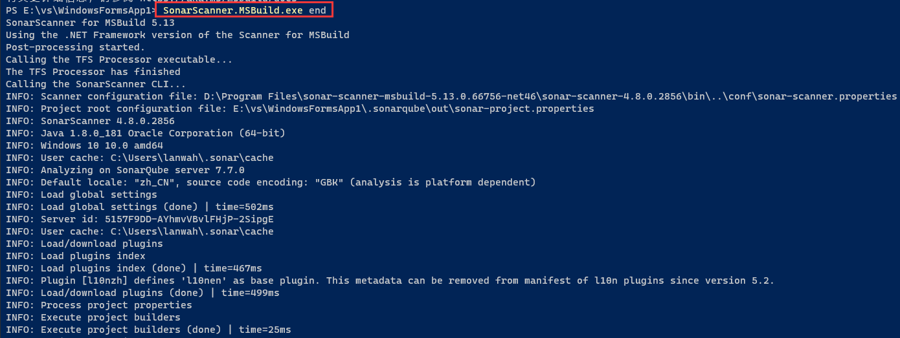

命令运行完成后如下图所示

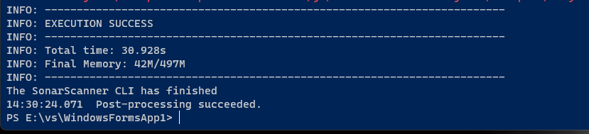

5、至此扫描操作完成，扫描结果已上传到服务器可以到服务器进行查看。

## QA

上传代码扫描结果操作完成，但是服务器上无法下载扫描结果的PDF？

> 检查发现上传扫描结果阶段提示PDF上传失败，因此服务器上无法下载扫描结果PDF，上传失败的原因可能是==SonarQube.Analysis.xml==配置有问题。
>
> 打开 SonarQube.Analysis.xml 配置文件，检查服务器地址（==注意地址后面不能有反斜杠 /，否则将导致PDF上传服务器失败==），用户名，密码。正确的 sonar.host.url 配置如下：
>
> 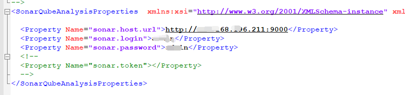

## Sonar系列

- [Sonar系列之SonarQube简介（一）](https://www.cnblogs.com/lfpriest/p/13366171.html)
- [Sonar系列之IDEA集成SonarLint（二）](https://www.cnblogs.com/lfpriest/p/13366227.html)
- [Sonar系列之SonarQube安装配置（三）](https://www.cnblogs.com/lfpriest/p/13366853.html)
- [Sonar系列之Jenkins集成sonar（四）](https://www.cnblogs.com/lfpriest/p/13367210.html)
- [Sonar启动后自动退出，提示：Process exited with exit value (es): 137](https://www.cnblogs.com/lfpriest/p/13410170.html)

## 相关参考

- [Visual Studio 中使用 SonarLint 分析 C# 代码](https://blog.51cto.com/u_15181572/6166350)
- [SonarQube扫描检测C#/.net代码](https://blog.csdn.net/weixin_44225369/article/details/120161329)
- [一文搞定SonarQube接入C#(.NET)代码质量分析](http://www.360doc.com/content/22/0618/17/79961355_1036531456.shtml)
