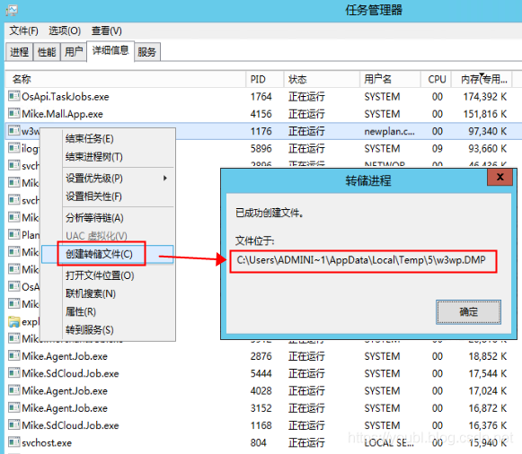
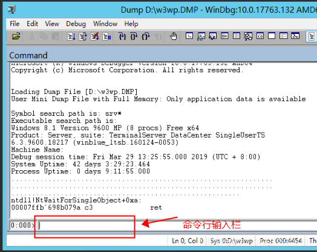

# WinDbg排查.net性能或内存问题步骤简述

[TOC]

---

## 一、安装WinDbg

> 第一步当然是安装了，需要注意的是，千万不要搜索 windbg 然后下载，搜索到的windbg安装文件，都不是我们想要的，真正的windbg，实际上是在微软的SDK里，下载链接在这里：
> https://developer.microsoft.com/en-US/windows/downloads/windows-10-sdk
> 点击这个网页里的 DOWNLOAD THE .ISO，文件大概814M ，等下载完成后，解压，运行安装程序，
> 在安装组件选择处，选择 Debugging Tools for Windows 即可，其它项可以不安装；
> 按步骤安装完成后，你的桌面上或开始菜单里，就有WinDbg(X64)的快捷方式了，双击它就跑起来了。

## 二、诊断数据获取

在目标机器上，打开任务管理器，进入“详细信息”标签页，找到有问题的进程，按右键，选择“创建转储文件”，等个1,2分钟，就会出现创建成功，并显示文件所在位置，这个文件就是我们要诊断的dmp数据了：
==注意：创建转储文件会暂停进程，如果是线上服务，要评估影响。==

## 三、加载分析

1. 打开WinDbg(X64)，点击菜单的“File”=》Open Crash Dump…
   找到上个步骤生成的dmp文件，点击打开，并等待加载完成（即命令行没有显示BUSY字样）：
   

2. 打开文件后，进行环境初始化，先创建目录 D:\Symbol，然后在WinDbg里执行如下命令：
   2.1、从微软下载Symbol档，并缓存到D盘的Symbol下：
   `.sympath srv*D:\Symbol*https://msdl.microsoft.com/download/symbols`
   2.2、指定显示完整的Symbol下载信息：
   `!sym noisy`
   3、自动加载CLR诊断相关模块，如果要分析其它机器的dump文件时，比较好用：
   `.cordll -ve -u -l`
   需要注意的是：有时加载其它机器的文件还是会无法加载，可以在dmp文件所在的机器上安装windbg进行诊断。

3. OK，可以开始用WinDbg的命令进行排查和诊断了
   3.1、常用命令：
   **查看引起CPU过高命令比如：**

   !threadpool 查看线程池CPU占用，包括总线程数、队列请求数、CP线程数。
   !threads -special 查看每个线程状态
   !runaway 查看每个线程的CPU占用时间，可以找到哪个线程占用时间更高。
   ~number s 切换到指定线程，number为具体线程的ID。
   kb 查看当前线程堆栈
   !clrstack 切换到具体的线程后，用此命令查看当前线程的托管代码。类似于 !dumpstack -EE
   !clrstack -a 表示显示所有参数信息和变量信息
   !eestack -EE 相当于在所有线程上执行 dumpstack (参数EE表示只显示托管代码)
   !name2ee 查看指定文件的指定类的MethodTable,EEClass等信息，如
   !name2ee * RabbitMQ.Client.Impl.Frame
   根据提示，用 !dumpmt 地址 查看具体的MethodTable信息；
   !dumpmt 找到相关MethodTable处的相关信息。
   !dumpmd 根据MethodDesc找到相关模块信息，比如MethodTable.
   !dumpdomain 显示所有域里的程序集，或者根据参数获取指定域。
   !savemodule 根据具体程序集地址，把当前程序集的代码生成到指定文件

   **查看占用内存过高的命令比如：**

   !eeheap 查看堆中信息，可以查看到大对象。
   !dumpheap 查看GC堆中信息，一般带-min,-stat,-type等参数。
   !dumpheap -stat 按对象类型排序输出所有对象个数、占用字节数
   注：Free这项： 0118c800 101 14824 Free
   这项一般都是GC还未压缩空间或一些堆上分配的禁止GC回收的pinned object（非托管对象或unsafe指针对象）.
   !dumpheap -type System.String -min 100 查找堆上大于100字节的字符串，注：-min 85000(大于85000字节的字符串或对象将存储在大对象堆上)
   !dumphead -mt xxxxx 类型不确定时，用mt串查找
   !do 地址 查看指定地址存放的数据信息
   !gcroot 地址 根据堆地址，查看相关模块引用代码信息，如果没找到，表示等待回收。
   !gcgen 地址 根据堆地址，看它的代龄，0代，1代，2代，试了好像没有这个指令

   !help 命令 可以查看指定命令的帮助信息
   注意：调试Dump一定要用对应版本的WinDbg，比如32位系统Dump要用WinDbg-x32

   **以下步骤是分析死锁的命令：**

   1、 !threadpool 查看Worker Thread工作线程数
   2、!threads 查看后台线程数
   3、 !locks 查看死锁，如果没有数据，要改用
   !SyncBlk
   Index SyncBlock MonitorHeld Recursion Owning Thread Info SyncBlock Owner
   295 0000009ad30235c8 3 1 0000009ad2deec60 4eac 37 00000097c014be58 ASP.global_asax
   341 0000009acc5abaa8 3 1 0000009acc259d80 1494 27 000000984025f0c8 ASP.global_asax
   上表意思：4eac线程（37号线程）占用了资源 00000097c014be58，阻塞了 （3 - 1）/ 2 = 1个线程（3表示 MonitorHeld）

   4、~* kv 查找所有线程数据，在里面搜索 c014be58
   可以看到 35线程和37线程都要用这个资源

   5、~35s 切换线程，再用 !clrstack -a 查看堆栈

   6、 用 !dso 查看线程堆栈上的对象

## 四、举例分析

### 以下步骤是分析高CPU占用的命令

1、用命令找出占用CPU时间最多的线程： !runaway 结果参考（都是CPU占用10分钟以上的线程）：
0:035> !runaway
User Mode Time
Thread Time
39:14b4 0 days 0:10:53.187
35:948 0 days 0:10:53.156
38:938 0 days 0:10:52.984
40:14e4 0 days 0:10:51.578
36:16f8 0 days 0:09:53.265

2、用命令切换到指定线程，如切换到线程27：~27s 结果参考：（注：该步骤会下载 mscorlib.ni.pdb）
0:035> ~39s
mscorlib_ni+0x4d9586:
00007ffac3e99586 488b4610 mov rax,qword ptr [rsi+10h] ds:000000f595cf9510=000000f495c35318

3、用命令显示指定线程的堆栈信息：!clrstack 结果参考：（注：该步骤会下载 clr.pdb）
0:039> !clrstack
OS Thread Id: 0x14b4 (39)
Child SP IP Call Site
000000f7a3ecbfb0 00007ffac3e99586 System.Collections.Generic.Dictionary2[[System.__Canon, mscorlib],[System.__Canon, mscorlib]].FindEntry(System.__Canon) 000000f7a3ecc020 00007ffac3e70ae4 System.Collections.Generic.Dictionary2[[System.__Canon, mscorlib],[System.__Canon, mscorlib]].TryGetValue(System.__Canon, System.__Canon ByRef)
000000f7a3ecc060 00007ffa6655befd Mike.Domain.DapperProvider.DapperUtil.GetPrimaryKeyName(System.Type)
000000f7a3ecc0c0 00007ffa6655b48e Mike.Domain.DapperProvider.DapperRepository`2[[System.__Canon, mscorlib],[System.Int64, mscorlib]]…ctor()
000000f7a3ecc110 00007ffa664c22f8 DynamicClass.lambda_method(System.Runtime.CompilerServices.Closure)
000000f7a3ecc140 00007ffa6655ae78 Mike.Tool.Core.Constructor.CreateInstance()
000000f7a3ecc190 00007ffa6655acb2 Mike.Tool.Core.ClassLoader.GetInstance[System.__Canon, mscorlib]
000000f7a3ecc1e0 00007ffa6655aade Mike.Tool.Core.ClassLoader.GetSingleInstance[System.__Canon, mscorlib]

第3步的结果里，可以看到卡在Dictionary.FindEntry方法上，
再切换到其它几个线程，都可以看到，卡在同一个方法上，基本上可以判定是Dictionary的线程不安全导致的问题，
解决方法，要么替换成ConcurrentDictionary，要么对关键的读取 和 修改代码进行lock了

==========================================================================================
以下步骤是分析高内存占用的命令：
1、用命令找出占用内存最多的对象： !dumpheap -stat 结果参考：
0:039> !dumpheap -stat
Statistics:
MT Count TotalSize Class Name
00007ffac4c31ea0 1 24 System.Collections.Generic.GenericEqualityComparer1[[System.Int64, mscorlib]] 00007ffac4c03738 1 24 System.Collections.Generic.GenericEqualityComparer1[[System.UInt64, mscorlib]]
00007ffac40791a8 984 118080 System.Reflection.RuntimeParameterInfo
00007ffac405c1b8 676 180528 System.Collections.Hashtable+bucket[]
00007ffac4057c20 853 197198 System.Char[]
000000f31516c8b0 2659 197852 Free
00007ffac40570b0 9886 237264 System.Object
00007ffac4073548 2207 247184 System.Reflection.RuntimeMethodInfo
00007ffac4059498 2345 249196 System.Int32[]
00007ffac40dae60 7 356424 System.Int64[]
00007ffac4057148 2099 435992 System.Object[]
00007ffac4092388 21860 874400 System.Threading.QueueUserWorkItemCallback
00007ffac4056ad0 11232 1103744 System.String
00007ffac4092090 1316 1805664 System.Threading.IThreadPoolWorkItem[]
00007ffac405be10 1401 3657601 System.Byte[]
Total 104448 objects
2、查看具体的类的内存：
!dumpheap -type System.Web.Caching.CacheEntry 命令，查看所有具体的CacheEntry地址等信息，
注意：这个数据太大，要加一个范围比较好，例如：
!dumpheap -type Mike.Promotion.Service.Dto.VoucherDishDto 0 0x0000001700202000
这后面2个参数，0表示起始，0x0000001700002000表示结束，结束值从 !eeheap -gc 的输出结果里：generation 2 starts at的值，增加一点范围就好

3、 !eeheap -gc 查看托管堆

## 本文摘自

版权声明：本文为CSDN博主「游北亮」的原创文章，遵循CC 4.0 BY-SA版权协议，转载请附上原文出处链接及本声明。
原文链接：https://blog.csdn.net/youbl/article/details/88893182