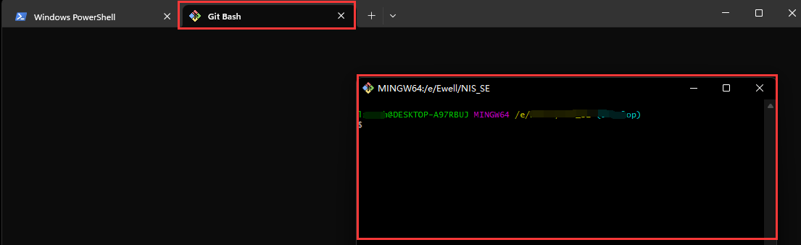
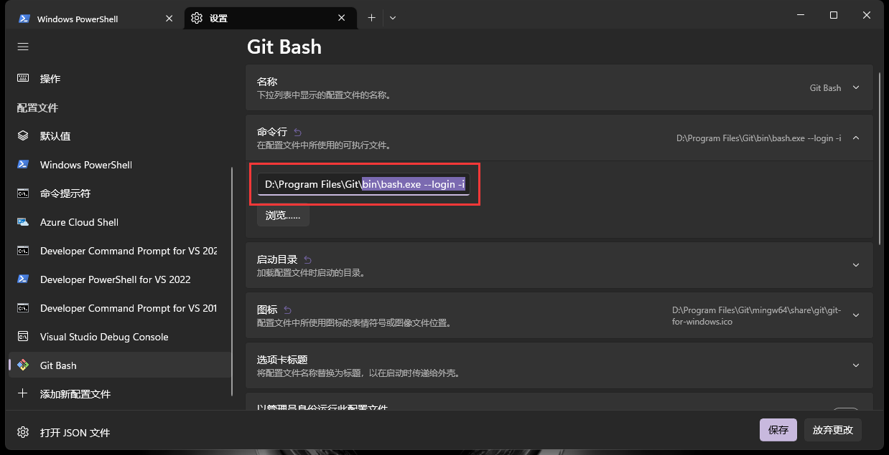
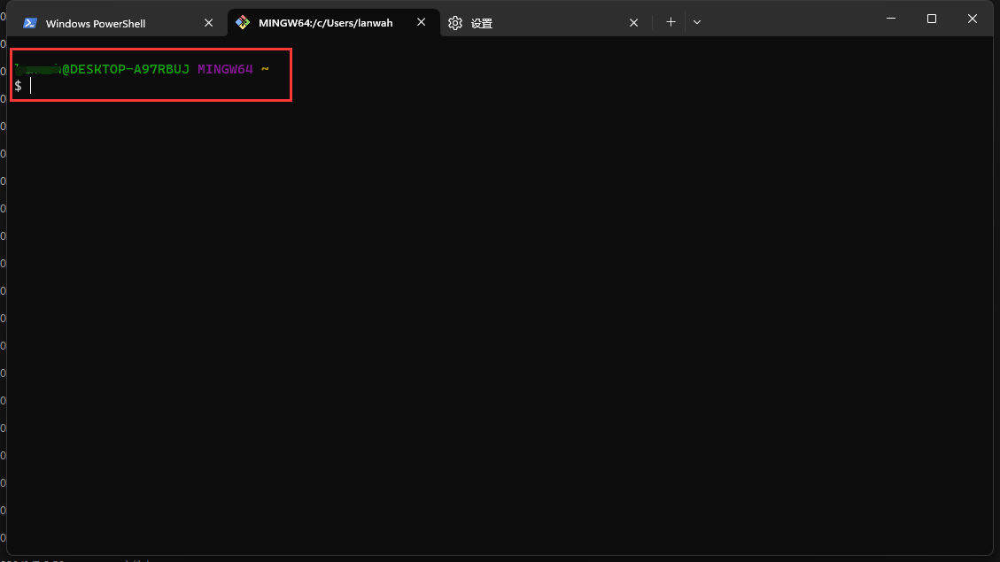
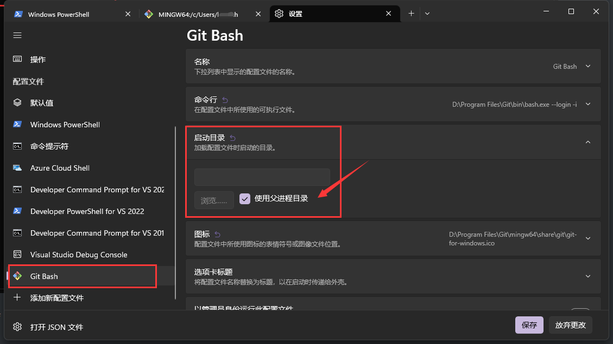

# Windows Terminal集成Git Bash

---

[TOC]

---

## 目的

集成操作终端，统一管理与方便操作使用。

## Window Terminal 安装以及使用

1. [Windows Terminal的介绍与安装](https://zhuanlan.zhihu.com/p/351281543)
2. [Windows Terminal完整指南](https://blog.csdn.net/freeking101/article/details/117767267)
2. Oh My Posh 安装与使用

## Windows Terminal 集成 Git Bash

[Windows Terminal 下集成 GIT](https://www.cnblogs.com/N-A-N/p/16769507.html)

## 常见问题及解决办法

1. [Windows Terminal打开Git乱码并且无法使用Linux命令](https://blog.csdn.net/m0_51426055/article/details/126220859)
2. Windows Terminal 已经集成了操作入口，但是 Git Bash命令窗口却以弹出窗口的形式打开，如下图所示

**解决办法：**如下图所示，注意路径为 bin\bash.exe  启动参数为 --login -i

3. 如下图所示，通过Terminal终端打开Git Bash时默认路径不对，不是当前的操作目录。

**解决办法：**如下图所示，启动目录中配置为使用父进程目录，不要配置成 %USERPROFILE%

## 相关参考

1. [git-bash.exe参数](https://www.cnblogs.com/tekikesyo/p/11175497.html)

2. [How can I find out the command line options for git-bash.exe](https://superuser.com/questions/1104567/how-can-i-find-out-the-command-line-options-for-git-bash-exe)

3. [Linux man page](https://linux.die.net/man/1/sh)