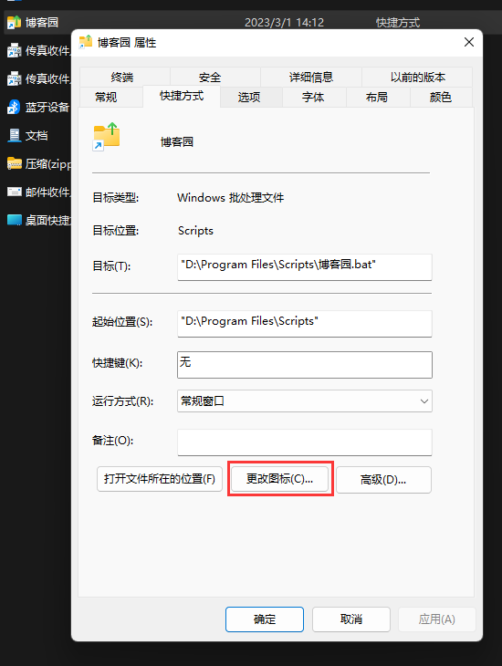

# dotnet-cnblogs-tool 工具使用

工具的作用在下面第一部分原作者的GitHub说明和博客中有介绍，此文中就不在说明。

---
[toc]
***

### 一、DotNet博客园图片上传工具

1. ==GitHub源码地址==：https://github.com/stulzq/dotnet-cnblogs-tool
2. 介绍博客：[如何高效的编写与同步博客](https://www.cnblogs.com/stulzq/p/9043632.html)

### 二、dotnet-cnblogs安装与使用

1. [dotnet-cnblog工具的使用](https://www.cnblogs.com/hxld/p/16831363.html)
2. [dotnet-cnblog的安装与使用](https://www.cnblogs.com/henry666/p/16621020.html)
3. [快捷方式制作](https://www.cnblogs.com/shengliC/p/14410298.html)

### 三、快捷方式的分享点

**改进的目的：**强迫症的作祟，希望看起来更加美观，效果如下图所示：

==前提：==请先阅读快捷方式制作中关联的文章。

**操作步骤：**

1. 找个固定的目录存放脚本bat，如下图所示：

2. 然后把脚本发送到桌面快捷方式，如下图所示：

3. 在资源管理器中输入 `%AppData%\Microsoft\Windows\SendTo` 打开发送到目录，并把==步骤2==中发送到桌面的快捷方式剪切到此处，如下图所示：

4. 修改快捷方式的图标，如下图所示

5. 到此优化完成。

### 四、碰到的问题

用Markdown编写文章时图片请使用`` 别用img否则用工具上传不了！