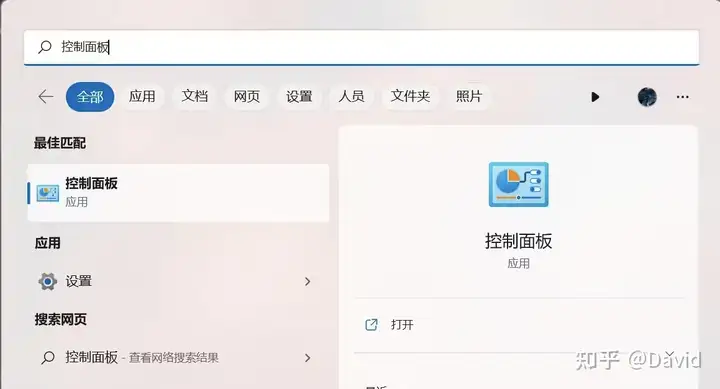
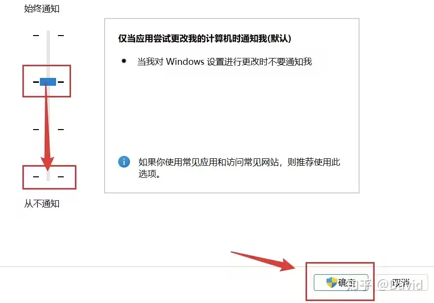

# Windows系统关闭或通过Windows兼容性设置跳过软件启动时用户帐户控制方法

[TOC]

## 方法一：关闭用户账户控制

### 1.打开控制面板

### 2.打开系统和安全

### 3.打开更改用户帐户控制设置，并选择从不通知，点击确定即可

## 方法二：为某一应用/程序跳过用户账号控制

<mark>注意！！！需要以管理员身份运行的软件不适用此方法！</mark>

### 1.win+R 打开运行，输入regedit,点击确定

### 2.依次点击 `HKEY_CURRENT_USER\Software\Microsoft\Windows NT\CurrentVersion\AppCompatFlags\Layers`，如果没有Layers文件夹就先新建一个Layers

> [!TIP]
>
> 其实这边有个更便捷的操作，那就是找需要设置的软件，找到属性中的以管理员身份运行勾选上，如下图所示
>
> 
>
> 然后上述注册表中就会出现此软件的配置但是**数据**中的值是 **~ RUNASADMIN**，然后根据下面是配置修改成相应的值 **~ RUNASINVOKER** 即可，注意符号别漏了。

### 3.在Layers中空白区域点击鼠标右键新键一个字符串值

### 4.字符串值名字为你要跳过用户账号控制的应用的绝对路径

例如我要跳过网易有道词典 地址为`C:\Users\qyj\AppData\Local\youdao\dict\Application\YoudaoDict.exe`

### 5.将其填到新建的字符串值名称中，数据填 RUNASINVOKER，点击确定关闭即可

> [!IMPORTANT]
>
> 请注意！**方法二** 这个其实是在注册表把UAC的权限改为普通用户了，对于需要管理员权限运行的软件改了这个没用。
>
> 如果软件不需要以管理员身份运行那么关闭软件设置内的以管理员身份启动选项即可。

## 版权特别声明

本文摘自：[Windows系统关闭或通过Windows兼容性设置跳过软件启动时用户帐户控制方法 - 知乎 (zhihu.com)](https://zhuanlan.zhihu.com/p/655338684)，此文做了转载，只是稍做了整理和补充。