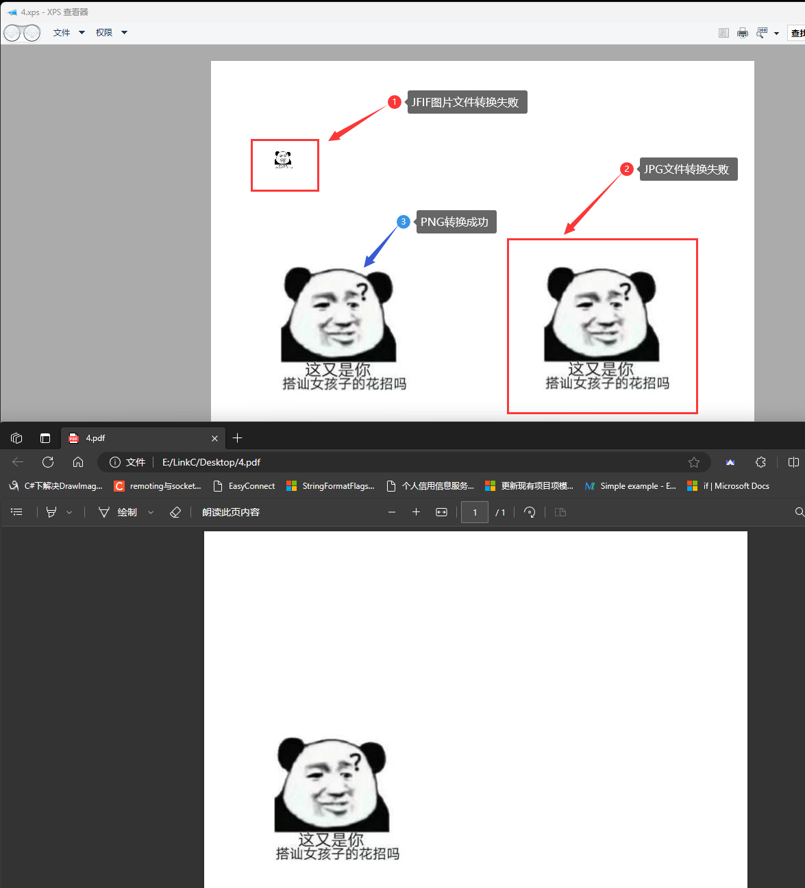

# GhostXPS转PDF

[TOC]

---

记录使用GhostXPS转PDF过程中碰到的一些问题。

## Q&A

之前有分享过 [Xps转PDF](https://www.cnblogs.com/lanwah/p/16057807.html) 的文章，其中通过GhostXPS转PDF时存在如下问题：

<span style="color:white;background-color:blue;">通过虚拟打印机生成Xps文件时，如果Xps中有==非PNG图片==那么转换是不会报错的但是图片会丢失。</span>



<span style="color:white;background-color:red;">注意：</span>上图中Xps文件中的图片是通过Graphics绘制的。

此问题我在 https://bugs.ghostscript.com/ 上也提了疑问，得到的回答是绘制到Xps中的Jpg图片的Dpi为0导致的。

问题的地址为：**[image in xps convert to pdf failed](https://bugs.ghostscript.com/show_bug.cgi?id=707290)**

文章末尾也给了官方提供的Xps定义规范，遗憾的是本人英文水平有限也没从给出的规范中找到跟此问题有关的信息。

与此同时我也一直有个新的疑惑：==既然并不是所有的图片都能顺利的转换成PDF，那么Xps中哪些图片类型能够转换成PDF呢？==

此问题从Xps定义规范中我也没找到答案，如果有人有GhostXps的使用经验，或者从Xps定义规范中找到了答案也希望可以与我共同分享。

<span style="background-color:lightgreen;">解决方式</span>

既然PNG图片可以打印，那么就在打印图片前做下处理，处理方式是<span style="color:blue;">“判断要绘制的图片是否为PNG，非PNG图片则进行转换”</span>。

判断图片是否为PNG图片推荐阅读：[PNG文件格式详解](https://www.cnblogs.com/senior-engineer/p/9548347.html)

核心实现如下，其中判断图片是否为Png的方式换了，因为绘制前已经拿到了图片，因此使用图片直接判断（而不是转成图片二进制然后通过图片头部标识来判断）。

```C#
        /// <summary>
        /// 转成Png（GhostXPS.XpsConverter目前只支持Png）
        /// </summary>
        /// <param name="imgPhoto"></param>
        /// <param name="isNew"></param>
        /// <returns></returns>
        public static Image ConvertToPng(this Image imgPhoto, out bool isNew)
        {
            isNew = false;
            if (imgPhoto.IsPng())
            {
                return imgPhoto;
            }
            else
            {
                // 转换成Png
                var base64 = imgPhoto.ToPngBase64String();
                isNew = true;
                return base64.ToImage();
            }
        }

        /// <summary>
        /// 判断是否为Png图片
        /// </summary>
        /// <param name="imgPhoto"></param>
        /// <returns></returns>
        public static bool IsPng(this Image imgPhoto)
        {
            return imgPhoto.RawFormat.Equals(ImageFormat.Png);
        }
```

<span style="color:green;font-weight:bold;">提示</span>

<div style="background:green;color:white;padding:15px;border-radius:6px;">今天（2024-04-26）收到了邮件，作者已经增强了此问题中描述的功能，详见文章：<a href="https://bugs.ghostscript.com/show_bug.cgi?id=707290" style="color:white;">image in xps convert to pdf failed</a></div>

## 相关推荐

1. [image in xps convert to pdf failed](https://bugs.ghostscript.com/show_bug.cgi?id=707290)

2. [GhostScript Pdf 转换图片 记录](https://www.cnblogs.com/julyluo/p/14606190.html)

3. [PNG文件格式详解](https://www.cnblogs.com/senior-engineer/p/9548347.html)
4. [Pdf文件处理组件对比(Aspose.Pdf,Spire.Pdf,iText7)](https://www.cnblogs.com/RobotZero/p/7742282.html)