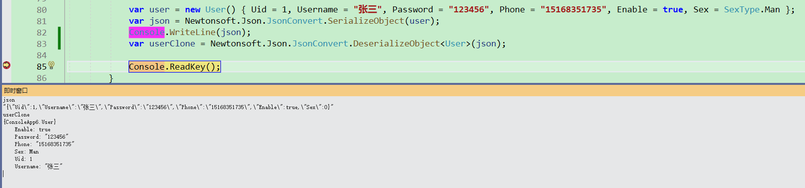
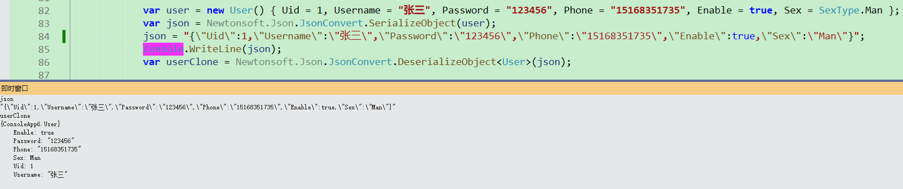
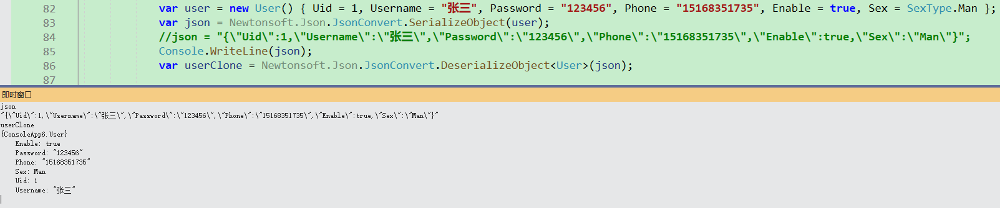

# Newtonsoft.Json使用

[TOC]

---

用于记录开发过程中Newtonsoft.Json中使用的常用功能。

## 枚举类型序列化/反序列化

由于枚举类型的基类是值类型，因此默认情况下（无任何特性修饰）枚举类型序列化之后的值是Int32类型的数字，反序列化会把相应的数字/==枚举名称==转成对应的枚举。

例如：

<span style="background-color:lightgreen">类定义</span>

```C#
    public class User
    {
        public int Uid
        {
            set; get;
        }
        public string Username
        {
            set; get;
        }
        public string Password
        {
            set; get;
        }
        public string Phone
        {
            set; get;
        }
        public bool Enable
        {
            set; get;
        }
        public SexType Sex
        {
            get; set;
        }
    }

    public enum SexType
    {
        Man,
        Women,
    }
```

测试代码和运行结果



枚举名称转对象的结果



调整后

```C#
    public class User
    {
        public int Uid
        {
            set; get;
        }
        public string Username
        {
            set; get;
        }
        public string Password
        {
            set; get;
        }
        public string Phone
        {
            set; get;
        }
        public bool Enable
        {
            set; get;
        }
        [JsonConverter(typeof(StringEnumConverter))]
        public SexType Sex
        {
            get; set;
        }
    }
```

添加了 ==[JsonConverter(typeof(StringEnumConverter))]== 特性，运行结果



### 结论

枚举类型==没加==[JsonConverter(typeof(StringEnumConverter))]特性时：

**序列化操作**

枚举类型序列化会转换为其对应的Int32的值；

**反序列化操作**

Int32对应的枚举类型值或枚举类型名称都可以反序列化为对应的枚举类型。

==加了[JsonConverter(typeof(StringEnumConverter))]特性后==

**序列化操作**

枚举类型序列化会转换为其对应的枚举类型名称；

**反序列化操作**

Int32对应的枚举类型值或枚举类型名称都可以反序列化为对应的枚举类型。

## 序列化后的字符串字段顺序控制

测试类

```C#
    public class User
    {
        public int Uid
        {
            set; get;
        }
        public string Username
        {
            set; get;
        }
        public string Password
        {
            set; get;
        }
        public string Phone
        {
            set; get;
        }
        public bool Enable
        {
            set; get;
        }
        [JsonConverter(typeof(StringEnumConverter))]
        public SexType Sex
        {
            get; set;
        }
    }
```

不处理时序列化后的字符串为

`{"Uid":1,"Username":"张三","Password":"123456","Phone":"15168351735","Enable":true,"Sex":"Man"}`

### 通过[JsonProperty(Order = 1)]控制字段序列化后的顺序

此方式可以达到预期的目的，前提是我们有序列化对象的源码，还有就是不利于扩展，在修改对象属性时需要重新数里各个属性的排序，因此此处不做过多的介绍。

### 通过自定义**ContractResolver**的方式实现

OrderedContractResolver类

```C#
        public class OrderedContractResolver : DefaultContractResolver
        {
            protected override IList<JsonProperty> CreateProperties(Type type, MemberSerialization memberSerialization)
            {
                var props = base.CreateProperties(type, memberSerialization);
                return props.OrderBy(a => a.PropertyName).ToList();
            }
        }
```

序列化时

```C#
            var user = new User() { Uid = 1, Username = "张三", Password = "123456", Phone = "15168351735", Enable = true, Sex = SexType.Man };
            var json = Newtonsoft.Json.JsonConvert.SerializeObject(user, new JsonSerializerSettings()
            {
                ContractResolver = new OrderedContractResolver()
            });
```

输出结果
`{"Enable":true,"Password":"123456","Phone":"15168351735","Sex":"Man","Uid":1,"Username":"张三"}`

### 相关参考

1. [C#/Python Json序列化时控制字段顺序](https://www.freeaihub.com/post/2047.html)
2. [Order of serialized fields using JSON.NET](https://stackoverflow.com/questions/3330989/order-of-serialized-fields-using-json-net)
