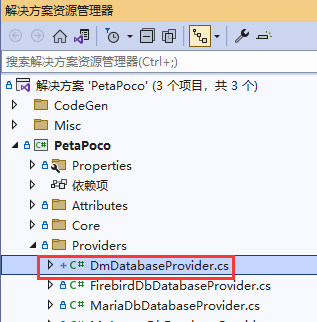
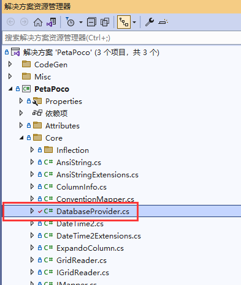
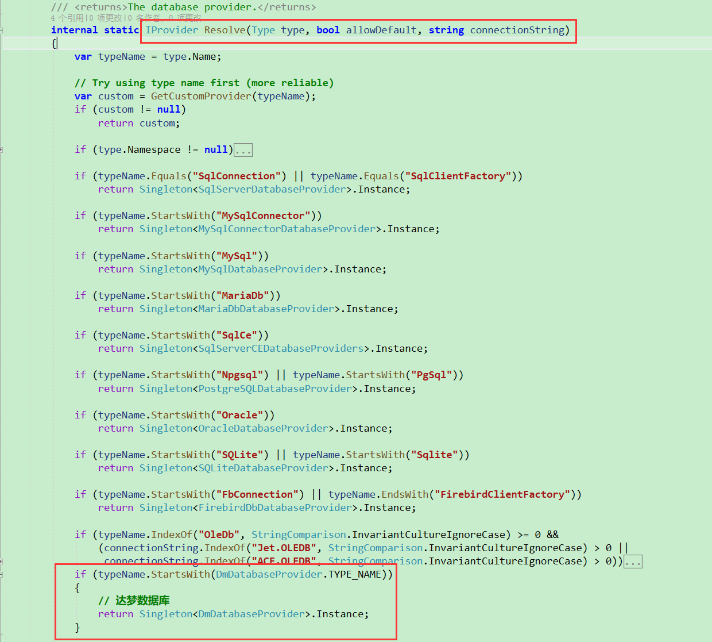
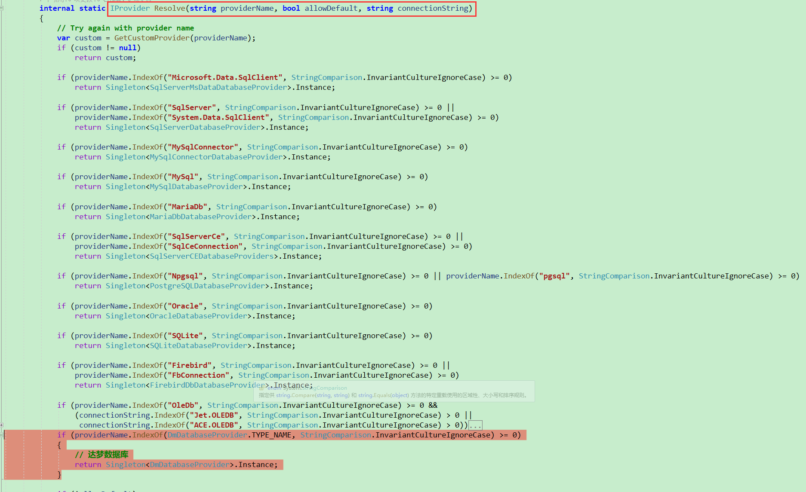

# PetaPoco支持达梦数据库

本文用于记录PetaPoco支持达梦数据库所做的修改，本想把做的修改作为RP提交到PetaPoco库的，考虑到国产数据库只有我国推行的比较多，对老外来说可能会有片面性，因此放弃了，本文记录下修改的过程，以便需要的童鞋可以参考。

## 操作步骤

1. 如下图所示， 添加 **DmDatabaseProvider.cs** ，路径为 PetaPoco\Providers\DmDatabaseProvider.cs 。此类的功能是实现达梦数据库的提供程序，通过达梦提供的dll创建DbProviderFactory对象，并提供对特有数据库语法的支持，比如参数前缀是==:(冒号)==那么只要重写GetParameterPrefix方法即可。


DmDatabaseProvider.cs的代码如下：

```c#
using System;
using System.Data.Common;
using PetaPoco.Core;

namespace PetaPoco.Providers
{
    /// <summary>
    /// 达梦数据库
    /// 官方网站：https://eco.dameng.com/
    /// .Net Data Provider：https://eco.dameng.com/document/dm/zh-cn/app-dev/dot-Net-Data-Provider.html
    /// .NET：https://eco.dameng.com/document/dm/zh-cn/start/net-development.html
    /// .NET Data Provider编程指南：https://eco.dameng.com/document/dm/zh-cn/pm/net-rogramming-guide.html
    /// 数据库安装目录下有相关的操作手册
    /// </summary>
    public class DmDatabaseProvider : DatabaseProvider
    {
        /// <summary>
        /// 达梦数据库类型
        /// </summary>
        public const string TYPE_NAME = "DmDb";

        public override DbProviderFactory GetFactory()
            => GetFactory("Dm.DmClientFactory,DmProvider");

        public override string GetParameterPrefix(string connectionString)
            => ":";

        public override string EscapeSqlIdentifier(string sqlIdentifier)
            => $"\"{sqlIdentifier.ToUpperInvariant()}\"";
    }
}
```
2. 如下图所示，找到 PetaPoco\Core\DatabaseProvider.cs 文件。
   

3. 找到 `internal static IProvider Resolve(Type type, bool allowDefault, string connectionString)` 函数，添加对达梦数据库的解析，代码如下：

   ```C#
               if (typeName.StartsWith(DmDatabaseProvider.TYPE_NAME))
               {
                   // 达梦数据库
                   return Singleton<DmDatabaseProvider>.Instance;
               }
   ```

   形成如下代码
   

4.  找到 `internal static IProvider Resolve(string providerName, bool allowDefault, string connectionString)` 函数，添加对达梦数据库的解析，代码如下：

   ```C#
               if (providerName.IndexOf(DmDatabaseProvider.TYPE_NAME, StringComparison.InvariantCultureIgnoreCase) >= 0)
               {
                   // 达梦数据库
                   return Singleton<DmDatabaseProvider>.Instance;
               }
   ```

   形成如下代码：

   

5. 至此，代码的修改已经完成。

## 数据库连接字符串的配置

`<add name="dmdb" connectionString="Server=192.168.150.20:5236;schema=schemaName;UserId=SYSDBA;PWD=123456" providerName="DmDb"/>`

注意 ==providerName="DmDb"==，如果需要换个名称，那么修改 DmDatabaseProvider.cs 文件中的 TYPE_NAME 使之与providerName配置的值一样即可。

PetaPoco支持的数据库连接字符串配置如下

```xml
<?xml version="1.0" encoding="utf-8"?>
<configuration>
  <connectionStrings>
    <clear />
    <add name="postgres" connectionString="Host=localhost;Username=petapoco;Password=petapoco;Database=petapoco;Port=5001" providerName="Npgsql" />
    <add name="mysql" connectionString="Server=localhost;Uid=petapoco;Pwd=petapoco;Database=petapoco;Port=5002" providerName="MySql.Data.MySqlClient" />
    <add name="mysqlconnector" connectionString="Server=localhost;Uid=petapoco;Pwd=petapoco;Database=petapoco;Port=5006" providerName="MySqlConnector" />
    <add name="mariadb" connectionString="Server=localhost;Uid=petapoco;Pwd=petapoco;Database=petapoco;Port=5003;SslMode=none" providerName="MySql.Data.MySqlClient" />
    <add name="sqlite" connectionString="Data Source=PetaPoco.sqlite;Version=3;" providerName="System.Data.SQLite" />
    <add name="mssqlce" connectionString="Data Source=petapoco.sdf" providerName="System.Data.SqlServerCe.4.0" />
    <add name="mssql_builder" connectionString="Data Source=localhost,5005;User ID=sa;Password=pAtAp0c8" providerName="System.Data.SqlClient" />
    <add name="mssql" connectionString="Data Source=localhost,5005;Initial Catalog=PetaPoco;User ID=sa;Password=pAtAp0c8" providerName="System.Data.SqlClient" />
    <add name="mssqlmsdata_builder" connectionString="Data Source=localhost,5005;User ID=sa;Password=pAtAp0c8" providerName="Microsoft.Data.SqlClient" />
    <add name="mssqlmsdata" connectionString="Data Source=localhost,5005;Initial Catalog=PetaPocoMsData;User ID=sa;Password=pAtAp0c8" providerName="Microsoft.Data.SqlClient" />
    <add name="firebird" connectionString="User=SYSDBA;Password=petapoco;Database=/firebird/data/petapoco.fdb;DataSource=localhost;Port=5004;ServerType=0;Charset=NONE;Pooling=false" providerName="FirebirdSql.Data.FirebirdClient" />
    <add name="msaccess" connectionString="Provider=Microsoft.ACE.OLEDB.12.0;Data Source=|DataDirectory|Databases\MSAccess\petapoco.accdb" providerName="OleDb"/>
    <add name="dmdb" connectionString="Server=192.168.150.20:5236;schema=schemaName;UserId=SYSDBA;PWD=123456" providerName="DmDb"/>
  </connectionStrings>
  <startup>
    <supportedRuntime version="v4.0" sku=".NETFramework,Version=v4.6.1" />
  </startup>
  <system.data>
		  <DbProviderFactories>
			  <remove invariant="FirebirdSql.Data.FirebirdClient" />
			  <add name="FirebirdClient Data Provider" invariant="FirebirdSql.Data.FirebirdClient" description=".NET Framework Data Provider for Firebird" type="FirebirdSql.Data.FirebirdClient.FirebirdClientFactory, FirebirdSql.Data.FirebirdClient" />
		  </DbProviderFactories>
  </system.data>
</configuration>
```

注意==17行==的配置为达梦数据库的配置。
