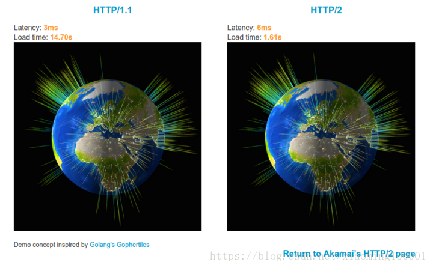
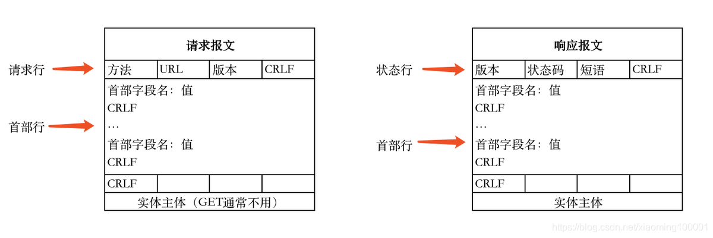
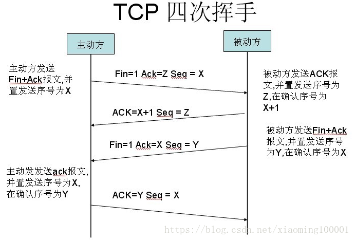
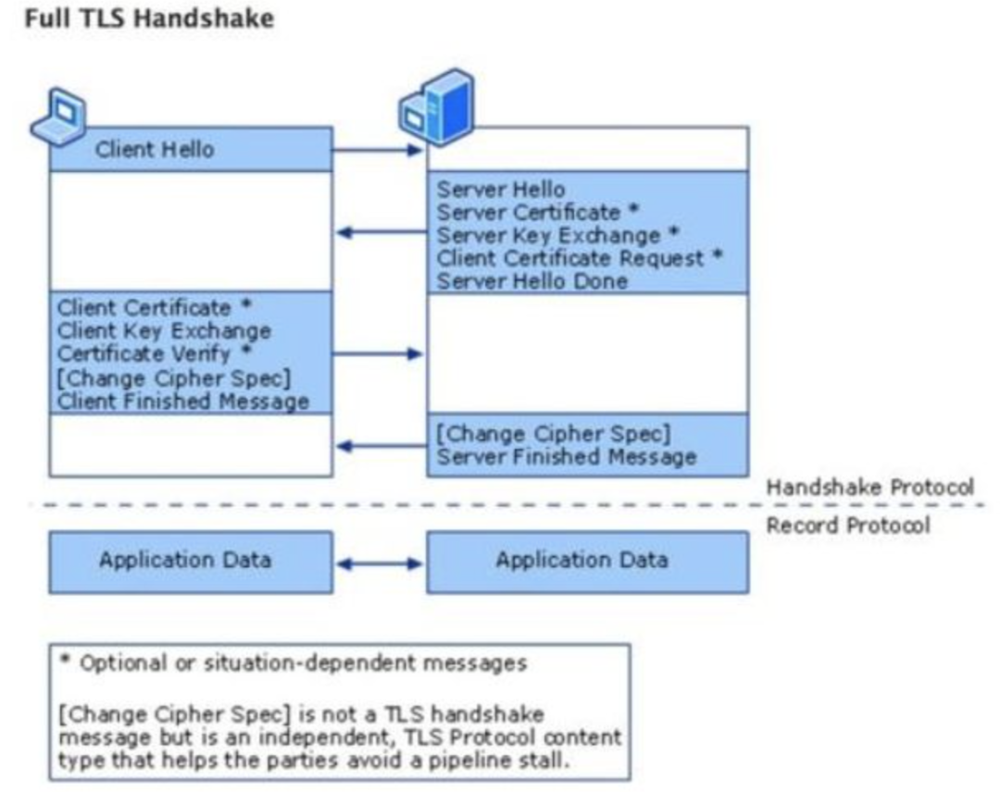
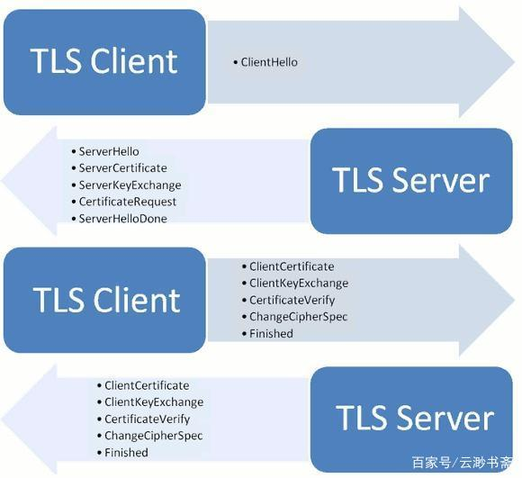

# Http与Https

[TOC]

---

## 什么是Http？

> 超文本传输协议，是一个基于请求与响应，无状态的，应用层的协议，常基于TCP/IP协议传输数据，互联网上应用最为广泛的一种网络协议,所有的WWW文件都必须遵守这个标准。设计HTTP的初衷是为了提供一种发布和接收HTML页面的方法。

### 发展历史

| 版本     | 产生时间 | 内容                                                         | 发展现状           |
| -------- | -------- | ------------------------------------------------------------ | ------------------ |
| HTTP/0.9 | 1991年   | 不涉及数据包传输，规定客户端和服务器之间通信格式，只能GET请求 | 没有作为正式的标准 |
| HTTP/1.0 | 1996年   | 传输内容格式不限制，增加PUT、PATCH、HEAD、 OPTIONS、DELETE命令 | 正式作为标准       |
| HTTP/1.1 | 1997年   | 持久连接(长连接)、节约带宽、HOST域、管道机制、分块传输编码   | 2015年前使用最广泛 |
| HTTP/2   | 2015年   | 多路复用、服务器推送、头信息压缩、二进制协议等               | 逐渐覆盖市场       |

这个Akamai公司建立的一个官方的演示，使用HTTP/1.1和HTTP/2同时请求379张图片，观察请求的时间，明显看出HTTP/2性能占优势。

多路复用：通过单一的HTTP/2连接请求发起多重的请求-响应消息，多个请求stream共享一个TCP连接，实现多留并行而不是依赖建立多个TCP连接。

### HTTP报文格式

### HTTP的特点

**无状态**

> 协议对客户端没有状态存储，对事物处理没有“记忆”能力，比如访问一个网站需要反复进行登录操作

**无连接**

> HTTP/1.1之前，由于无状态特点，每次请求需要通过TCP三次握手四次挥手，和服务器重新建立连接。比如某个客户机在短时间多次请求同一个资源，服务器并不能区别是否已经响应过用户的请求，所以每次需要重新响应请求，需要耗费不必要的时间和流量。

**基于请求和响应**

基本的特性，由客户端发起请求，服务端响应

**简单快速、灵活**

**通信使用明文、请求和响应不会对通信方进行确认、无法保护数据的完整性**

### HTTP通信的过程

客户端输入URL回车，DNS解析域名得到服务器的IP地址，服务器在80端口监听客户端请求，端口通过TCP/IP协议（可以通过Socket实现）建立连接。HTTP属于TCP/IP模型中的运用层协议，所以通信的过程其实是对应数据的入栈和出栈。

报文从运用层传送到运输层，运输层通过TCP三次握手和服务器建立连接，四次挥手释放连接。

## 什么是Https？

> 《图解HTTP》这本书中曾提过HTTPS是身披SSL外壳的HTTP。HTTPS是一种通过计算机网络进行安全通信的传输协议，经由HTTP进行通信，利用SSL/TLS建立全信道，加密数据包。HTTPS使用的主要目的是提供对网站服务器的身份认证，同时保护交换数据的隐私与完整性。
>
> PS:TLS是传输层加密协议，前身是SSL协议，由网景公司1995年发布，有时候两者不区分。

如下图所示，HTTPS整个传输的加密过程都在新的安全层SSL/TLS中实现，而原来的HTTP层的传输流程保持不变，这样就很好地兼容了旧的HTTP协议，也沿袭了TCP/IP协议族的分层思想。

HTTPS协议其实就是HTTP over TLS，TLS(Transport Layer Security) 传输层安全协议是HTTPS协议的核心。

### TLS/SSL协议

SSL最早是由网景公司(Netscape)开发的，后被IETF（The Internet Engineering Task Force - 互联网工程任务组）标准化后写入RFC（Request For Comments），SSL在迭代到3.0后才将其标准化，并重新更名为TLS。目前TLS先后迭代了[TLS 1.0](https://link.zhihu.com/?target=https%3A//www.rfc-editor.org/rfc/rfc2246.html)、[TLS 1.1](https://link.zhihu.com/?target=https%3A//www.rfc-editor.org/rfc/rfc4346.html)、[TLS 1.2](https://link.zhihu.com/?target=https%3A//www.rfc-editor.org/rfc/rfc5246.html)和[TLS 1.3](https://link.zhihu.com/?target=https%3A//www.rfc-editor.org/rfc/rfc8446.html)，目前被广泛使用的是TLS 1.2版本。

TSL可以理解为SSL (Secure Socket Layer)安全套接字层的后续版本。

### TLS加密原理

本文中不具体阐述TLS加密的原理，有需要了解此原理的推荐阅读下面的文章。

**推荐阅读**

1. [HTTPS原理和TLS认证流程全解析](https://zhuanlan.zhihu.com/p/440612523)
2. [HTTPS协议、TLS协议、证书认证过程解析](https://www.cnblogs.com/snowater/p/7804889.html)

### HTTPS的特点

**内容加密**

> 采用混合加密技术，中间者无法直接查看明文内容

**验证身份**

> 通过证书认证客户端访问的是自己的服务器

**保护数据完整性**

> 防止传输的内容被中间人冒充或者篡改

>**混合加密：**结合非对称加密和对称加密技术。客户端使用对称加密生成密钥对传输数据进行加密，然后使用非对称加密的公钥再对秘钥进行加密，所以网络上传输的数据是被秘钥加密的密文和用公钥加密后的秘密秘钥，因此即使被黑客截取，由于没有私钥，无法获取到加密明文的秘钥，便无法获取到明文数据。
>
>**数字摘要：**通过单向hash函数对原文进行哈希，将需加密的明文“摘要”成一串固定长度(如128bit)的密文，不同的明文摘要成的密文其结果总是不相同，同样的明文其摘要必定一致，并且即使知道了摘要也不能反推出明文。
>
>**数字签名技术：**数字签名建立在公钥加密体制基础上，是公钥加密技术的另一类应用。它把公钥加密技术和数字摘要结合起来，形成了实用的数字签名技术。

**收方能够证实发送方的真实身份**

**发送方事后不能否认所发送过的报文**

**收方或非法者不能伪造、篡改报文**

### HTTPS实现原理（SSL的验证过程）

客户端执行 HTTPS 请求时，需要由 TCP 协议建立和释放连接。这就涉及 TCP 协议的三次握手和四次挥手。TCP 连接建立好后，对于 HTTP 而言，服务器就可以发送数据给客户端。但是对于 HTTPS，它还要运行 SSL/TLS 协议，SSL/TLS 协议分两层，第一层是记录协议，主要用于传输数据的加密压缩；第二层是握手协议，它建立在第一层协议之上，主要用于数据传输前的双方身份认证、协商加密算法、交换密钥。

#### 单向验证过程

SSL 单向验证总共有四步：

**第一步**，客户端向服务器端发起 Client Hello，请求内容包括：

- 客户端支持的 SSL/TLS 协议版本列表；
- 客户端支持的对称加密算法列表；
- 客户端生成的随机数 A；

**第二步**，服务器端回应客户端 Server Hello，回应内容包括：

- 双方都支持的 SSL/TLS 协议版本；
- 双方都支持的对称加密算法；
- 服务器秘钥库中的证书；
- 服务器端生成的随机数 B；

**第三步**，客户端收到服务器端回应，客户端检查服务器端证书是否合法，验证内容如下：

- 服务器端证书是否过期；
- 服务器端证书是否被吊销；
- 服务器端证书是否可信；
- 服务器端证书域名和客户端请求域名是否一致。

验证通过后，客户端回应服务器端，回应内容包括：

- 客户端生成一个“随机数 C”，“随机数 C”也被称为”pre-master-key”，然后使用服务器端证书中的公钥加密“随机数 C”，将加密后的“随机数 C”发送给服务器端。

**第四步**，服务器端使用秘钥库中的私钥解密加密后的“随机数 C”得到“随机数 C”，此时客户端和服务器端都拿到了随机数 A、随机数 B、随机数 C，双方通过这 3 个随机数使用相同的秘钥交换算法计算得到相同的对称加密秘钥，这个对称加密秘钥就作为客户端和服务器端数据传输时对称加密使用的秘钥。

服务器端和客户端握手结束，之后就可以用对称加密传输数据了。

#### 双向验证过程

SSL 单向验证过程中，客户端会验证自己访问的服务器端证书，服务器端对客户端证书不做验证。如果服务器端验证客户端证书，则需要开启服务器端验证，这就是双向验证。

SSL 双向验证和单向验证的不同之处在于：

- 第二步中服务器端第一次回应客户端的 Server Hello 消息中，会要求客户端提供客户端证书；

- 第三步中客户端验证完服务器端证书后，回应的内容中，会增加两个信息：

- - 客户端证书；
  - 客户端证书验证消息（CertificateVerify message）：客户端将之前所有收到的和发送的消息组合起来，并用 hash 算法得到一个 hash 值，然后用客户端密钥库的私钥对这个 hash 进行签名，这个签名就是 CertificateVerify message；

说明：这里关于客户端私钥的使用，网上有很多文章认为：在协商对称加密方案时，服务端先用客户端公钥加密服务器选定的对称加密方案，客户端收到后使用私钥解密得到。首先，对称加密方案就那么几种，逐个试试就能试出来，没必要为了这个增加一个客户端和服务端的交互过程。而这里关于**CertificateVerify message**的说法参考了维基百科关于“Transport Layer Security”一文中"Client-authenticated TLS handshake"的描述。链接：https://en.wikipedia.org/wiki/Transport_Layer_Security#Client-authenticated_TLS_handshake

服务器端收到客户端证书后，会做如下处理：

- 确认客户端发送的证书是有效合法的；
- 用客户端证书中的公钥验证收到信息中的签名，以确定这个证书是客户端发出的；
- 服务器端和客户端，握手结束，之后就可以用对称加密传输数据了。

**总结一下：**

1、单向验证中，如果是你客户端，你需要**拿到服务器的证书，并放到你的信任库中**；如果是服务端，你要生成私钥和证书，并将这两个放到你的密钥库中，并且将**证书发给所有客户端**。

2、双向验证中，如果你是客户端，你要**生成客户端的私钥和证书**，将它们放到密钥库中，并将**证书发给服务端**，同时，在**信任库中导入服务端的证书**。如果你是服务端，除了在密钥库中保存服务器的私钥和证书，还要在信**任库中导入客户端的证书**。

3、再次强调，使用单向验证还是双向验证，是服务器决定的。

4、https的验证过程，不管是单向还是双向，只有**四步**，网上很多关于https验证过程的文章中，写了来来回回七八上十步。要真是这样，访问一个https地址，时间全花在了交互上了。

## 相关参考

1. [HTTP和HTTPS协议，看一篇就够了](https://blog.csdn.net/xiaoming100001/article/details/81109617/)
2. [HTTPS实战之单向验证和双向验证](https://www.cnblogs.com/yaowen/p/10448603.html)
3. [HTTPS原理和TLS认证流程全解析](https://zhuanlan.zhihu.com/p/440612523)
4. [HTTPS协议、TLS协议、证书认证过程解析](https://www.cnblogs.com/snowater/p/7804889.html)
5. [浅谈HTTPS的安全性与原理](https://zhuanlan.zhihu.com/p/59061649)
6. [谈谈 HTTPS 的 SSL 单向验证和双向验证](https://mp.weixin.qq.com/s?__biz=MzI3ODc3NzQ4NQ==&mid=2247488058&idx=1&sn=162cbdd3f4bee5b8946e273f5d4474db&chksm=eb5089d8dc2700ce3a8cb7624c6f1d3b418227d18f339961c4e862ad57d064cf5946f7556b60)
7. [HTTPS 是怎么保证安全的？可以被中间人攻击吗？](https://mp.weixin.qq.com/s?__biz=MzI3ODc3NzQ4NQ==&mid=2247488043&idx=1&sn=306db317171a36a4762664229a937366&chksm=eb5089c9dc2700df8df6826998dce0866c8fb7e33003b168e4ed138c54951f79f1ef4301b227&scene=21#wechat_redirect)
8. [C#请求HTTPS地址的故障分析和TLS知识点总结 - 万德福儿 - 博客园](https://www.cnblogs.com/chen943354/p/16456070.html)
   1. [Transport Layer Security (TLS) best practices with .NET Framework | Microsoft Learn](https://learn.microsoft.com/en-us/dotnet/framework/network-programming/tls)
   2. [TLS/SSL best practices - .NET | Microsoft Learn](https://learn.microsoft.com/en-us/dotnet/core/extensions/sslstream-best-practices)
   3. [Protocols in TLS/SSL (Schannel SSP) - Win32 apps | Microsoft Learn](https://learn.microsoft.com/en-us/windows/win32/secauthn/protocols-in-tls-ssl--schannel-ssp-#tls-protocol-version-support)
   4. [cn.bing.com -亚数信息-SSL/TLS安全评估报告](https://myssl.com/cn.bing.com?domain=cn.bing.com&port=443)

## Http服务使用Https

1. [.Net 5 Web应用程序配置Https（使用SSL证书）](https://blog.csdn.net/qq_48520962/article/details/116721703)
2. 

## Http客户端使用Https

1. [.Net 6.0 使用 RestSharp https 请求 配置无证书](https://blog.csdn.net/qq_31496629/article/details/129241389)
2. 

## WebService客户端使用Https

1. [c#代码访问https服务器以及https的webservice](https://www.bbsmax.com/A/x9J21Naez6/)
2. [ASP.Net连接WebServer使用Https协议（证书）](https://www.shuzhiduo.com/A/nAJvA1XGzr/)
3. [CA5359:请勿禁用证书验证](https://learn.microsoft.com/zh-cn/dotnet/fundamentals/code-analysis/quality-rules/ca5359)
3. [RemoteCertificateValidationCallback 委托](https://learn.microsoft.com/zh-cn/dotnet/api/system.net.security.remotecertificatevalidationcallback?view=net-8.0)