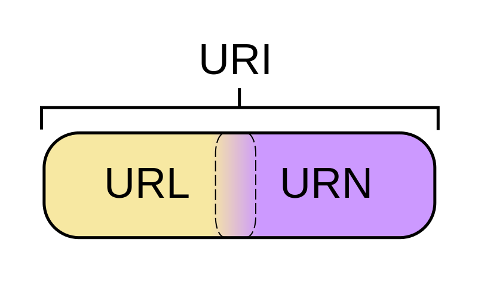

# URL和URI的区别及理解

[TOC]

---

## 解释

**URI包括URL和URN两个类别，URL是URI的子集，所以URL一定是URI，而URI不一定是URL**

**URI** = Universal Resource Identifier 统一资源标志符，用来标识抽象或物理资源的一个紧凑字符串。

**URL** = Universal Resource Locator 统一资源定位符，一种定位资源的主要访问机制的字符串，一个标准的URL必须包括：protocol、host、port、path、parameter、anchor。

**URN** = Universal Resource Name 统一资源名称，通过特定命名空间中的唯一名称或ID来标识资源。

## 例子

**举个栗子：**

个人的身份证号就是URN，个人的家庭地址就是URL，URN可以唯一标识一个人，而URL可以告诉邮递员怎么把货送到你手里。

**再举个栗子：**

[https://blog.csdn.net/GTQ28](https://blog.csdn.net/zhangzhanbin?spm=1001.2014.3001.5343)是个URL，通过这个网址可以告诉CDN找到我的博客所在地，并且还告诉用HTTP协议访问。

## 详细说明

### 一、URI

1. 什么是URI

   URI，统一资源标志符(Uniform Resource Identifier， URI)，表示的是web上每一种可用的资源，如
   HTML文档、图像、视频片段、程序等都由一个URI进行标识的。

2. URI的结构组成

   URI通常由三部分组成：

   ①资源的命名机制；

   ②存放资源的主机名；

   ③资源自身的名称。

   （注意：这只是一般URI资源的命名方式，只要是可以唯一标识资源的都被称为URI，上面三条合在一起是URI的充分不必要条件）

### 二、URL

URL是URI的一个子集。它是Uniform Resource Locator的缩写，译为“统一资源定位 符”。
通俗地说，URL是Internet上描述信息资源的字符串，主要用在各种WWW客户程序和服务器程序上。
采用URL可以用一种统一的格式来描述各种信息资源，包括文件、服务器的地址和目录等。URL是URI概念的一种实现方式。

URL的一般格式为(带方括号[]的为可选项)：

`protocol : // hostname[:port] / path / [;parameters][?query]#fragment`

URL的格式由三部分组成：

①第一部分是协议(或称为服务方式)。
②第二部分是存有该资源的主机IP地址(有时也包括端口号)。
③第三部分是主机资源的具体地址，如目录和文件名等。
第一部分和第二部分用“: //”符号隔开，
第二部分和第三部分用“/”符号隔开。
第一部分和第二部分是不可缺少的，第三部分有时可以省略。

URL举例

如：[https://blog.csdn.net/GTQ28](https://blog.csdn.net/zhangzhanbin?spm=1001.2014.3001.5343)
我们可以这样解释它：
①这是一个可以通过https协议访问的资源，
②位于主机 blog.csdn.net上，
③通过“GTQ28”可以对该资源进行唯一标识（注意，这个不一定是完整的路径）

### 三、URI和URL之间的区别

从上面的例子来看，你可能觉得URI和URL可能是相同的概念，其实并不是，URI和URL都定义了资源是什么，但URL还定义了该如何访问资源。URL是一种具体的URI，它是URI的一个子集，它不仅唯一标识资源，而且还提供了定位该资源的信息。URI是一种语义上的抽象概念，可以是绝对的，也可以是相对的，而URL则必须提供足够的信息来定位，是绝对的。

### 四、通俗说

统一资源标志符URI就是在某一规则下能把一个资源独一无二地标识出来。
拿人做例子，假设这个世界上所有人的名字都不能重复，那么名字就是URI的一个实例，通过名字这个字符串就可以标识出唯一的一个人。现实当中名字当然是会重复的，所以身份证号才是URI，通过身份证号能让我们能且仅能确定一个人。
那统一资源定位符URL是什么呢。也拿人做例子然后跟HTTP的URL做类比，
就可以有：动物住址协议://地球/中国/浙江省/杭州市/西湖区/某大学/14号宿舍楼/525号寝/张三.人
可以看到，这个字符串同样标识出了唯一的一个人，起到了URI的作用，所以URL是URI的子集。URL是以描述人的位置来唯一确定一个人的。

## 版权特别声明

版权声明：本文为博主原创文章，遵循 CC 4.0 BY-SA 版权协议，转载请附上原文出处链接和本声明。
本文链接：https://blog.csdn.net/zhangzhanbin/article/details/115337251

