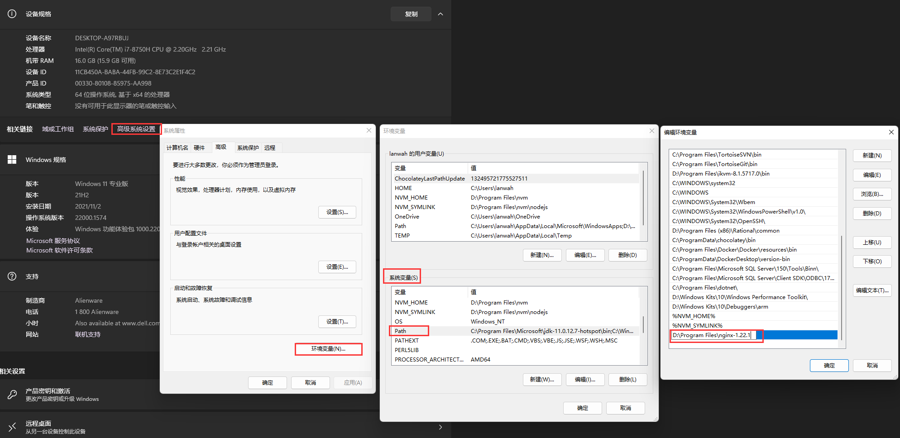
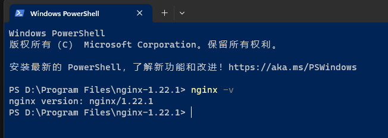
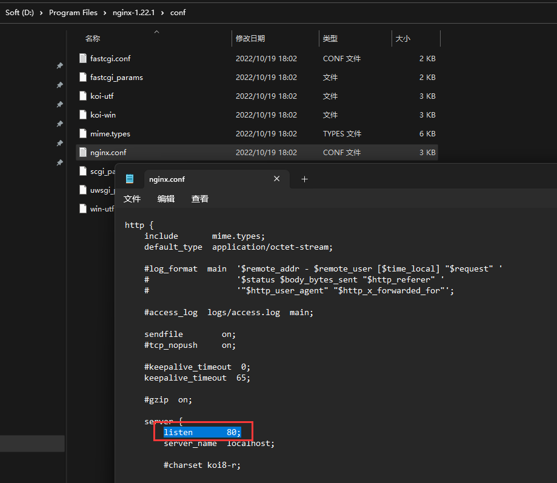
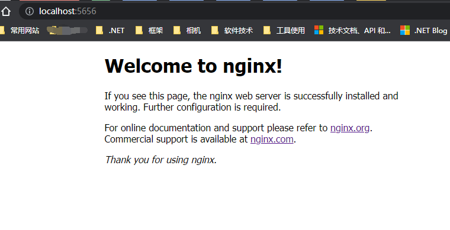
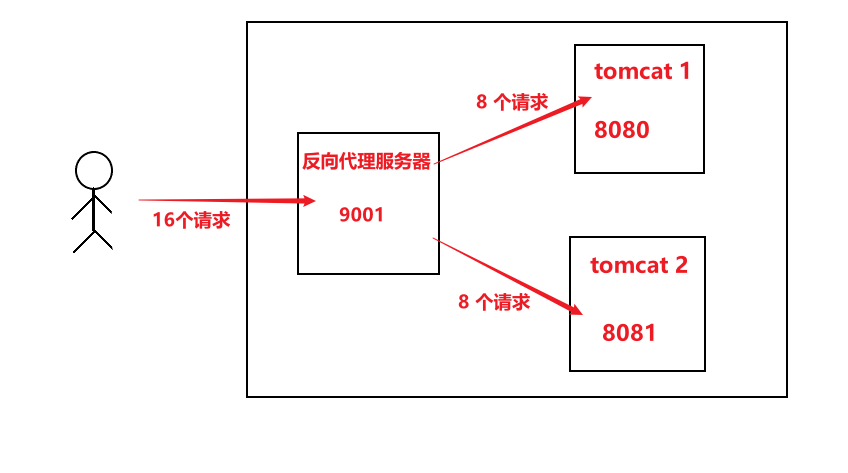
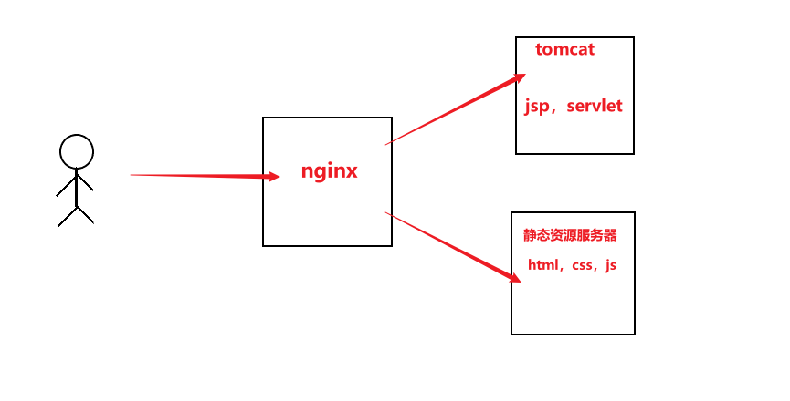

# Windows 下Nginx 的安装与配置

[TOC]

---

[Nginx官网首页](https://nginx.org/)

[Nginx下载首页](https://nginx.org/en/download.html)

[Nginx文档首页](https://nginx.org/en/docs/)

[Beginner’s Guide(初学者的指南)](https://nginx.org/en/docs/beginners_guide.html)

## 快速导航

1. [Nginx 安装与部署](https://www.cnblogs.com/wcwnina/p/8728430.html)

2. [Nginx 的基本概念](https://www.cnblogs.com/SihanLin/p/16518351.html)

## 环境变量配置



如图所示，检查系统环境变量中有无ngx安装目录的配置，没有的话则添加。

## 验证安装是否成功



如图所示，在命令行输入 `nginx -v` 能输出版本信息则表明安装成功。

## 启动并验证启动是否成功

1. 如图所示，打开配置文件，查看端口号，默认为80端口，建议修改默认端口避免80端口被占用造成的启动失败（IIS默认站点用的也是80端口），我这边改成了5656端口；
    

2. 打开终端或命令行，并==定位到nginx安装目录==，输入 `start nginx` 启动服务。

3. 在浏览器中输入 http://localhost:5656/ 打开如下界面时表示已启动成功，启动失败的话可以查看logs目录下的error.log日志文件定位失败的原因。
    

## Nginx Windows基本操作指令

| 含义                      | 命令                                       |
| ------------------------- | ------------------------------------------ |
| `nginx -v`                | 查看nginx版本                              |
| `start nginx`             | 启动nginx                                  |
| `nginx -s quit`           | 退出服务                                   |
| `nginx -s stop`           | 强制关闭服务                               |
| `nginx -s reload`         | 重载服务配置文件，类似于重启，服务不会中止 |
| `nginx -t`                | 验证配置文件                               |
| `nginx -c "配置文件路径"` | 使用配置文件                               |
| `nginx -h`                | 使用帮助                                   |

##   Nginx的基本概念

- *Nginx* 是一个高性能的 HTTP 和 反向代理 web服务器；
- 占用内存少，并发能力强，高性能，热部署；

### 正向代理与反向代理

[详解正向代理与反向代理](https://baijiahao.baidu.com/s?id=1763970559392417697&wfr=spider&for=pc)

#### 正向代理

在客户端（浏览器）配置代理服务器，通过代理服务器进行互联网访问。

是客户端的代理，代替客户端向外部服务器发送请求，获取服务端响应并返回给客户。对服务端而言，客服端的真实ip地址是隐藏的。


#### 反向代理

服务端的代理，代替服务端接收客户端的请求，并转发服务端的响应给客户。对客户端而言，服务端的真实ip地址是隐藏的。

客户端只需要将请求发送到反向代理服务器，由反向代理服务器去选择目标服务器，获取数据后，再返回给客户端。

此时`反向代理服务器 + 目标服务器` 对外就是`一台服务器`，暴露的是反向代理服务器的地址，隐藏了真实服务器的 IP.


反向代理作用主要有两点：可以使用**负载均衡**提高客户访问的并发量；隐藏服务端真实ip防止服务器受到恶意攻击。

### 负载均衡

**最朴素的请求处理**

- 客户端发送多个请求到一个服务器，服务器处理请求，有些需要访问数据库，服务器处理完毕，再将结果返回给客户端。

- 只适用于并发请求量较小的情况下。

- 大量并发请求可能会导致服务器瘫痪。

小栗子🌰

一匹很瘦弱的马，拉不动一根很粗的木材，如何解决？

- 换一匹更强壮的马（提升服务器性能）
- 用很多匹马一起拉（负载均衡）

负载均衡

增加服务器的数量，将请求（负载）分发到各个服务器上。



### 动静分离

为了加快网站的解析速度，可以把动态网页和静态网页由不同的服务器来解析。

加快解析速度，降低原来单个服务器的压力。



### 访问控制

nginx可在location中设置访问控制，只设置允许的ip的地址访问。

```nginx
location /a {
    stub_status on;   # 开启nginx的状态页，响应访问状态信息
    allow 192.168.23.37; # 允许访问的ip地址
    allow 192.168.94.1;
    deny all;   # 拒绝其他ip地址访问
}
```

## Nginx配置

### proxy_pass

https://nginx.org/en/docs/http/ngx_http_proxy_module.html#proxy_pass

在nginx中配置proxy_pass代理转发时，如果在proxy_pass后面的url加/，表示绝对根路径；如果没有/，表示相对路径，把匹配的路径部分也给代理走。

假设下面四种情况分别用 http://192.168.1.1/proxy/test.html 进行访问。

**第一种**

```nginx
location /proxy/ {
  proxy_pass http://127.0.0.1/;
}
```

代理到URL：http://127.0.0.1/test.html  


**第二种（相对于第一种，最后少一个 / ）**

```nginx
location /proxy/ {
  proxy_pass http://127.0.0.1;
}
```

代理到URL：http://127.0.0.1/proxy/test.html

  

**第三种**

```nginx
location /proxy/ {
  proxy_pass http://127.0.0.1/aaa/;
}
```

代理到URL：http://127.0.0.1/aaa/test.html

 

**第四种（相对于第三种，最后少一个 / ）**

```nginx
location /proxy/ {
  proxy_pass http://127.0.0.1/aaa;
}
```

代理到URL：http://127.0.0.1/aaatest.html

==建议==

为了方便记忆和规范配置，建议所有的 proxy_pass 后的url都以“/”结尾。
proxy_pass http://192.168.1.10/linux/;

### root/alias

https://nginx.org/en/docs/http/ngx_http_core_module.html#root

https://nginx.org/en/docs/http/ngx_http_core_module.html#alias

location 命中后

如果是root，会把请求url的 ==ip/域名+port==替换为root指定的目录，访问资源

如果是alias，会把请求url的==ip/域名+port+匹配到的路径==替换为alias指定的目录，访问资源

#### 详解root

##### 基本用法

以请求http://example.com/foo/bar/hello.html 为例，location配置如下

```nginx
location /foo {
    root /home/hfy/;
}
```

匹配到/foo，url的`域名+port`替换为root指定的目录，即url中的examp.com被替换为了/home/hfy，所以实际访问的路径为`/home/hfy/foo/bar/hello.html`

为了更好理解，再来一个例子，请求的url不变，location配置更改为

```nginx
location /foo/bar {
    root /home/hfy/;
}
```

匹配到/foo/bar，url的`域名+port`替换为root指定的目录，即url中的examp.com被替换为了/home/hfy，所以实际访问的路径仍然为`/home/hfy/foo/bar/hello.html`。**root在替换时不会替换匹配到的路径**。

##### location的最左匹配原则

location会从url最左边的路径匹配，如果一致则命中该location。只有中间匹配到不会命中。
比如请求的url为http://example.com/foo/bar/hello.html ，location为

```nginx
location /bar {
    root /home/hfy/;
}
```

不会命中该location，因为从url中的/foo开始匹配，与`location /bar`不一致，不会命中，如果url更改为http://example.com/bar/hello.html 才会命中该规则

##### index

在location内部其实默认配置了一条规则`index index.html`，补全后的规则如下

```nginx
location /foo {
    root /home/hfy/;
    index index.html;
}
```

假设我们访问的url为http://example.com/foo/bar ，匹配到/foo，实际访问的路径为/home/hfy/foo/bar。如果我们的bar是一个文件夹，其中如果包含index.html文件，则会把该文件返回。所以index的作用是，当实际访问的是一个目录时，会返回该目录中index指定的文件，如果该目录中不存在index指定的文件，则会返回403。

在访问http://example.com/foo/bar ，时我们打开浏览器的控制台，查看发送的请求，会发现发生了一个301重定向，http://example.com/foo/bar 被重定向为http://example.com/foo/bar/ ，由此引发了新的问题，为什么会发生重定向，url末尾的/，location 匹配路径末尾的/，以及root 指定目录末尾的/都表示什么意思

#### 详解alias

##### 基本用法

以请求http://example.com/foo/bar/hello.html为例，location配置如下

```nginx
location /foo {
    alias /home/hfy/;
}
```

匹配到/foo，url的ip/域名+port+匹配到的路径替换为alias指定的目录，即url中的example.com/foo被替换为了/home/hfy，所以实际访问的路径为/home/hfy/bar/hello.html

同样再来一个例子，请求的url不变，如果location配置更改为

```nginx
location /foo/bar {
    alias /home/hfy/;
}
```

匹配到/foo/bar，url的ip/域名+port+匹配到的路径替换为alias指定的目录，即url中的example.com/foo/bar被替换为了/home/hfy，所以实际访问的路径为/home/hfy/hello.html。alias在替换时会替换匹配到的路径。

alias其余特性，最左匹配、index、location解析url工作流程、末尾’/'与root一致。

建议此章节详细阅读[详解nginx的root与alias](https://blog.csdn.net/weixin_44387339/article/details/128114151)

==建议==

1. url末尾不加/，如果需要带/时依靠nginx自动帮我们重定向加/
2. location 路径不加/，这样末尾有无/的url都能匹配到
3. root或者alias指定的目录后面加/，明确表示root指定的是目录，增强配置的可读性


## 相关参考

1. [Nginx配置详解](https://www.jianshu.com/p/d063b566752f)
2. [Nginx 的基本概念](https://www.cnblogs.com/SihanLin/p/16518351.html)
3. [nginx 之 proxy_pass详解](https://www.cnblogs.com/cnblog-long/p/11690329.html)
4. [nginx 反向代理之 proxy_pass](https://www.cnblogs.com/yyxianren/p/10831511.html)
5. [详解nginx的root与alias](https://blog.csdn.net/weixin_44387339/article/details/128114151)
   版权声明：本文为博主原创文章，遵循 CC 4.0 BY-SA 版权协议，转载请附上原文出处链接和本声明。
   本文链接：https://blog.csdn.net/weixin_44387339/article/details/128114151
6. [Nginx的alias指令引发的漏洞](https://www.cnblogs.com/seizer/p/17035771.html)
6. [Nginx 配置详解](https://blog.csdn.net/u011262253/article/details/120941175)

## 推荐阅读

1. [Nginx反向代理websocket](https://www.cnblogs.com/chaizhenhua/p/16252828.html)
2. [详解nginx的root与alias](https://blog.csdn.net/weixin_44387339/article/details/128114151)
3. [Nginx的alias指令引发的漏洞](https://www.cnblogs.com/seizer/p/17035771.html)
3. [详解正向代理与反向代理](https://baijiahao.baidu.com/s?id=1763970559392417697&wfr=spider&for=pc)


文章持续更新中....有Nginx相关的优秀的文章也欢迎大家推荐给我。
