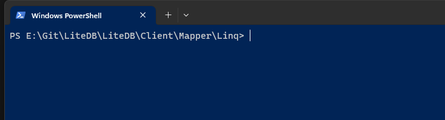
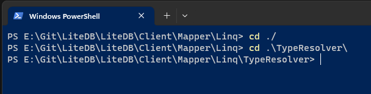
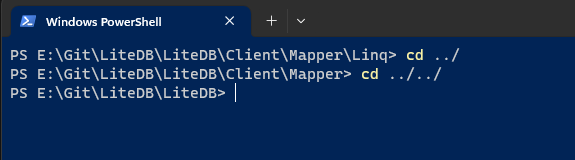
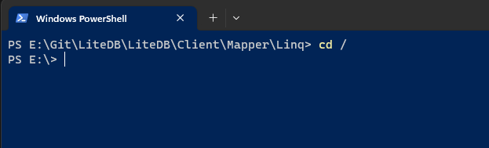

# 相对路径

[TOC]

**路径中 “./”、“../”、“/” 代表的含义**

==注意：==表示的是相对于当前的路径或目录而言，所以前提是要知道当前的路径是什么！

## 含义

**路径中 “./”、“../”、“/” 代表的含义**

**"./"：代表目前所在的目录。**

**" . ./"代表上一层目录。**

**"/"：代表根目录。**

> [!IMPORTANT]
>
> / 反斜杠，用于网络地址的分割符，比如Url中的分隔符就是反斜杠（/）
>
> \ 斜杆，用于目录路径中的分割符。

## 举个栗子

如下图所示，当前路径为：E:\Git\LiteDB\LiteDB\Client\Mapper\Linq

当前目录

上层目录

根目录

